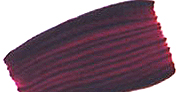

## Les laques, pigments
### Les paques, pigments utilisés en arts plastiques
 **Les laques (couleurs)**  

_Les couleurs dites "laques" doivent-elles forcément être rouges, pourpres ou carminées ?_

_Pas du tout._

_En fait, originellement, le terme hindoustani "LAKH" désigne une peinture brillante et résistante ainsi qu'un procédé, un savoir-faire impliquant beaucoup de soin ainsi que nous pouvons le constater au vu des oeuvres des maîtres laqueurs asiatiques (voir [La gomme laque, les laques](gommelaque.html) et [La laque japonaise](laquejaponaise.html)). Ce même terme "lakh" est dans plusieurs langues en relation directe avec l'eau ([cf. un passage de l'article précité](gommelaque.html#laquelakhetlakshmi)). Or, les peintures dont il s'agit ont aussi pour la plupart un point commun avec l'eau : la transparence, qui donne un effet pictural lié à l'application en nombreuses couches._

_Essentiellement et initialement, les laques ne sont donc pas des couleurs mais des procédés de peinture décorative ou artistique ayant un aspect plastique assez précis. Or, les pigments (on parle ici de véritables pigments, non de colorants fugaces) pouvant donner l'impression d'un laquage de par une grande transparence intrinsèque étaient assez peu nombreux avant la création des synthèses pétrochimiques._

Sommaire

[Une "couleur laque" est-elle forcément végétale ?](laques.html#unelaqueestelleforcementvegetale)

[Usages typiques des "couleurs laques"](laques.html#usagestypiquesdescouleurslaques)

[Limites de l'application "couleur laque"](laques.html#limitedelappellationcouleurlaque)

[Laques "classiques"](laques.html#laquesclassiques)

[Laques courantes](laques.html#laquescourantes)

[Les laques contemporaines et "couleurs pour glacis"](laques.html#leslaquescontemporaines)

_De ce fait, il semblerait que le terme de "laque" ait fini par correspondre durablement à une famille de pigments assez bien déterminés qui continue à s'étendre au fil du temps ponctué par les inventions chromatiques. On y trouve des violets, des jaunes, une bonne quantité de rouges (voir illustration ci-dessous)_ _et des noirs, tous organiques chimiquement parlant, semble-t-il._

**Une "couleur laque" est-elle forcément végétale ?**

Certains auteurs affirment ou sous-entendent que les laques sont les pigments végétaux, par opposition aux pigments minéraux.  
Nous donnerons à ce sujet un point de vue plus en... mi-teintes.

Le famille des laques a évolué. Elle n'est pas un univers chromatique figé. Même le genre du mot laque peut varier - [lire encadré in la Gomme laque, les laques](gommelaque.html#lalaqueoulelaque). Un pigment (voire une préparation pluripigmentaire) non végétal peut selon nous être considéré comme une laque dès l'instant où il a une grande transparence et une certaine brillance. C'est le cas des quinacridones et autres synthèses organiques contemporaines. Par contre,à part quelques exceptions, les pigments minéraux sont trop mats et souvent trop opaques pour prétendre à l'appellation de laque.  
Il existe une certaine continuité entre pigments végétaux - généralement organiques - et pigments issus de la pétrochimie.

_[Lire l'article Pigments organiques vs pigments inorganiques](organiquesvsinorganiques.html)_

**Usages typiques des "couleurs laques"**

Bien souvent, de la [gaude](laquesanciennes.html#laquedegaude) à [l'orseille](violetsetmauves.html#lorseille) en passant par la [garance](garance.html), les "couleurs laques" ont servi de teintures. Dans ce domaine, les "fixateurs de laques" les plus classiques sont la [craie](craie.html) [albuminée](albumine.html), [l'amidon](amidon.html), [l'alun](alun.html), etc.

En peinture, les "couleurs laques" se prêtent particulièrement, par leur transparence, aux [glacis](glacis.html).

Dans le domaine des technique des laques (gomme laque, [urushi](laquejaponaise.html#urushietkiurushi), huiles chinoises, laques contemporaines), les "couleurs laques" n'ont pas toujours été les préférées de tous les laqueurs ! Il n'est pas rare qu'une armoire chinoise soit "laquée" avec un lourd mélange à base d'oxyde de fer rouge très couvrant et très mat, agglutiné par une [huile cantonaise](autreshuiles.html#lhuiledeboisdechine), tout à l'opposé des "couleurs laques" et des "gommes laques".  
Que dire sinon que le terme hindoustani originel qui fut à la base de l'appellation "laque" a voyagé dans le temps et dans l'espace ? Il a été associé à des pigments, des procédés de peinture et de teinture pour des raisons variées.

**Limites de l'appellation "couleur laque"**

Dans les gammes de peintures proposées par les fabricants, quelques couleurs n'ayant guère de rapport avec des "couleurs laques" habituelles, ont donné lieu à des "versions laques" par simple adjonction d'une [charge incolore](chargesincolores.html). Celle-ci, souvent à base [d'alumine](alumine.html) et/ou de [silice](silice.html), donne des couleurs qui sortent un peu du cadre normal de cette appellation de par leur matité et leur minéralité. Quelques industriels ont fait le choix intelligent de préférer l'intitulé de "couleurs glacis".

Les limites de l'intitulé _laque_ sont donc bien présentes dans certains esprits. Pas tous : lire ci-dessous [un passage concernant d'étranges "_laques de bitume_"](laques.html#lalaquedebitume).

_Laques "classiques"_

_**Elles sont énumérées dans la page "[Laques anciennes](laquesanciennes.html)".**_

Dans leur formulation originelle, elles ont peu de permanence et deviennent transparentes. Au Moyen-âge et au-delà, les peintres anticipaient ce phénomène de différentes manières et tout particulièrement en les associant au [cinabre](vermillons-2.html) (utilisé comme fond) qui a, lui, tendance à s'assombrir.

Comme nous l'écrivions ci-dessus, elles sont généralement pourpres, rouges ou carminées à l'ouest du continent eurasiatique. La gaude,  jaune, ne semble pas avoir percé dans le domaine des Beaux-Arts. De même, les laques noires sont peu utilisées en peinture occidentale, au contraire de l'Extrême-Orient.

Elles ont toutes une mauvaise réputation, _infondée,_ quant à leur aptitude au séchage ou à la siccativation et quant à leur permanence, surtout en ce qui concerne leurs versions contemporaines (lire l'article "_[pigments séchant mal](mauvaiseabsorp.html)_"). Comme indiqué dans cet article, le kermès et les cramoisis ne sont plus fabriqués avec les oeufs de cochenille et l'alizarine a été remplacée en 1868 par Groebe et Libermann, par une imitation à base d'[anthracène](anthracene.html), puis un "rouge d'anthraquinone" d'une tenue déjà assez correcte. La "garance véritable" de certains fabricants est _au mieux, vraiment au mieux_ une alizarine de synthèse (lire [l'article sur cette couleur](garance.html)). A part de très rares fabricants de haut vol et peut-être quelques paysans afghans, personne n'arrache plus les rhizomes de _rubia tinctorium_. Quant aux produits [anthraquinoniques](anthraquinones.html), ils sont progressivement remplacés par des mélanges plus permanents de type quinacridone + dykéto-pyrrolo-pyrrole.

Voir aussi ci-dessous _[Réputations tenaces](laques.html#reputationstenaces)_.

_Laques courantes_

Les laques rouges plus ou moins violacées, c'est-à-dire les plus utilisées sont maintenant

> \* [azoïques](azoique.html)
> 
> \* [anthraquinoniques](anthracene.html)
> 
> \* [quinacridoniques](quinacridones.html)/dykétopyrrolopyrroliques (permanentes, voir photo ci-dessous)
> 
> \* [xanthiniques](xanthine.html)
> 
> \* [aniliniques](anilines.html) (fugaces).

Il s'agit d'hydrocarbures, non de cochenilles ni de racines d'herbes rubiacées. _La_ _**fugacité notoire** de la plupart des laques_ ainsi que les coûts de production ont en effet suscité un effort technologique dès le début du XIXème siècle.

_Réputations tenaces_

La persistance de la réputation de lenteur au séchage que ces pigments ont, malgré la transformation radicale de leur chimie à laquelle nous assistons depuis un, deux ou trois siècles, pourrait être due aux raisons suivantes :

> \* les mauvaises réputations "collent à la peau", surtout dans le milieu de la peinture - et ce n'est pas un mot d'esprit.
> 
> \* les colorants d'un rouge froid (pourpre, magenta, rose tyrien, etc.), même contemporains, demeurent tous très peu couvrants bien que très colorants. C'est un fait physique naturel.
> 
> \* _en termes de tendances_, la réaction logique d'un peintre non averti qui utiliserait ces pigments est d'ajouter encore et encore, vainement, des couches de plus en plus épaisses, pour tenter de "couvrir" davantage. C'est ainsi qu'il allongerait lui-même les temps de séchage.

_Les "couleurs à laques" ne seraient donc pas moins "siccatives" que d'autres, mais inciteraient le peintre à considérer, comparativement à d'autres couleurs, qu'_au regard de leur facteur couvrant_, elles sèchent plus lentement._

Tout semble indiquer que les laques sont encore les têtes de Turcs des auteurs. Par exemple, l'un des plus célèbre - et des plus compétents - note que "_Le blanc d'argent les dévore_", oubliant que la [céruse](ceruse.html) (blanc d'argent) dévore bien d'autres couleurs et substances et que les occasions de mélanger ou de mettre en contact une laque et un blanc, surtout aussi couvrant que celui-là, sont rarissimes.

_Les laques contemporaines et "couleurs pour glacis"_

En fait, elles n'ont rien de contemporain. Depuis quelques siècles déjà, d'autres teintes que les garances et autres alizarines sont employées en glacis à l'aide de procédés très efficients.

La nouveauté, c'est l'initiative de certains fabricants qui proposent toutes sortes de couleurs apprêtées pour les glacis dans leurs gammes de peintures en tubes. Les pigments employés sont les [quinacridones](quinacridones.html), les [azoïques](azoiques.html) et les [phtalocyanines](phtalocyanines.html) déjà cités et toutes sortes d'autres pigments - parfois même les plus couvrants, comme l'oxyde de fer -, adjoints de charges incolores neutres comme [l'hydrate d'alumine](chargesincolores.html#lhydratedalumine) et la [silice colloïdale](silicepeinture.html#silicecolloidale).

Mentionnons un peu à part **la laque de bitume**, imitation d'un beau colorant brun-noir du XIXème siècle qui s'était révélé de très mauvaise tenue. Il s'agit en fait dans le cas présent d'un mélange d'oxyde de fer noir et de noir d'ivoire, transformé en laque. Attention : certains fabricants proposent une laque de bitume _couvrante_, appellation pouvant paraître paradoxale. On touche là à la limite du terme "laque".

Voir [bitume de Judée](bitume.html).

Encore un peu à part, la "**laque de grenat**", une synthèse quinacridonique, est assez réussie.

Voir _[grenat](grenat.html)_ [in glossaire](grenat.html).

 [Communication](http://www.artrealite.com/annonceurs.htm) 

