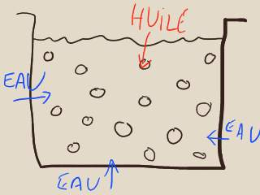
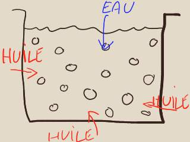

## Les liants émulsions
### Les liants émulsions, usage en arts plastiques et autres
 C'est la substance enrobante qui mène le jeu, voila la règle : "(...) _plus la quantité de liant enrobant sera importante, plus les gouttelettes de liquide enrobé seront éloignées les unes des autres_ (...)" (réf. [Pierre Garcia](livres.html#pierregarcia), p. 79). L'enrobant, son type, son abondance, déterminent en effet l'aspect général et le comportement de la peinture.

**Émulsions maigres**

L'émulsion maigre se comporte à peu près comme un liant aqueux. On la travaille à l'eau de A à Z (dilution, séchage, nettoyage du matériel).

La présence d'huile permet certains types de travaux en transparence inaccessibles à la peinture 100% aqueuse.

Il faut cependant prendre garde à la [réversibilité](liants.html#reversibilite) partielle de certaines émulsions maigres : les couches n'acquièrent pas forcément l'autonomie permise par les émulsions grasses. 

Au point de vue physique, les molécules d'eau se combinent à l'air ambiant, autorisant les molécules oléagineuses à s'organiser en [macromolécules](macromolecule.html) très stables autour du pigment. Ceci n'est qu'une vérité statistique : les éléments du liant aqueux ne disparaissent pas pour autant. S'ils sont réversibles, ils demeurent des réceptacles pour l'eau.

Les émulsions maigres ne donneraient selon certains auteurs que des films aux qualités mécaniques modérées ou faibles. Elles pourraient craqueler dès le séchage. Cependant, les peintures alkydes, utilisées avec des adjuvants comme le Liquin ®, se situant pourtant bien dans la catégorie des émulsions maigres, n'ont pas ce défaut semble-t-il (merci de [nous faire parvenir](ecrire.html) tout complément d'information à ce sujet).

l'oeuf est naturellement une émulsion maigre (lire [l'article sur l'oeuf et la tempera](oeuf.html)).

**Émulsions grasses**

Elles ont une viscosité très intéressante par rapport au travail habituel à l'huile, autorisant de forts empâtements et diminuant légèrement le risque de coulure.

Au séchage, les molécules d'eau sont progressivement chassées par l'huile encore fraîche, liquide. Les vides laissés sont comblés progressivement. Il y a un [retrait](retrait.html), d'autant plus modéré que l'émulsion est grasse.

L'épaisseur sera d'autant plus importante que le liant enrobé (et non l'eau seule) sera proportionnellement plus présent.

[La laque japonaise KI-URUSHI](laquejaponaise.html) est une émulsion grasse naturelle.

Les produits

**Les émulsions et l'huile : problématique du gras sur maigre**

Lire préalablement l'article _[Gras sur maigre](grassurmaigre.html)_.

Les peintures et médiums [alkydes](alkydes.html), l'oeuf et le liant [méthylcellulosique](methylcellulosiqueliant.html) peuvent être employées en peinture à l'huile.

Une émulsion adjointe à une huile, **n'est pas plus maigre simplement parce qu'elle contient plus d'eau !** En effet, celle-ci s'évapore en bonne partie assez rapidement (sauf empâtement trop épais). Par contre, si vous augmentez la proportion de liant aqueux, vous rendez effectivement la pâte plus maigre.

Par ailleurs, une citation de Pierre Garcia (_Le métier du peintre,_ chez Dessain & Tolra) nous a semblé intéressante :

"_Pour tout dire, les émulsions ont un comportement assez facétieux : il n'est pas rare en voulant réaliser une émulsion maigre d'obtenir une émulsion grasse (ou vice versa)._" Cette remarque vaut surtout pour l'oeuf et les produits dont le peintre ne connaît pas bien la composition (produits "à base de" ceci ou cela).

**Émulsion huile/liant à l'oeuf**

En lui-même, le jaune [d'oeuf](oeuf.html) est une émulsion plutôt maigre : 30% d'huile d'oeuf, dite [lécithine](lecithine.html).

Ses particularités sont la finesse et un satiné très particulier. L'oeuf se prête assez bien aux enductions crayeuses classiques (voir [gesso](fabriquerungesso.html)). Dans le passé, il a d'ailleurs joué un rôle important en tant que [liant a tempera](oeuf.html) (icônes, etc.). 

Noter que le temps de séchage de l'oeuf et des produits à l'oeuf (sauf émulsions vraiment grasses) est plutôt court.

Le jaune d'oeuf peut être directement combiné à l'huile de lin ou une autre huile de cette manière-ci par exemple (recette en grande partie empruntée à [Pierre Garcia](livres.html#pierregarcia)) :

> \* un jaune d'oeuf vidé, sans sa membrane  
> \* le même volume d'eau distillée  
> \* la même quantité (eau + jaune) d'huile introduite très progressivement en battant le mélange au fouet  
> \* un conservateur (pas forcément le vinaigre - voir [Éléments pour recettes dans l'article sur l'oeuf](oeuf.html#elementspourrecettes)).

ce qui produit en théorie une émulsion maigre (en théorie car tous les oeufs n'ont pas précisément la même composition). Pour adapter la recette à vos besoins, lire la [liste d'éléments pour recettes dans l'article sur l'oeuf et la tempera](oeuf.html#elementspourrecettes). Un site consacré à la tempera à l'oeuf a également retenu notre attention : [eggtempera.free.fr/fr](http://eggtempera.free.fr/fr).

Quitte à surprendre, notons qu'une mayonnaise est une émulsion à l'oeuf avec laquelle il est possible de peindre. [Lire texte in _L'oeuf_](oeuf.html#mayo).

**KI-URUSHI/sumac**

C'est une émulsion naturelle utilisée depuis la nuit des temps. La première laque, dit-on.

Elle n'est autre que la sève d'un arbre (URUSHI en japonais, [sumac](sumac.html) en persan et en français).

Elle donne lieu en Asie à de nombreux procédés de laques continentales ou japonaises.

Lire absolument l'article consacré à _[La laque japonaise](laquejaponaise.html)_.

**Émulsion huile/liant méthylcellulosique**

Le liant méthylcellulosique n'est pas en lui-même une émulsion mais il autorise les émulsions (lire [l'article sur ce produit](methylcellulosiqueliant.html)).

L'Alcasit ®, le Glutolin ® et les produits similaires ont un côté blanchâtre un peu désagréable, qui s'estompe en partie au séchage. Cependant, la plupart des produits destiné à favoriser l'empâtement ont ce type de défauts (colorations intempestives).

Leur siccativité surprend, leur [retrait](retrait.html) aussi.

**Proportions** : elles sont laissées à discrétion du peintre, mais par exemple, 67% d'alcasit pour 33% d'huile est une proportion déjà importante pour fabriquer un liant (par opposition avec un médium - lire l'article sur la [fabrication du médium huile/méthylcellulose](mediumhuilemethylcell.html)). 

**La cire saponifiée**

[Lire texte in Les cires, l'encaustique.](cires.html#ciresaponifiee)

**Les alkydes**

Lire la [page consacrée](alkydes.html) à ces peintures.

**Emulsions à la caséine**

_Il est possible - mais pas très simple - de fabriquer une émulsion caséine/huile._ _L'huile étant un [ester](ester.html) et la caséine une [base](base.html), il faut s'attendre à ce qu'une réaction se produise (voir [Saponification](saponification.html)) et donc utiliser de très faibles proportions de [caséine](caseine.html) ou essayer de neutraliser sa charge._

_La réalisation de ce type de produits combinés requiert de nombreux contrôles et une mise au point précise._

Plus simple en apparence à cause de la relative facilité de préparation des produits, une émulsion réalisée avec

> \* une [caséine soluble](caseine.html#preparationnormale) diluée normalement dans l'eau  
> \* une [cire blanche](cires.html#cireblanche) mise sous la forme d'une [encaustique](cires.html#enpeinture)

s'avère en réalité parfois ardue à effectuer correctement ! Verser la caséine dans l'encaustique à froid provoque l'apparition de sortes de grumeaux irréductibles. Il en va de même si l'on plonge la caséine froide dans l'encaustique chaude. Il faut donc réchauffer la caséine ou l'émulsion, ce qui ne va pas sans problèmes car une véritable cuisson modifierait la structure moléculaire des protéines de la caséine.

De plus, nous avons constaté que cette dernière est fort discrète une fois le travail séché (on constate juste une sorte de léger épaississement de la pâte). Il faut donc une proportion de cire assez faible.

**Émulsions à la chaux**

Lire [_Utilisation en peinture à l'huile_ in _La chaux_](chaux.html#utilisationenpeinturealhuile).

**Émulsion-enduit au savon noir**

Cet enduit est surtout destiné à des surfaces non lisses. Il est utilisé en décoration.

Une recette typique :

> \* 10 grammes de colle, 10 grammes d'huile de lin, 100 grammes d'eau, 1 ou 2 grammes de [savon noir](savonnoir.html) "pour émulsionner l'huile" (dit-on).  
> \* du pigment (blanc ou autre)  
> \* remuer vigoureusement.

Il pourrait également être employé comme liant à peindre. Merci de [nous communiquer](ecrire.html) toute information quant à l'emploi de l'émulsion au savon noir comme liant. **Nous émettons cependant quelques réserves** : certains liants saponifiés donnent d'excellents résultats, d'autres, mal préparés (ingrédients ou dosages ne convenant pas) ou mal conçus, peuvent donner des résultats instables.

**Émulsion à la gélatine**

La gélatine en question peut être une [colle de peau](colledepeau.html) ou [d'os](colledos.html) (proportions à peu près similaires), [de poisson](colledepoisson.html) ou autre (quantités à ajuster) - voir [gélatines](gelatine.html).

Proportions approximatives :

> \* 20 parts de colle de peau ou d'os diluée (compter très environ 7 grammes par décilitre d'eau)  
> \* 2 parts d'huile éventuellement mêlée de [standolie](standolie.html). Cette proportion d'huile peut être doublée, ou davantage, pour réaliser une [émulsion grasse](liantsemulsions.html#emulsionsgrasses). Son rôle, on s'en doute, est solidifiant et assouplissant, sans parler de ses vertus picturales.  
> \* "un peu" d'eau.  
> \* une part de [carbonate d'ammonium](carboammonium.html), destinée à faciliter le mélange intime, l'émulsion huile / colle aqueuse par [saponification](saponification.html) de l'huile. Cette opération essentielle peut induire une charge électrochimique déséquilibrée. Il est prudent de tester le [pH](ph.html) de la pâte obtenue.

L'huile doit être incorporée très progressivement dès que la colle bouillonne. Le carbonate d'ammonium doit être introduit quasiment "au goutte-à-goutte" pendant cette étape.

L'application doit être réalisée à chaud sur une surface encollée non grasse.

Cette émulsion est surtout utilisée en peinture décorative. Nous ne l'avons pas encore testée.

**Encres "lino"**

Ce sont des émulsions de composition souvent mystérieuse qui sont utilisées pour la [linogravure](linoleum.html), mais aussi pour le [monotype](monotype.html).

Les meilleurs résultats seraient obtenus avec les encres lino les plus grasses. Le diluant de ces encres est généralement une [essence](essences.html).

**Adjuvants facilitant l'émulsion**

Comme on a pu le remarquer dans les différentes recettes de cet article, le carbonate d'ammonium permet la formation d'émulsions. [Lire l'article consacré à ce produit.](carboammonium.html)

Le [camphre](camphre.html) pourrait aussi jouer un rôle, mais nous avouons ignorer pour l'instant lequel précisément.

