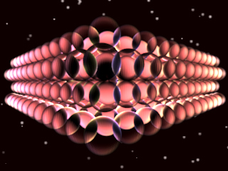
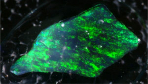
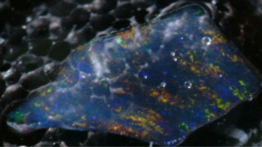
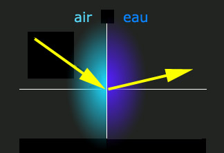

## Les métamatériaux - Chapitre XI des Dialogues de Dotapea
### Les métamatériaux - Un tour d'horizon sur les échelles, le passé, le présent et les perspectives de certains univers minuscules - Chapitre XI des Dialogues de Dotapea
 Navig. page/section

  
  

\_\_\_\_\_

**Pages soeurs**

[I, A propos des liants](chap01liants.html)  
[II, Bulles, siccativ., struct. élec.](chap02bullessiccativation.html)  
[III, Caséine, phosphore, dissociation](chap03caseine.html)  
[IV, Les orbitales](chap04orbitales.html)  
[V, L'aérogel](chap05aerogel.html)  
[VI, Polarisation de la lumière](chap06polaris.html)  
[VII, Sfumato et diffusion Rayleigh](chap07rayleigh.html)  
[VIII, Les interférentielles](chap08interferences.html)  
[IX, Dextrine, farine et chiralité](chap09dextrine.html)  
[X, L'ocre bleue](chap10ocrebleue.html)  
XI, Les métamatériaux  
[XII, Le jaunissement](chap12jaunissement.html)  
[XIII, Laser etc.](chap13laser.html)  
[XIV, L'holographie](chap14holographie.html)  
[XV, L'holographie numérique](chap15holographienum.html)  
[XVI, Extérieur, intérieur, chaux](chap16interieurexterieurchaux.html)  
[XVII, L'électrolyse et les ions](chap17electrolyseions.html)  
[XVIII, L'électricité, un peu plus loin](chap18electriciteplusloin.html)  
[XIX, Oxydation, métaux](chap19oxydationsmetaux.html)  
[XX, Les échelles](chap20echelles.html)  
[XXI, Nature et évolution des résines](chap21resines.html)  
[XXII, Le mouillage pigmentaire](chap22mouillage.html)  
[XXIII, La molette](chap23molette.html)  
[XXIV, Blanche neige](chap24blancheneige.html)  
[XXV, Lumière et matière](chap25lumiereetmatiere.html)  
[XXVI, Magnétisme](chap26magnetisme.html)  
[XXVII, Ambre et vieilles branches](chap27ambre.html)  
[XXVIII, L'origami miroir](chap28origamimiroir.html)  
[XXIX, Le feu](chap29feu.html)  
[XXX, Peau du métal](chap30peaudumetal.html)  
[XXXI, La ville en un souffle](chap31bellastock.html)  
[XXXII, Oxyder des matériaux](chap32oxydermateriaux.html)  
[XXXIII, Ocre bleue, une solution](chap33ocrebleuesimulation.html)

\_\_\_\_\_

Copyright © www.dotapea.com

Tous droits réservés.  
[Précisions cliquer ici](droitscopie.html)

**Les dialogues sur la physique-chimie  
appliquée aux arts**

**Chapitre XI**

**Les métamatériaux** 

**Un tour d'horizon sur les échelles, le passé, le présent et les perspectives de certains univers minuscules.**

dial   dial   dial

Ce chapitre des [Dialogues de Dotapea](dialoguesdotapea.html) est une discussion entre Jean-Louis, physico-chimiste au CNRS, et un candide, Emmanuel.

Les personnages sont réels, la discussion aussi. Elle peut reprendre à tout moment et ce texte peut s'allonger. Ce sera sûrement le cas en ce qui concerne ce chapitre en forme de panorama et en même temps de "focale" sur une dimension de l'actualité qui a quelques rapports avec le passé et l'avenir.

Essayons de poser quelques points de repère.

 

**Sommaire**

[Les métamatériaux définis par leur structure](chap11metamateriaux.html#metamateriauxstruct)

[L'opale et ses billes](chap11metamateriaux.html#opalebilles)

[L'invisibilité](chap11metamateriaux.html#invisibilite)

[Invisible... et aveugle](chap11metamateriaux.html#invisibleetaveugle)

[Un étrange indice de réfraction](chap11metamateriaux.html#indicerefract)

[Le noir ultime](chap11metamateriaux.html#noirultime)

[Nano versus micro...](chap11metamateriaux.html#nanovsmicro)

[...ou plutôt bottom-up versus top-down ?](chap11metamateriaux.html#bottomuptopdown)

[Les échelles](chap11metamateriaux.html#echelles)

[Passé et perspectives des métamatériaux](chap11metamateriaux.html#passepersp) :

[\- L'argile turquoise des Mayas](chap11metamateriaux.html#argileindigomaya)

[\- Les glaçures iraniennes](chap11metamateriaux.html#glacuresiraniennes)

[\- Les épées de Damas](chap11metamateriaux.html#epeesdamas)

Emmanuel : La science actuelle semble redécouvrir, parfois recréer un certain nombre de procédés anciens ou naturels faisant intervenir ce que l'on nomme aujourd'hui des "métamatériaux". Avant tout, de quoi s'agit-il ? 

Jean-Louis : En simplifiant un peu, un métamatériau est un matériau dont les propriétés découlent non de sa nature, mais de sa structure.

Les exemples les plus parlants peuvent être pris dans le domaine de l'optique, c'est aussi le domaine dans lequel la recherche est la plus active.

Pour qu'un matériau possède des propriétés particulières vis à vis de la lumière, il faut que les détails de sa structure aient des dimensions caractéristiques de l'ordre des longueurs d'onde de la lumière en question et même, préférablement, plus petites.  
Pour la lumière visible cela implique des structures de l'ordre de la fraction de micromètre, pour les micro-ondes de l'ordre du décimètre.

**Les métamatériaux définis par leur structure**

Vite, un exemple! Les opales sont des pierres précieuses formées de l'assemblage régulier de billes sub-micrométriques de [silice](silice.html).

**L'opale et ses billes**

La silice pure est un matériau transparent, comme le verre. Or les opales ont cet aspect "opalescent" caractéristique et recherché. Cette propriété optique particulière résulte non pas de la nature (silice) du matériau mais de sa structure interne, l'assemblage régulier de billes de ~0.1 - 0.5µm (microns) de diamètre. Les opales sont des métamatériaux.

Emmanuel : On a vu que [l'aérogel](chap05aerogel.html) est également constitué de billes de silice, mais beaucoup plus espacées. Le verre est-il également constitué de billes, mais organisées différemment ? Je me souviens que tu écrivais que le verre est un liquide. On dit aussi que c'est de la silice [amorphe](amorphe.html), mais comment ça se présente à cette échelle, de la silice amorphe, est-ce qu'il y a encore des billes ou bien est-ce un magma totalement informe ?

Jean-Louis : L'aérogel est fait de billes de taille variable et leur répartition est aléatoire. Dans les opales les billes sont non seulement de taille rigoureusement identique mais elles sont parfaitement organisées dans toutes les directions. Les verres ne comportent aucun espace vide et sont totalement homogènes.

On sait faire des opales artificielles en "empilant" des micro-billes de silice. En changeant le diamètre des billes, on change la couleur des opales ainsi produites.

  
Photos : courtoisie de Charles Hirlimann, CNRS  
 © Copyright

Emmanuel : Donc là, ce sont des opales synthétiques ?

Jean-Louis : Oui, faites maison.

Emmanuel : Ca marche par absorption ? En modifiant la taille des billes, j'absorbe ou je réémets telle ou telle longueur d'onde ?

Jean-Louis : C'est encore un phénomène [d'interférences](chap08interferences.html) multiples. Le fait d'avoir des billes empilées régulièrement fait que les propriétés optiques du matériau varient périodiquement.

Cela crée "un réseau d'indice" ou "réseau de phase" qui donne lieu à des absorptions sélectives de certaines longueurs d'ondes (couleurs). C'est un peu comme les ailes des scarabées.

Emmanuel : L'opale du haut semble ne renvoyer que du vert. Les autres couvrent un plus large spectre. C'est fonction de la taille des billes ?

Jean-Louis : Oui. Les irisations viennent de ce que l'organisation n'est pas parfaite, sinon les couleurs seraient homogènes.

Emmanuel : Si l'on pouvait créer précisément les irisations que l'on veut, cela pourrait ouvrir des champs intéressants pour les arts visuels. Entre autres.

Jean-Louis : Du fait de la petitesse des longueurs d'onde visibles, les opales sont quasiment le seul métamatériau "optique" que l'on sache fabriquer à ce jour. Si on transporte le problème à des longueurs d'ondes supérieures (micro-ondes), on peut faire beaucoup mieux.

 

**Faire varier la couleur des billes d'opale est maintenant possible. Lire [passage](hitech.html#suspensionsmagnetiques) in « Hi-tech »**

Par exemple on est sur le point de fabriquer un métamatériau qui aurait la propriété de rendre un objet invisible aux micro-ondes ([lien](http://www.pratt.duke.edu/news/index.php?story=276)). Un objet enveloppé dans ce métamatériau ne perturberait pas la propagation des ondes électromagnétiques (uniquement dans la bonne gamme de fréquences), comme schématiquement représenté ci-dessous:

Pour le domaine visible, ce n'est pas pour demain.

**L'invisibilité**

Emmanuel : Ca semble très, très, très calculé pour repartir exactement au bon endroit en évitant soigneusement l'objet central sans qu'il y ait déformation apparente. Il est si bien évité qu'il risque fort d'être aveugle, ne recevant plus le rayonnement concerné.

Jean-Louis : C'est le gros défaut du système !

Mais si on savait faire de tels matériaux dans le domaine optique, on aurait des lentilles capables de focaliser la lumière mieux que ne le font les lentilles ordinaires. Si on savait faire des gants de chirurgie invisibles, un chirurgien (ou un plombier sous un évier) ne verrait plus ses mains dans son champ visuel mais seulement son outil. On sait par contre faire des métamatériaux pour les ultrasons. Pour les sons ordinaires, la faisabilité existe mais la réalisation pratique serait trop encombrante et coûteuse.

**Invisible... et aveugle**

Les propriétés particulières de métamatériaux, qui résultent de leur structure, peuvent faire par exemple que leur indice de réfraction soit négatif.

Emmanuel : J'ai du mal à comprendre ce que cela signifie dans le cadre du rapport entre indice de réfraction et vitesse de la lumière (voir [lien](chap06polaris.html#indicerefraction)). Par contre, sur le plan angulaire, qu'en dis-tu ?

Jean-Louis : Comme l'indice de l'eau est supérieur à celui de l'air, le rayon réfracté est plus proche de la normale à l'interface (la droite perpendiculaire à l'interface).

  
Dans le cas des métamatériaux avec un indice de réfraction négatif, on a le schéma suivant :

**Un étrange indice de réfraction**

Emmanuel : Parlons de tout autre chose. Le papillon _Papilio ulyses_ mâle arborerait aussi des structures microscopiques remarquables (des structures en écailles de moins d'un micron formant des sortes de puits organisés en nids d'abeilles), bien que l'indice de réfraction qu'elles affichent n'est pas négative (1,6).

Elles lui permettent d'obtenir ce qu'aucun artiste, artisan ou créateur de mode ne peut réaliser avec de simples pigments : un « noir ultime » (dit ultra-black). La lumière semble se perdre dans ces cavernes infimes. Là aussi, c'est la structure et non la matière même qui est à l'oeuvre. Le papillon doit évidemment se réjouir de récupérer sous forme calorique presque toute l'énergie de la lumière.

Richard Brown, chimiste au Britain's National Physical Laboratory de Teddington (Royaume-Uni), a créé une sorte d'enduit "piqueté", au nickel et au phosphore qui produit un effet similaire au noir ultime naturel de _Papilio ulyses_ (2002), étudié initialement par l'équipe de Pete Vukusic à l'université d'Exeter, également au Royaume-Uni. Le naturel a directement inspiré le synthétique et celui-ci concerne les arts plastiques et domaines voisins.

Mais qu'en est-il des échelles de ces phénomènes qui semblent très différents ?

Jean-Louis : L'invisibilité serait le résultat de la mise en oeuvre de ce qu'on appelle les métamatériaux. Par contre, le "noir ultime" est plus proche du nanométrique mais ça reste tout juste sub-micrométrique pour certains détails.

L'invisibilité et le noir ultime, ça n'a rien à voir l'un avec l'autre ni à proprement parler avec les nanotechnologies.

**Le noir ultime**

Emmanuel : Justement, un article publié dans _Le Monde scientifique_ en décembre 2006 donne une définition des "technologies micrométriques" par opposition aux nanométrique : les microtechnologies cisèleraient (notamment pour fabriquer des circuits intégrés) alors que les nanotechnologies assembleraient... Est-ce si tranché simplement en fonction de la dimension de l'univers où l'on opère ?

Vers 2000 on a créé un microprocesseur où les circuits étaient séparés de sept atomes (de silicium je crois, pas sûr), ce qui est, disait-on, le minimum absolu pour la technique classique au-delà de quoi on passe aux processeurs quantiques encore expérimentaux...

Jean-Louis : C'est même pas expérimental, juste encore théorique.

Emmanuel : D'accord. A vue de nez, sept atomes de silicium, c'est nanométrique. Peut-on vraiment ciseler quelque chose de cette taille et pourquoi n'aurait-t-on pas recours de préférence à des assemblages ? Intuitivement, qui peut le plus (petit) peut le moins (petit) dès lors que l'on peut assembler.

**Nano versus micro...**

Jean-Louis : C'est le combat du "bottom-up" contre le "top-down". La technologie silicium classique grave le silicium au moyen de masques photographiques qui sont projetés en réduction sur le matériau (top-down, du haut vers le bas). On atteint actuellement les limites de résolution, on aura du mal à faire beaucoup plus petit, la technologie devient atrocement lourde. Une "fonderie" de silicium coûte l'équivalent du PIB d'un petit état comme le Luxembourg.

D'une part en effet, les propriétés de la matière changent radicalement si on diminue trop la taille des composants, mais surtout pour faire une structure aussi petite il faut en rater 10 000, ça coûte cher, et en plus on ne sait pas faire des circuits complexes.

L'alternative sur laquelle on travaille c'est le bottom-up, "par le bas", utiliser l'auto-assemblage de molécules pour fabriquer des structures de plus en plus grosses. On ne sait pas assembler des trucs aussi petits. Pour le moment on compte sur l'auto-assemblage, l'auto-organisation. C'est pas tout cuit.

**...ou plutôt bottom-up versus top-down ?**

Emmanuel : Revenons aux questions d'échelle. La longueur d'onde de la lumière visible se situe environ entre 400 et 800 nanomètres. Qu'en est-il des atomes, des molécules, des structures que nous évoquons ?

Jean-Louis : Les atomes font tous quelque chose comme 0,1 nanomètre de "diamètre". Les molécules font n'importe quoi, dans tous les sens et toutes les directions entre 0,2nm et plusieurs micromètres. Une molécule d'ADN que tu déroulerais ferait 0,5nm de diamètre et quelques microns de long ! Les molécules de cristal liquide de ton écran d'ordinateur font 0,5nm de diamètre et 2nm de long. Donc toute molécule est "naturellement" nanométrique. C'est un nano-objet.

La terminologie est imprécise, mais nanotechnologie implique que 1) ça soit de taille entre 1 et 100nm, 2) ça soit auto-organisé si c'est moléculaire ou atomique.

Structures naturelles micrométriques : quasiment tout ce qui est organique (cellules, noyaux, etc.). La structure des ailes de scarabée, les yeux des mouches,....

  
Structures naturelles vraiment nanométriques : par exemple l'épaisseur des membranes cellulaire qui est quasi-universellement de 5nm, mais les objets eux-mêmes sont rarement aussi petits, en tout cas pas ceux que "le grand public" connait.

**Les échelles**

**(voir aussi le [chapitre XX](chap20echelles.html))**

Emmanuel : Faisons pour terminer un petit tour dans l'univers des métamatériaux du passé - dont la redécouverte suscite un certain intérêt - pour essayer de situer la question maintenant sous le rapport du temps :

> \* L'argile turquoise des Mayas. Les Mayas auraient mis au point une étrange matière : une argile teinte par de [l'indigo](bleusfroids.html#lindigo). Des argiles de type paligorskite (et aussi sépiolite, qui donnerait de moins bons résultats) permettaient d'obtenir une substance pigmentaire turquoise. Éric Dooryhée et ses collaborateurs du CNRS de Grenoble ont pu reproduire le phénomène avec des matériaux nanoporeux. Ils espèrent obtenir des colorants stables et non-toxiques. [\[\*\]](chap11metamateriaux.html#noteesrf)
> 
> \* Les glaçures iraniennes. La nucléation (tu en parlais il y a peu - [lien](gazliquidessolides.html#nucleation)) et la « croissance » de nanoparticules de métaux et d'alcalis dans des [glaçures](glacure.html) iraniennes du X au XIIIème siècles indiquent également un emploi précoce de matériaux très particuliers qui semblent éveiller l'intérêt des chercheurs d'aujourd'hui. [\[\*\]](chap11metamateriaux.html#noteesrf)
> 
> \* Les épées de Damas. Très étrange acier où l'on a trouvé récemment des nanotubes de carbone. Je cite un article publié dans _Le monde_ du 20/11/2006 : « _Selon la légende, les épées de Damas pouvaient couper en deux un mouchoir de soie flottant dans le vent. Une prouesse qui a fait la réputation de ces armes dont l'acier, et surtout le tranchant, étaient redouté des croisés dans leur combat contre les musulmans. Leur secret tiendrait de la répartition dans la lame d'un carbure de fer - la cémentite - qui dessinait à leur surface de magnifiques reflets moirés._ »  
> « _Ces nanotubes sont devenus apparents sur l'échantillon fourni par le Musée historique de Berne (Suisse) après sa dissolution dans de l'acide chlorhydrique. Cette opération a permis également de mettre en évidence "des nanofibres de cémentite, qui auraient été encapsulées et protégées par les nanotubes de carbone", précisent les chercheurs dans leur communication.  
> Pour réaliser ces armes, les forgerons utilisaient un acier spécial inventé en Inde et importé de ce continent sous forme de lingots - le wootz - (.)_ »

\_\_\_\_

\* ESRF (European Synchrotron Radiation Facility) Newsletter - n°44 - déc. 2006 - "Science and art" - [Lien](http://www.esrf.eu/UsersAndScience/Publications/Newsletter)

**Passé et perspectives des métamatériaux :  
des exemples**

[Chapitre suivant](chap12jaunissement.html)

 

 [Communication](http://www.artrealite.com/annonceurs.htm) 

