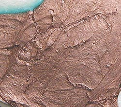

## Les métaux (pigments)
### Les métaux comme pigments, usage en arts plastiques
 **Les métaux (pigments)**  

_On prend ici le mot "métaux" dans son acception courante  
qui concerne des matières, des éléments d'un aspect généralement brillant.  
Cependant, plus strictement parlant les métaux constituent rien moins que la  
majorité des éléments existants ([cf. table de Mendeleïev](annexe1.html)).  
Beaucoup sont absolument mats ou pour d'autres raisons ne correspondent  
pas à notre concept commun de "l'aspect métallique".  
Des pigments contenant des métaux (stricto sensu) n'ont pas  
nécessairement un tel aspect.  
Voir [Le métal.](metal.html)_

_Toute occasion d'employer une véritable poudre métallique devrait être saisie._

**L'oxydation**

_En échange d'un aspect généralement splendide, certains métaux sont très sensibles aux problèmes d'oxydation, accentués par toute humidité ou acidité de l'environnement. A l'inverse, l'or, l'aluminium et le chrome sont stables._

Les problèmes liés à l'oxydation concernent surtout le cuivre, le bronze, le fer et l'étain (concernant les métaux moins oxydables, lire l'introduction de l'article _[Les métaux comme support](metaux.html)_). Nous avons cependant constaté que les peintures grasse (huiles, cires) ainsi que quelques rares liants synthétiques aqueux et la [gomme laque](gommelaque.html), parviennent à figer littéralement cette réaction. Ils isolent physiquement les métaux de l'air ambiant et de l'humidité que celui-ci contient.

L'emploi des mêmes métaux en peinture aquarellée ou gouachée n'est pas forcément à conseiller - du moins pas sans quelques réserves - : ces liants-là n'enrobent qu'insuffisamment les poudres, exposant ces métaux oxydables à l'atmosphère ambiante, sans parler des risques d'oxydation intempestive _pendant la durée du séchage_.

Cependant, les phénomènes d'oxydation peuvent être exploités à bon escient. Dans le domaine de la sculpture, le métier des patineurs consiste précisément à les provoquer.

Certains fabricants mettent à disposition des artistes, à cette fin, certains pigments aisément oxydables comme la poudre de fonte ou de fer (notamment la [limaille](limaille.html) et les [battitures](battitures.html)), par exemple.

**Le broyage**

Les fabricants d'imitations sous forme de peintures en tubes ou en pots proposent quelquefois différentes finesses de broyage. C'est un point important : les "matières" obtenues peuvent offrir des aspects très différents à partir d'une même base chimique. Certains produits sont vraiment réussis.

Les fabricants de poudres métalliques "brutes" ne proposent généralement qu'une seule qualité de broyage : la plus fine, mais il est possible de se procurer [limailles](limaille.html) et [battitures](battitures.html) chez certains professionnels des métaux.

Enfin les imitation micacées, elles, ne gagnent pas forcément à être broyées. Ces pigments ont des structures fines. [Voir _Les pigments interférentiels_.](interferentielspigments.html)

**Décliner les teintes métalliques comme des couleurs**

Il existe différents types de métaux utilisés en tant que tels en arts plastiques (en fait il en existe beaucoup d'autres, mais qui ne sont pas utilisés pour obtenir un aspect "métallique") :

> \* les jaunes (or, bronze, laiton)
> 
> \* les rouges (cuivre)
> 
> \* les blancs et les gris (aluminium, acier, fer, étain)
> 
> \* les métaux oxydés. Verts, bleus, jaunes, rouges ou noirs, ils s'apparentent aux pigments habituels et altèrent radicalement l'aspect brillant des métaux non oxydés.

Il est possible de combiner ces tendances chromatiques. Il est aisé de transformer un or trop jaune en "or blanc" avec un peu d'aluminium par exemple. De même, un métal blanc gagne beaucoup de mystère à se voir teinté d'une légère nuance jaune ou rouge. Les déclinaisons de couleurs proposées par les fabricants de peintures en tubes ou en pots sont parfois assez détaillées, trop détaillées même par rapport à ce que l'on peut obtenir en mélange à l'aide de trois ou quatre couleurs métalliques de base.

Dans le cas des pigments, il peut s'avérer nécessaire de s'assurer préalablement de la stabilité en mélange de tous les composants et du traitement éventuel à mettre en oeuvre pour chacun d'entre eux, particulièrement en peinture à l'eau. Par exemple, certaines poudres cuivrées s'oxydent très rapidement au contact de l'eau (voir photo ci-contre, zone bleue en haut à gauche) mais réagissent bien en présence d'huile. Par contre, des éléments comme l'or et l'aluminium ne posent aucun problème, étant beaucoup moins oxydables et réactifs que le cuivre.

**Charges métalliques destinées aux résines**

Ce sont aussi des poudres pigmentaires.

Leur aspect est généralement peu engageant, mais après coulage il est transfiguré.

Ces charges ne sont guère faciles d'emploi en peinture.

 [Communication](http://www.artrealite.com/annonceurs.htm) 

