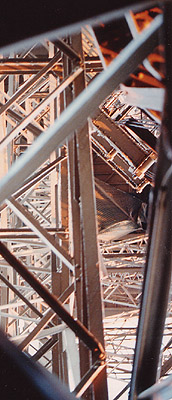

## Les métaux (supports)
### Les métaux comme supports, usage en arts plastiques
 **Les métaux (supports)**  

_Tous les métaux peuvent être oxydés et leurs oxydes sont des composés alcalins, c'est dans la définition même du [métal](metal.html). Cependant, certains métaux s'oxydent beaucoup moins facilement que d'autres._

_L'or et l'aluminium sont dans ce cas. Ils sont fort stables et se travaillent facilement (découpe, déformation). L'aluminium a un avantage supplémentaire évident : il est très bon marché. Il est utilisé comme support par quelques peintres (remarque : l'or a aussi été employé comme support). Bien qu'il soit très stable, il est indispensable de l'enduire (voir [Enduction](metaux.html#enductiondesmetauxpourlapeinture), ci-dessous). Citons aussi le chrome, si peu oxydable dans des conditions normales qu'il est utilisé dans la fabrication de l'acier... inoxydable._

_Mais même les métaux oxydables peuvent être utilisés._

Sommaire

[Persistance du plomb](metaux.html#persistanceduplomb)

[Émaux](metaux.html#emaux)

[Enduction des métaux pour la peinture - exemple de la Tour Eiffel](metaux.html#enductiondesmetauxpourlapeinture)

[Peintures capables d'adhérer directement sur les métaux](metaux.html#peinturescapablesdadhererdirectementsurlesmetaux)

_Parmi eux, les métaux ferreux comptent parmi les plus oxydables, mais ne doivent pas être systématiquement boudés (voir ci-dessous [Exemple de la Tour Eiffel](metaux.html#enductiondesmetauxpourlapeinture)). D'autres, particulièrement ceux dont la base est le cuivre (bronze, laiton, cuivre pur), ont été traditionnellement utilisés tels quels comme supports pour la peinture à l'huile, ce qui n'est pas conseillé car certains pigments sont des oxydants. Enduire le support est toujours souhaitable._

_Qu'ils soient en plaques, en feuilles ou sous d'autres formes, il est important de noter que **les métaux ferreux ou non ferreux semblent s'accommoder assez bien dans l'ensemble des enduits à base d'huiles à peindre.** Cependant, certains enduits contemporains semblent présenter des caractéristiques protectrices peut-être un peu plus complètes et surtout plus adaptées aux différentes catégories de métaux._ _C'est souvent chez des fournisseurs de métaux ou de matériel BTP que peintres et plasticiens trouveront ces produits._

Recherche de l'oxydation

Les plasticiens peuvent préférer des métaux facilement oxydables et provoquent parfois l'oxydation à l'instar des patineurs en sculpture. Il n'est cependant pas facile de contrôler le processus, ce qui explique d'ailleurs que les bons patineurs sont très recherchés.

Prenons un exemple : le fer. Oxydée, sa surface devient pulvérulente et vire au jaune, au rouge, au brun. Elle décline les chromatismes éternels des ocres, c'est à dire des oxydes de fer ("[terres de Mars](oxydesdefer.html)"). Un premier problème se pose : comment interrompre le processus ou comment prévoir l'évolution chromatique de l'oxydation ? Toute suite après, une seconde difficulté apparaît : cette rouille n'est rien d'autre que du pigment brut, alors comment la "lier" ou la "fixer" sans en altérer non seulement l'aspect, mais aussi la teinte (lire l'article [Les pigments, les couleurs](pigments.html)) ?

C'est en fait impossible. Il faut recourir à des solutions qui sembleront très imparfaites ou bien adopter une autre philosophie _en considérant dès le début que le résultat final ne ressemblera pas à la seule oeuvre de la nature. Dans cette perspective, le plasticien sait au commencement du travail que la rouille lui servira de pigment._

Il y a aussi le point de vue selon lequel c'est l'éphémère qui est recherché. Pas de vernis, pas de liant, pas de fixation de l'oxydation : la nature continuera son oeuvre.

Persistance du plomb

**L'alliage plomb + antimoine + étain** est encore assez couramment utilisé pour réaliser certains travaux combinant sculpture et peinture. Il est en effet malléable à basse température. **Cette substance est dangereuse.** Elle doit être entièrement enduite le plus rapidement possible et les objets réalisés - généralement de petite taille à cause du poids - doivent être tenus hors de portée des enfants et des animaux.

Émaux

Les émaux sont des substances très particulières qui intéressent le domaine des métaux en tant que supports : il s'agit de sortes de verres pouvant parfaitement être appliqué sur support métallique. Ils sont l'objet d'un [article spécifique](email.html).

Enduction des métaux pour la peinture - exemple de la Tour Eiffel

L'enduit polyuréthane et les primaires d'accrochage contemporains pour métaux en général, autorisant toutes les peintures semblent supplanter progressivement le [minium](minium.html), produit dangereux interdit de vente aux détaillants mais pas aux grossistes.

Mentionnons la [gomme laque de Coromandel](gommelaque.html#presentationdelalaquedecoromandel) comme excellent enduit naturel, assez peu coûteux, pour métaux ferreux ou non-ferreux.

> \>>> Produit encore plus banal, [l'huile de lin](huiledelin.html) fortement diluée dans la térébenthine a fait ses preuves. Elle a constitué un apprêt valable pour le fer puddlé qui constitue... la Tour Eiffel ! La couche suivante était plus grasse, garnie de siccatifs et de pigments minéraux dont l'ocre jaune et certains éléments siliceux. Ces deux couches d'apprêt particulièrement bien étudiées sont encore de nos jours, après un siècle d'exposition à l'air libre, en très bon état.

Peintures capables d'adhérer directement sur les métaux

On a cité dans l'introduction les peintures à l'huile directement appliquées sur des métaux cuivrés, mais ce procédé traditionnel n'est pas un cas unique.

Certaines peintures destinées à la décoration intérieure et aux BTP sont des sortes de patines métalliques (ors, argents, étains, etc.) à la chimie complexe, autorisant aussi la peinture sur verre.

Des produits de type "loisirs créatifs", destinés théoriquement à la peinture sur verre permettent également de travailler sur des métaux. Certains doivent être cuits au four alimentaire.

Les petits pots de peinture pour les maquettes, distribués par les marchands de jouets, adhèrent également à différents métaux.

_Nous conseillons à nos visiteurs de se reporter aux documentations des fabricants en cas de doute sur l'adhérence d'un produit sur un métal spécifique._

> _Il est préférable de toute manière de ne pas appliquer directement une peinture sur son support pour obtenir un résultat durable. L'enduction est une opération pratiquement inévitable sauf si l'on recherche une oxydation._

 [Communication](http://www.artrealite.com/annonceurs.htm) 

