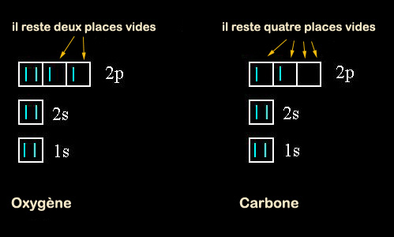
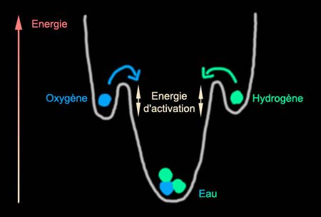

## Les orbitales - Les dialogues de Dotapea - Chapitre II
### Les orbitales et certaines tendances de la matière - Les dialogues de Dotapea - Chapitre II
 Navig. page/section

  
  

\_\_\_\_\_

**Pages soeurs**

[I, A propos des liants](chap01liants.html)  
[II, Bulles, siccativ., struct. élec.](chap02bullessiccativation.html)  
[III, Caséine, phosphore, dissociation](chap03caseine.html)  
IV, Les orbitales  
[V, L'aérogel](chap05aerogel.html)  
[VI, Polarisation de la lumière](chap06polaris.html)  
[VII, Sfumato et diffusion Rayleigh](chap07rayleigh.html)  
[VIII, Les interférentielles](chap08interferences.html)  
[IX, Dextrine, farine et chiralité](chap09dextrine.html)  
[X, L'ocre bleue](chap10ocrebleue.html)  
[XI, Les métamatériaux](chap11metamateriaux.html)  
[XII, Le jaunissement](chap12jaunissement.html)  
[XIII, Laser etc.](chap13laser.html)  
[XIV, L'holographie](chap14holographie.html)  
[XV, L'holographie numérique](chap15holographienum.html)  
[XVI, Extérieur, intérieur, chaux](chap16interieurexterieurchaux.html)  
[XVII, L'électrolyse et les ions](chap17electrolyseions.html)  
[XVIII, L'électricité, un peu plus loin](chap18electriciteplusloin.html)  
[XIX, Oxydation, métaux](chap19oxydationsmetaux.html)  
[XX, Les échelles](chap20echelles.html)  
[XXI, Nature et évolution des résines](chap21resines.html)  
[XXII, Le mouillage pigmentaire](chap22mouillage.html)  
[XXIII, La molette](chap23molette.html)  
[XXIV, Blanche neige](chap24blancheneige.html)  
[XXV, Lumière et matière](chap25lumiereetmatiere.html)  
[XXVI, Magnétisme](chap26magnetisme.html)  
[XXVII, Ambre et vieilles branches](chap27ambre.html)  
[XXVIII, L'origami miroir](chap28origamimiroir.html)  
[XXIX, Le feu](chap29feu.html)  
[XXX, Peau du métal](chap30peaudumetal.html)  
[XXXI, La ville en un souffle](chap31bellastock.html)  
[XXXII, Oxyder des matériaux](chap32oxydermateriaux.html)  
[XXXIII, Ocre bleue, une solution](chap33ocrebleuesimulation.html)

\_\_\_\_\_

Copyright © www.dotapea.com

Tous droits réservés.  
[Précisions cliquer ici](droitscopie.html)

**Les dialogues sur la physique-chimie  
appliquée aux arts**

**Chapitre IV**

**Les orbitales  
et certaines tendances de la matière**

dial   dial   dial

Ce chapitre IV des [Dialogues de Dotapea](dialoguesdotapea.html) est une discussion entre Jean-Louis, physico-chimiste au CNRS, et un candide, Emmanuel.

Les personnages sont réels, la discussion aussi. Elle peut reprendre à tout moment et ce texte peut s'allonger.

La question de la structure électronique a été introduite dans [un passage du chapitre II](chap02bullessiccativation.html#structelec).

Emmanuel : Nous avons abordé superficiellement la question essentielle de la structure électronique, sans laquelle il est difficile de comprendre ce qui peut se passer en chimie. Peux-tu donner des éléments de base pour commencer, avant d'aller un peu plus loin ?

Jean-Louis : Les alchimistes, déjà, avaient ébauché une tentative de classification des éléments en fonction de leurs propriétés physiques ou chimiques, certes souvent folklorique.

Le chimiste russe [Mendeleïev](mendeleiev.html) a publié en 1872 une classification, appelée depuis "table périodique" ou "[table de Mendeleïev](annexe1.html)". Cette classification, basée elle aussi sur des similitudes de propriétés physico-chimiques a reçu plus tard la justification formelle de ses fondements lorsque la structure de la matière a été élucidée.

La matière qui nous entoure résulte de l'assemblage d'unités élémentaires appelées atomes, eux-mêmes faits de particules appelées protons, neutrons et électrons. Les protons et les neutrons forment le noyau atomique, les électrons tournent autour, schématiquement. Les neutrons, particules neutres, servent à maintenir les protons dans le noyau.

...et le nombre de protons, normalement égal à celui des électrons, s'appelle le numéro atomique. C'est ce nombre qui fait qu'un élément donné "est ce qu'il est" et pas autre chose.

L'atome d'azote a pour numéro atomique 7. Avec 6 ce n'est plus de l'azote mais du carbone, avec 8 c'est de l'oxygène.

Pour un élément donné, le nombre de neutrons peut éventuellement varier. L'azote "ordinaire" possède sept neutrons, il existe aussi de l'azote avec huit neutrons qui possède exactement les même propriétés chimiques. C'est un [isotope](ion.html#isotopeinion) de l'azote. (du grec _iso-topein_, "la même place", parce que cet azote à quinze nucléons occupe la même place que l'azote dans le tableau périodique. Normal  : c'est de l'azote!)

\[Lire à ce sujet l'article _[La transmutation](transmutation.html)_\]

Emmanuel : D'accord. Venons-en aux couches électroniques.  
 

Jean-Louis : Le nombre de protons (et donc d'électrons) conditionne non seulement la nature de l'atome mais aussi (voire, avant tout ?) ses propriétés chimiques. _Les électrons ne sont pas comme des mouches autour d'un pot de confiture mais astreints à certaines orbites précises appelées "orbitales atomiques" ou orbitales._ Quand on progresse dans le tableau périodique en partant de l'hydrogène (un proton, un électron) les orbitales atomiques se remplissent progressivement. Ce remplissage se fait suivant des lois qui échappent un peu à notre entendement de créatures non-quantiques, mais qui sont bien décrites.

Les orbitales électroniques s'appellent 1s, 2s, 2p, 3s, 3p, 3d, etc....  
Les "s" contiennent deux électrons maxi, les "p" six, les "d" dix.

**Ipséité d'un [élément](element.html)**

Au finale, certaines configurations électroniques sont plus stables que d'autres et cette stabilité accrue fera que les réactions chimiques entre les éléments simples vont dans certaines directions et pas d'autres. Pour prendre une image, en montagne les pierres ont plus tendance à rouler vers la vallée qu'à partir vers les sommets.

Parmi les configurations électroniques particulièrement stables sont :

> \* les orbitales vides,
> 
> \* à moitié pleines
> 
> \* et surtout totalement pleines.

Quand on a fini de remplir une orbitale, on passe à l'orbitale suivante.

**Orbitales et stabilité**

C'est ce qui entraîne la périodicité des propriétés physico-chimiques des éléments : les états du genre "un seul électron dans la dernière orbitale" reviennent périodiquement. Ce sont les éléments de la [première colonne](annexe1.html#tableau) du tableau des éléments : lithium, sodium, potassium, rubidium,... ou "[métaux alcalins](alcalin.html#metauxalcalins)".

Ces éléments ont une forte tendance à se débarrasser de cet électron qui les éloigne de la configuration très stable "couche pleine", ils apparaissent donc souvent sous la forme ionique Li+, Na+, K+, etc. De l'autre côté du tableau, les éléments (dernière colonne, gaz rares : He, Ne, Ar, Kr, Xe, Rn) ont déjà bien rempli leur dernière couche, il ne leur manque que quelques électrons supplémentaires. Ces corps vont avoir tendance à en chercher d'autres.

Cette recherche peut avoir plusieurs issues.

**Les tendances atomiques fondamentales**

Prenons l'exemple de [l'oxygène](oxygene.html), à qui il manque deux électrons pour que sa dernière orbitale, qui peut en contenir six, soit pleine. Il pourra par exemple chercher un élément prêt à lui prêter deux électrons ou chercher deux éléments qui pourraient en prêter chacun un.

Premier cas : l'oxygène peut, un peu paradoxalement, s'associer avec un autre atome d'oxygène, et mettre une partie de ses électrons en commun avec lui \[[explications et schémas in Chap. II](chap02bullessiccativation.html#o2)\].

Le même oxygène peut aussi s'associer avec le calcium, qui a plutôt deux électrons "en trop" pour former CaO (la [chaux](chaux.html)), ainsi chacun est content.

Deuxième cas, l'oxygène s'associe avec deux atomes d'hydrogène pour former H2O, l'eau.

Entre les deux, si l'on peut dire, notre oxygène peut chercher l'âme soeur de différentes façons avec différents éléments qui ont eux aussi des électrons à partager ou à perdre. Je dis perdre, c'est une image, ils ne peuvent jamais aller très loin de leur noyau. Toute cette discussion est de toutes façons un peu caricaturale mais elle décrit globalement ce qui se passe.

 

**Exemple de l'oxygène**

Les chimistes traduisent parfois ces notions en termes de "[valence](valence.html)". La valence étant schématiquement la quantité de "liens" qu'un atome cherche à établir avec d'autres atomes. Oxygène 2, carbone 4, hydrogène 1, chlore 1, sodium 1... (je ne parle même pas des exceptions, elles sont légion !).

Sur cette base on comprend la formation de molécules comme CO2 (gaz carbonique), HCl (acide chlorhydrique), NaOH (soude caustique). Pour finir, mentionnons que bien entendu, les molécules ainsi formées sont plus stables que les produits de départ : la formation d'eau à partir d'hydrogène et d'oxygène libère beaucoup d'énergie, et que les éléments dont les couches sont "naturellement" pleines sont très peu réactifs chimiquement, voire pas du tout, ce sont les gaz rares.

**Valence et stabilité des associations moléculaires**

L'idée qu'il faut comprendre c'est qu'une réaction quelle qu'elle soit ne se fera que si elle apporte un gain sur le plan énergétique. Les réactions chimiques vont généralement dans le sens qui minimise l'énergie totale.

Une molécule d'oxygène O2 possède une certaine énergie de liaison ([voir passage _in_ Chap. II](chap02bullessiccativation.html#o2)), c'est le travail qu'il a fallu fournir pour assembler les deux atomes. Pareil pour une molécule d'hydrogène. Si on met ces deux molécules ensemble, il ne se passe rien, elles sont stables à température ambiante. Mais si on apporte "un peu" d'énergie (énergie dite "d'activation") avec une allumette ou même simplement un catalyseur (mousse de platine, en l'occurrence), les deux molécules réagissent vigoureusement (au mieux ça brûle, au pire ça explose) pour donner de l'eau. L'énergie libérée par cette explosion/combustion fait que la molécule d'eau finale possède très peu d'énergie, elle est donc très stable.

Voici le dessin traditionnel des physiciens pour représenter les niveaux d'énergie. Le système est assujetti à rester sur la courbe, il peut monter et descendre par exemple si on le chauffe ou si on le refroidit. Les "creux" sont des points d'équilibre stable. Le système peut donc rester en équilibre à mi-pente tant que l'on ne le "secoue" pas trop (tant que l'on reste en deçà de l'énergie d'activation nécessaire). Un exemple typique est celui des explosifs qui possèdent une forte énergie interne mais sont dans un état marginalement stable.  
 

Le fait qu'une grande quantité d'énergie soit libérée lors de la réaction est signe que le produit final est particulièrement stable. Pour [fabriquer du plâtre](platreliant.html#compositionfabrication) il faut chauffer du gypse pendant longtemps à haute température. Le plâtre obtenu est "instable" en ce qu'il ne demande qu'à  
réagir avec de l'eau. Lors de la prise, le plâtre chauffe parce que de l'énergie est libérée (plus ou moins celle que l'on a fourni lors de la fabrication du plâtre). Le plâtre pris est stable et inerte, il ne réagit plus. C'est pareil dans l'exemple de l'eau.

**L'énergie :**

**ce qu'il faut pour associer, ce qu'il faut pour dissocier...**

**et pour quelle stabilité ?**

Emmanuel : Sur l'énergie de liaison que tu évoques quelquefois, pourrais-tu donner quelques compléments d'information ? On comprend que c'est elle qui peut lier les atomes, mais on comprend mal quelle est sa nature, même si on sent qu'elle a quelque chose à voir très directement avec la question de la structure électronique et surtout avec le nombre d'électrons engagés. Au-delà, l'énergie nécessaire pour dissocier les éléments d'une molécule est-elle seulement liée à une quantité d'électrons communs impliqués ou faut-il voir autre chose ?  
 

Jean-Louis : Non, c'est globalement ça. Conceptuellement, tu peux voir cela comme un ressort maintenu comprimé par une ficelle. Il possède de l'énergie "interne" qui est libérée si on coupe la ficelle. Un diable dans sa boite..

 

**L'énergie de liaison**

[La suite : chapitre V](chap05aerogel.html)

 

 [Communication](http://www.artrealite.com/annonceurs.htm) 

