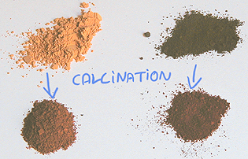
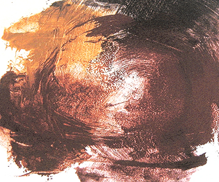
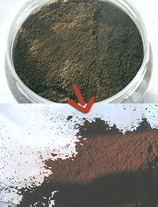

## Les oxydes de fers, famille de pigments
### Les oxydes de fer, famille de pigments, usage en arts plastique, transformation par calcination
 **Les oxydes de fer**  Très présent dans la nature, le fer, en association avec l'oxygène et quelques autres atomes, colore les argiles, les marbres et de nombreux autres minéraux. Le fer à l'état pur est rare sur terre à l'état naturel étant donné qu'en deçà de sa température de fusion - 1535°C - _il s'associe toujours à d'autres éléments_. Cette très forte température n'est pas atteinte lors de la cuisson des argiles ferreuses (maximum de l'ordre de 1200°C).

La densité du fer est de 7,88. Voir aussi [table de Mendeleiev](annexe1.html#fe).

_Variation par calcination_

La calcination des oxydes jaunes donne les oxydes rouges. L'opération, très simple, peut être réalisée en dix à vingt minutes à l'aide d'une casserole et d'un réchaud de n'importe quel type, à feu modéré, en remuant bien le pigment à l'aide d'une cuiller en bois. C'est sans danger. Ce procédé est très bien connu  : il date du paléolithique moyen.

L'oxyde de fer brun peut également être calciné, ce qui démontre qu'il contient également de l'eau. Il donne alors une sorte de rouge plus intense que l'ocre rouge. La terre d'ombre et la terre de Sienne, qui sont mêlées de [manganèse](annexe1.html#mn) peuvent aussi être brûlées.

La [photo ci-dessus](oxydesdefer.html#photopigments) montre dans la moitié gauche une ocre jaune calcinée donnant une variété rouge, à base Fe2O3, au-dessous du même pigment non calciné. A droite, un oxyde de fer brun (en haut) et le même oxyde de fer brun calciné (un peu rougeâtre, en bas). L'image ci-dessous montre, sur une palette, ces mêmes pigments agglutinés dans l'huile de lin. La répartition des pigments (haut, bas, gauche, droite) est la même. En bas à droite, l'oxyde de fer brun calciné correspond au ["violet" de mars](violetsetmauves.html#levioletdemars).

Sur [l'image ci-dessous](oxydesdefer.html#photopigmentslies), on simplement broyé les mêmes pigments avec de l'huile et donné quelques coups de spatule afin de montrer l'étonnante gamme de couleurs obtenue. On remarque que lorsque le pigment brun est calciné, le "violet" obtenu est plus clair.

Ce type d'expériences permet de constater à quel point il est facile de transformer une Sienne naturelle en Sienne brûlée, une ocre jaune en ocre rouge, une ombre naturelle en ombre brûlée (voir [photo ci-dessous](oxydesdefer.html#calcinationombres)), etc. Ces opérations ont vraisemblablement été pratiquées dès l'aube de l'humanité car elles ne nécessitent pas une température de cuisson très élevée. Elles constitueraient même selon certains la première opération de transformation chimique effectuée par l'être humain.

Chimiquement parlant, il y a changement du type d'oxydation lors de la calcination. Par l'action de la chaleur, la molécule d'oxyde ferrique (de [valence](valence.html) 3) perd une molécule H2O et se combine autrement car comme on l'a dit, à l'état naturel, le fer préfère toujours vivre en association.

**La synthèse d'oxydes de fer _bruns_ ou _noirs_ à partir d'autres variétés d'oxydes de fer nécessite des procédés que nous ne connaissons pas (**[toute information à ce sujet est bienvenue](ecrire.html)**).**

_Les terres de Mars_

Au Royaume Uni, en Cornouaille, la "terre de roche", minerai de fer, a été exploitée et transformée de toutes les manières possibles au XIXème siècle. Les "terres de Mars" d'aujourd'hui sont produites substantiellement de la même manière (voir photo d'un [jaune de Mars ci-dessous](oxydesdefer.html#oxydejaune)). De toutes manières, ces procédés ne sont, globalement, que la synthèse ou le rassemblement de pratiques millénaires - ce qui n'enlève rien au mérite des ingénieurs modernes.

Ce serait en tout cas à partir de cette époque que l'appellation "martienne" des oxydes de fer se serait répandue, surtout dans le monde anglo-saxon. Il n'est pas exceptionnel qu'un fabricant américain d'acrylique [fine](gammes.html) (gamme de couleurs restreinte) fasse une impasse sur l'ocre rouge, lui préférant un rouge de Mars.

Les terres de Mars, soit donc les oxydes de fer, sont bien plus [colorants](pigments.html#2facteurcolorant) que les ocres. Afin de les rendre utilisables, les fabricants de tubes recourent à des [charges incolores](chargesincolores.html) comme [l'alumine](alumine.html).

Variétés courantes :

> \* jaune
> 
> \* orangé (mélange d'oxyde jaune et d'oxyde rouge)
> 
> \* rouge

Lecture conseillée : [Le rouge de mars sur Pourpre.com](http://pourpre.com/chroma/dico.php?typ=fiche&&ent=marsrouge)

> \* "violet"
> 
> \* brun (peu courant)
> 
> \* noir (très courant)

_Utilisation des pigments "de Mars"_

Comme nous venons de le dire, les oxydes de fer sont extrêmement [colorants](pigments.html#2facteurcolorant). On constate sur la photo ci-contre à quel point l'oxyde de fer jaune est intense, solaire, profondément plus "irradiant" que l'ocre. Les autres couleurs "de Mars" sont similaires à ce point de vue.

Pour travailler avec eux sous forme de pigments, il faut faire extrêmement attention aux quantités sous peine de saturer totalement la palette et le tableau. Il n'est pas rare qu'un peintre même précautionneux gâche un tableau à cause de ces couleurs !

Quelques conseils, donc :

> \* il vaut vraiment mieux utiliser le pigment pur, non en mélange. Un mélange gagne en l'occurrence à être réalisé par superposition de couches de [glacis](glacis.html) très légers
> 
> \* comme le font les fabricants, vous pouvez ajouter de petites quantités de [charges incolores](chargesincolores.html#lhydratedalumine) en veillant à ne pas fragiliser la pâte, surtout si le liant est oléagineux
> 
> \* pour tirer profit de l'extraordinaire caractère colorant des oxydes de fer, n'hésitez pas à utiliser des quantités massives de [médium](mediumsetvernis.html#lesmediums). C'est une autre raison de travailler en glacis
> 
> \* si vous souhaitez mélanger l'oxyde en pâte couvrante et non en glacis, utilisez de toutes petites quantités.

_L'hématite_

C'est le minerai de fer banal, ce qui ne l'empêche pas d'être parfois splendide. Il est rouge, violacé ou noir ([magnétite](magnetite.html)) et recèle souvent des inclusions de [limonite](limonite.html). Ce sont les anciens Grecs qui lui donnèrent un nom évoquant le sang.

L'être humain s'en est servi tel quel depuis la préhistoire, sous forme de blocs ou de poudre (roche broyée dès le paléolithique).

Géologiquement parlant, sa formation est associée à la présence d'eau, ce qui explique que certaines sondes spatiales atterrissent sur Mars en des régions où ce minerai est abondant, afin d'y détecter les vestiges d'une vie marine passée.

Lire [l'article du glossaire](hematite.html).

Lire absolument l'article consacré à la [sanguine](sanguine.html)

 [Communication](http://www.artrealite.com/annonceurs.htm) 

