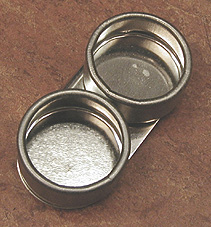
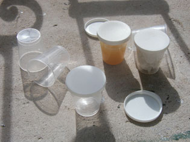

## Les palettes
### Les palettes utilisées en peinture
 **Les palettes**  La palette utilisée comme plaque à broyer

_La palette plate peut servir au "broyage", soit en fait au "liage" (mélange liant + pigment - voir_ [séparer ou non liants et pigments](separerounon.html)_). Le choix de la matière devient alors important car certains pigments d'usage courant rayent les surfaces les plus dures, sans parler de l'acier des spatules._

_La plaque de porphyre, bien séparée de la palette et tout à fait hors de prix, n'est pas forcément la meilleure solution. Un matériau peu coûteux, à changer régulièrement, comme le [mélaminé](melamine.html), est en fait plus adapté aux pigments d'aujourd'hui, déjà broyés fin, que l'on incorpore sans difficulté au liant avec un couteau à peindre._

1 - Palettes pour la peinture acrylique et la peinture à l'huile

Palettes classiques portables, bois ou papier

Ovales, rectangulaires, elles sont percées d'un trou où l'on glisse le pouce pour les tenir d'une seule main.

> \* Composées de bois pur de couleur brune ou vernies, elles modifient l'aspect chromatique des pâtes. En [mélaminé](melamine.html) blanc, elles présentent une luminosité et une neutralité chromatique supérieures. Elles sont aussi plus lisses, donc plus faciles à nettoyer, sans être glissantes.
> 
> \* Les transparentes (Plexiglas ®) posent le même problème que les palettes de bois : elles ne sont pas neutres chromatiquement parlant. Votre [jus](jus.html) outremer deviendra marron sous l'influence des ocres subtil de votre tomette, votre tapis, votre moquette, votre lino, votre parquet et aussi de vos chaussures.

Porter sa palette à la main n'est possible que si vous travaillez une matière très pâteuse, ne risquant pas de glisser et de se renverser, ce qui ne manque jamais d'advenir avec des peintures un peu liquides. Dès lors, il faut penser aux [palettes que l'on pose](palettes.html#palettesaposer) quelque part, bien à plat.

La palette de papier "[sulfurisé](s.html#sulfurise)" (disponible dans le commerce sous la forme de blocs) présente un intérêt certain : elle boit modérément l'huile sans que celle-ci transperce, avantage qui n'est pas sans intérêt pour les utilisateurs de peintures en tubes.

Certains peintres nous ont fait part de leur désappointement concernant l'emploi de palettes en papier _pour l'acrylique_  : l'eau est absorbée, la siccativation des pâtes est accélérée. Des enseignants proposent une solution apparemment efficace (sachant que tous les papiers dits sulfurisés ne se comportent pas de la même manière et ne posent pas forcément ce problème) : il s'agit de _glisser un tissus humide sous la feuille_ de papier-palette. Un professeur qui enseigne la peinture acrylique aux Arts Appliqués et en Sorbonne nous a tout récemment confié que "_le résultat est stupéfiant !!!_". Selon un biologiste, il pourrait être encore amélioré par l'emploi d'un produit que nous sommes en train d'identifier précisément. Enquête en cours.

Mentionnons enfin les accessoires pour palettes. Tous se fixent à l'aide d'une pince incorporée. Voir photo ci-contre. La quantité de liquide que l'on peut y verser peut paraître bien faible.

Palettes à poser

Trois catégories sont bien connues :

> \* la planche de [mélaminé](melamine.html) blanc. Il est aisé de s'en procurer au coin d'un boulevard, d'une route, sous la forme de pièces de meubles de cuisine ou d'étagères abandonnées. Elle ne coûte donc vraiment pas cher, ce qui autorise des surfaces de travail vraiment très confortables. A défaut elle peut être achetée coupée à façon. Ses qualités chromatiques sont excellentes.  
> Elle autorise le mélange direct liants + pigments sur la palette, elle résiste remarquablement à l'action de certains pigments ayant tendance à **rayer les surfaces** au broyage (ocre jaune, oxyde de fer jaune, jaune de mars, terre de Sienne naturelle), ce qui n'est pas le cas du verre ni du Plexiglas ®.
> 
> \* le miroir. On pourrait dire qu'il nécessite un plafond blanc ! De plus, il se raye facilement. Chic mais coûteux et peu pratique. Il est un peu trop lisse et il faut éventuellement le dépolir.
> 
> \* le verre. Un peu compliqué à préparer. En principe on doit d'abord peindre en blanc le verso (ou poser la plaque sur un support déjà blanc). Puis, il faut éventuellement dépolir l'avers avec du [carborundum ®](carborundum.html).
> 
> \* la palette de papier sulfurisé posée sur un coin de table.

Sauf dans le dernier cas, les palettes posées peuvent parfaitement servir à l'incorporation du pigment au liant (voir article [Séparer ou non liants et pigments](separerounon.html)). L'utilisation d'une molette et d'un récipient en verre ou d'une plaque de marbre ne sont pas particulièrement à recommander  : d'une part certains pigments contenant des oxydes de fer et quelques autres minéraux rayent les supports, d'autre part les pigments achetés dans le commerce, même en qualité "BTP", sont maintenant pré-broyés très, très finement. N'hésitez donc pas à incorporer liants et pigments sur une vaste palette en [Formica ®](formica.html) qui vous coûtera peu et que vous pourrez rayer à volonté !

La palette pliable

C'est une denrée rare, presque introuvable. Elle permet théoriquement de transporter et de stocker les pâtes même épaisses car elle ne se replie pas totalement.

Son défaut : elle ne peut empêcher les pâtes liquides de couler ou de goutter.

Conservation des pâtes sur toutes palettes

Le procédé consiste à confiner les pâtes à l'abri de l'air ambiant.

> \* Disposer une feuille d'aluminium alimentaire par-dessus la palette en veillant à ce que les pâtes ne rentrent pas en contact avec elle. Ne pas hésiter à poser des objets saillants de loin en loin entre les couleurs pour éviter ce contact par surélévation de la feuille. Un agencement même grossier donne des résultats appréciables.
> 
> \* Une méthode encore plus efficace consiste à disposer par-dessus chaque plot de couleur une assiette, une boîte, un verre en plastique retourné pour l'isoler de l'air ambiant.

2 - Petits pots en plastique

Ce sont des outils précieux pour qui veut conserver un mélange, une pâte. Voir photo ci-contre.

3 - Palettes pour l'aquarelle, la gouache, les peintures sans empâtement

Il s'agit de surfaces présentant des creusements susceptibles de retenir les pâtes liquides.

Elles ne sont pas toutes pourvue d'un trou pour le pouce, ce qui veut dire que certaines d'entre elles sont destinées à être posées et non tenues à la main. C'est en fait le cas de la majorité d'entre elles.

Quelques particularités permettent de les distinguer :

> \* la substance de la palette
> 
> > \* plastique. Elle ne se brise pas aisément, elle est légère et donc très facile à transporter.
> > 
> > \* porcelaine. De coût plus élevé, elle est facile à nettoyer, lourde (ce qui est un avantage pour qui travaille sur un coin de table), résistante, et par conséquent cassante. Cette particularité ne devrait pas la disqualifier pour autant : elle peut se conserver très, très longtemps.
> 
> \* la présence d'un couvercle destiné à une meilleure conservation.

 [Communication](http://www.artrealite.com/annonceurs.htm) 

