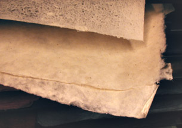
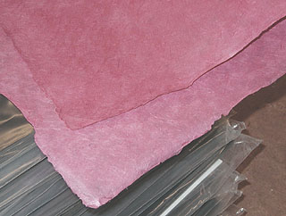

## Les papiers asiatiques
### Les papiers asiatiques, usage en arts plastiques
 **Les papiers asiatiques**  

Les papiers occidentaux sont souvent adjoints de gélatines ou d'autres colles (lire [Le papier et la colle _in_ Le papier](papier.html#lepapieretlacolle)), mais c'est moins systématiquement le cas en ce qui concerne les papiers asiatiques traditionnels. Cependant, les résines végétales employées jouent un rôle substitutif remarquablement efficace.

Les ingrédients de base des papiers asiatiques sont très nombreux. Toutes les parties végétales peuvent être employées. Mentionnons par exemple l'écorce de mûrier, d'emploi traditionnel au Laos. La plupart des substances utilisées sont assez fibreuses et résineuses pour ne pas rendre nécessaire l'adjonction d'une colle lors de leur fabrication.

Les papiers népalais (voir photos), correctement distribués en Occident, sont réputés pour leur beauté et leur solidité. Ils sont généralement produits avec du _lokta_, un chanvre de type _daphné canabina_. Différents chanvres ont été utilisés en Chine dans la fabrication des premiers papiers.

On trouve aussi certains mélanges dont les éléments constituants ne sont pas nécessairement traditionnels. Ce sont parfois des productions actuelles, des inventions plus ou moins récentes. On citera par exemple le [cristal](papier.html#papiercristal) froissé sur gaze, aux colorations diverses. Ce sont des créations originales qui démontrent, si c'était nécessaire, que les artistes, créateurs et ingénieurs de l'Est du continent ne se contente pas de se reposer sur un prestigieux passé.

Ces papiers, contemporains ou traditionnels, rencontrent d'ailleurs un succès certain à l'Ouest. On peut donc déplorer que l'importation de certains produits ne soit pas encore à la hauteur de la demande. Certains papiers très courants dans leur pays d'origine nécessitent en Europe un certain acharnement de la part des acheteurs... ainsi qu'un certain effort financier parfois. Manifestement, les filières d'importation ne sont pas encore très fluides, ce qui est regrettable pour tous.

 [Communication](http://www.artrealite.com/annonceurs.htm) 

