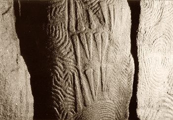

## Les pierres ignées
### Les roches ignées et leur usage en sculpture
 **Les roches ignées**

Une roche ignée est ou a été produite sous l'action du feu terrestre.

Ces pierres sont dures, ce qui n'a pas empêché l'être humain de les employer dans le cadre de réalisations artistiques monumentales dès le néolithique (photo : cairn de Gavrinis, Morbihan, France). _Leur résistance, leur permanence, leur insensibilité aux agressions de tous ordres sont extrêmes sans être totales sur une échelle de temps "géologique"._

Elles proviennent des profondeurs de notre planète et sont dites pour cette raison _endogènes_. On peut les opposer en cela aux matériaux issus de processus de surface ou océaniques (métamorphiques ou sédimentaires).

**Intrusives ou effusives, la durée du refroidissement fait la différence**

Commençons par celles que l'on dit _intrusives_ ou _plutoniques_. Elles se caractérisent formellement par un grain grossier (ex. : granite). Ces roches sont le résultat d'un refroidissement préalable sous la surface (milliers d'années), ce qui explique cet aspect grenu car la lenteur du processus permet la formation de [phénocristaux](phenocristal.html), alors qu'un refroidissement rapide donne un résultat tendant vers [l'amorphe](amorphe.html). Le granite et le gabbro notamment ont eu le temps de refroidir en profondeur avant d'être mis au jour par l'érosion ou le démantèlement des massifs montagneux auxquels ces roches sont associés au sein de poches appelées _plutons_.

\[aparté\]  
Lorsque deux plaques tectoniques s'affrontent, l'une d'elles peut passer sous l'autre. C'est le processus de subduction à l'origine d'une bonne partie des phénomènes volcaniques (tous sauf les rifts, où les plaques divergent). Dans la configuration montagneuse, l'affrontement des deux plaques est suffisamment équilibré pour que, restant à la même hauteur, elles se compriment, créant une zone dense aux abords de la surface. Cette masse qui soude littéralement les plaques ne permet pas aux chambres magmatiques situées au-dessous de trouver issue en surface par des cheminées volcaniques alors même que l'activité magmatique peut se poursuivre. Un pluton est donc en quelque sorte une chambre bouchée par le haut où le magma ne peut rien faire d'autre que refroidir lentement dans les profondeurs où il deviendra cristal.

A lire en complément pour une vision plus globale, un remarquable document synthétique complet de l'université de Laval à Québec :  
[Une théorie planétaire : la tectonique des plaques](http://www2.ggl.ulaval.ca/personnel/bourque/s1/tectonique.pl.html)

A l'inverse des roches plutoniques, les roches ignées _effusives_, qui reviennent en surface à la suite de phénomènes volcaniques, sont plus fines (basalte, obsidienne, ...). Leur réchauffement puis leur refroidissement soudain dans l'air ou dans l'eau ne permet pas la formation de cristaux.

Ainsi les compositions chimiques ne sont pas ce qui permet de distinguer roches effusives et intrusives, même si l'on doit noter que sur les très gros volumes rocheux (masses granitiques, masses basaltiques), il existerait une tendance à [l'acidité](rochesbasiquesacides.html) chez les intrusives et à l'alcalinité parmi les effusives, ce qui pourrait s'expliquer par une [différenciation magmatique](differenciatmagma.html) plus poussée dans les plutons car beaucoup plus longue (sous toute réserve, information non confirmée).

Quoi qu'il en soit, une chose certaine est que l'on trouve des roches chimiquement identiques dans les deux catégories. Citons pour exemple un minéral neutre, la [diorite](autrespierresign.html), roche plutonique grenue, et sa soeur jumelle effusive, l'andésite qui est, elle, [microlithique](microlithe.html). Ou bien le quartz et l'obsidienne. Encore une fois, seul le temps de refroidissement fait la différence.

 [Communication](http://www.artrealite.com/annonceurs.htm) 

