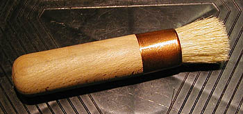

## Les pochoirs
### Les pochoirs, usage en arts plastiques
 **Le pochoir**  

_Le principe du pochoir (presque identique à celui de la [réserve](reserves.html)) date du paléolithique, mais le pochoir à proprement parler, florissant dès le tout début de l'Antiquité (Égypte, 5000 BC ?), a connu quelque peine à survivre à la période moderne - où il a connu de courtes flambées, notamment sous la forme du [stencil à ronéotyper](stencil.html), tombé en désuétude - sinon sous la forme d'une technique très proche, la [sérigraphie](serigraphie.html). Au-delà de ses applications utilitaires, il semble être revenu au goût du jour depuis quelques décennies._

La pièce servant à révéler la forme à peindre (le pochoir), en masquant ce qui ne doit pas être peint, est souvent découpée au cutter ou aux ciseaux dans une feuille de [Rhodoïd ®](rhodoid.html) (une [acétate](acetate.html) d'une épaisseur de 140µ par exemple). Celui-ci présente en effet les avantages d'être plus facile à découper, d'être transparent et de ne nécessiter aucune enduction, contrairement au carton utilisé dans le passé et que l'on devait apprêter avec de [l'huile de lin](huiledelin.html), généralement, ou de la [gomme laque](gommelaque.html). Les variétés "pré-dessinées" disponibles dans le commerce sont souvent métalliques, comme les pochoirs militaires ou industriels.

Il est possible, parmi une grande quantité de possibilités, d'utiliser

> \* séparément le liant - de l'huile de lin ou une [mixtion](mixtion.html) à dorer - et le pigment ou la poudre métallique. Le liant doit avoir séché quelque peu sans quoi il adhèrerait au pochoir. L'application peut être réalisée avec du [coton](coton.html) ou par projection (lire [_Projection séparée de liant et de pigment_ in _Les techniques de projection_](projection.html#projectiondepigment)).
> 
> \* une bombe, pour vaporiser la peinture en tirant parti éventuellement du relief du support. Lire _[La vaporisation.](vaporisation.html)_
> 
> 
> 
> \* [une brosse à pochoirs.](pincformes.html#lesbrossesapochoirs) Cet outil autorise une sorte de [moucheté](mouchete.html) intéressant. La peinture peut être de pratiquement n'importe quel type. Il faut cependant veiller à une harmonie entre le liant, le type de support et l'enduction.  
> La qualité de ces brosses est souvent misérable. Il est notamment courant que les [viroles](virole.html) soient très mal fixées. Une certaine circonspection s'impose lors de l'achat.

Le motif comporte souvent des pièces isolées qui sont maintenues dans l'ensemble grâce à ce que l'on nomme des "ponts". Ceux-ci sont très visibles dans le résultat final, sauf pour quelques techniques spécialement étudiées (utilisation de fils particulièrement fins, de trames fines très ajourées, etc.). L'aspect voyant des "ponts" classiques a été exploité largement dans les arts de la rue, mais il demeure nettement connoté militairement.

 [Communication](http://www.artrealite.com/annonceurs.htm) 

