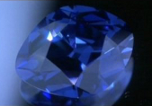

## Les polycycles carbonés
### Les polycycles carbonés, applications
 **Les polycycles carbonés  
(graphène, nanotubes, fullerène, diamants)**

Nous abordons ici sous un autre angle un type de métamatériaux en partie décrits dans [l'article "Les polycycles" du glossaire](polycyclique.html) qu'il est utile de lire en premier lieu.

Dans l'ensemble, ces matériaux ont été présentés et le sont toujours, par la presse, comme faisant partie des prochaines évolutions les plus prometteuses des nanosciences. Une attention particulière a été portée par un grand nombre de journalistes, de réalisateurs et d'auteurs à l'énumération de possibilités époustouflantes et révolutionnaires, sans doute par besoin d'un effet d'annonce ou simplement d'un engouement public. Malheureusement, après une première enquête il nous semble déjà évident qu'il faut aborder ce sujet avec circonspection si l'on veut rester dans des limites admissibles de crédibilité.

Mieux vaut prévenir que guérir, alors prévenons : en réalité, comme pour les initiations alchimiques (la pierre philosophale et les panacées notamment), le chemin parcouru pour étudier et comprendre la réalité physique vaudra sans doute davantage rétrospectivement que les résultats obtenus directement, qui risquent de nous paraître assez décevants comme nous allons le voir.

  
Graphène

  
Nanotube de carbone

  
Fullerène

Matériaux hautement [conducteurs](conductionelec.html) - au point que le vrai problème est parfois de les rendre moins conducteurs -, très légers et cent ou deux cents fois plus résistants que l'acier, ils ont évidemment fait rêver. Mais le temps passe et les problèmes demeurent, notamment en ce qui concerne les tailles encore lilliputiennes des composants produits et leurs coûts de fabrication, tandis que de nouveaux écueils apparaissent, concernant par exemple leur homogénéité ou celle des cultures d'éléments [semi-conducteurs](conductionelec.html) (on réfère ici au [graphane](conductionelec.html#graphane)). On rappellera ainsi, par exemple, afin de tempérer les ardeurs, que le prix d'un m2 de graphène était évalué à **600 milliards d'euros** en 2010 (source EcranFlexible.com).

Les nanotubes de carbone sont annoncés un peu partout comme seuls matériaux permettrant de réaliser des prouesses architecturales tels que la Méga-cité Shimizu ([lien vers recherche Google](https://www.google.fr/#fp=4225d9476c551251&q=shimizu+pyramide)) ou d'autres projets grandioses comme l'ascenseur spatial ([autre lien](https://www.google.fr/#q=ascenseur+spatial)). Et par chance, les nanotubes multifeuillets sont à la fois les plus solides et les moins coûteux (le gramme se compte en dizaines d'euros, en centaines ou en milliers pour les monofeuillets en 2013).

  
La Shimizu Pyramid ([lien](http://www.shimz.co.jp/english/theme/dream/try.html) vers le site de la Shimizu Corporation)  
fait partie de prospectives dites "arcologiques" ([lien recherche Google](https://www.google.fr/#fp=4225d9476c551251&q=arcologie))  
développées dès les années 1980.

Cependant, il existe des contraintes lors de leur assemblage. Les tubes sont souvent intégrés, "noyés" dans une fibre (à hauteur de 60% pour les plus denses, jusqu'à quelques pourcent dans le cas où l'on ne recherche pas un renforcement optimal, voire aucun renforcement) et leur disposition doit alors respecter le sens de la fibre. Sachant que chacun mesure de un à quelques dizaines de nanomètres de diamètre pour quelques centaines ou milliers de long, sachant également qu'un tel matériau, d'une dureté phénoménale, pourra difficilement être usiné, on comprend intuitivement qu'il ne s'agit pas de n'importe quel "tissage".

Les nanotubes multifeuillets ont été créés en 1991 (par Sumio Iijima, qui produisit également des monofeuillets deux ans plus tard) et pour autant il n'existe toujours pas de procédé simple et bon marché trouvant un véritable débouché en architecture et autres disciplines plastiques. Ils ont un prix et impliquent des contraintes n'autorisant pas un emploi massif dans ce domaine.

Comme champs d'applications pratiques, on citera la microscopie électronique ou la fabrication de raquettes de tennis un peu plus légères et solides que les modèles courants. Concernant le fullerène, la principale application actuellement envisagée concerne la mise au point de lubrifiants.

Le graphène, d'invention plus récente (2004, Andre Geim et Konstantin Novoselov, récompensés par le Nobel de physique 2010) a des propriétés plastiques intéressantes. Sa ténacité (c'est le terme consacré) est supérieure d'un facteur trois au moins à celle jusque là record du fil d'araignée. Un chat peut théoriquement faire sa sieste sur un hamac en graphène, presque invisible et plus que princier.

  
Kungl. Vetenskaps Akademien ©

Mais ce n'est pas ce qui déchaîne les passions. Avec le graphène, il est possible de réaliser un écran tactile d'épaisseur atomique, applicable sur différentes surfaces. Cela coûte horriblement cher mais nous savons le faire depuis quelques années. Le marché est important mais hors de portée malgré les différents procédés de fabrication développés.

L'utilisation comme matériau de stockage d'informations est tout autant freinée par cet obstacle mais aussi par des difficultés techniques de taille. On peut cependant associer graphène et [nanotubes semi-conducteurs](conductionelec.html#graphane) (ou autres composants) pour les contourner.

Les diamants synthétiques au bore (voir _[Le bleu de France](bleusfroids.html#bleudefrancediamant)_) posent le même type de problèmes d'assemblage nanométrique. Dans l'ensemble de ces disciplines, une certaine attention est portée sur les assemblages naturels, notamment dans des contextes intersidéraux ou géologiques car ces substances ne sont pas l'apanage de la main humaine. Dans des astéroïdes, dans des nébuleuses organiques, dans la croûte terrestre, de telles choses sont créées.

De même mais dans un matériau bien plus courant sur notre planète, le [graphite](graphite.html), on ne trouve rien d'autre que des feuilles de graphène superposées. Si les technologies à base de polycycles carbonés devaient trouver un essor notable, ce serait sans doute grâce à l'observation et la reproduction de phénomènes naturels. Et même si un tel essor n'advenait jamais, nous aurions au moins appris quelque chose de la nature. Du moins, espérons-le car observer et comprendre ne sont pas non plus choses faciles ni même, bien souvent, choses faisables.

Par ailleurs il existe quelques modestes applications artistiques et/ou architecturales qui pour ne pas être à la hauteur des rêves suscités par de nombreux organes de presse, ne doivent pas être traitées par le mépris. Ainsi un sculpteur, un plasticien, un architecte, doit selon nous s'intéresser aux nanotubes de carbones pour leurs propriétés solidifiantes (en gardant à l'esprit l'épineuse question du coût mais aussi celle, toujours pas clairement résolue, de la [nocivité](polycyclique.html#polycyclesnaturels)). Un infographiste peut prêter attention aux possibilités du graphène et ne perdra rien à se tenir informé.

 [Communication](http://www.artrealite.com/annonceurs.htm) 

