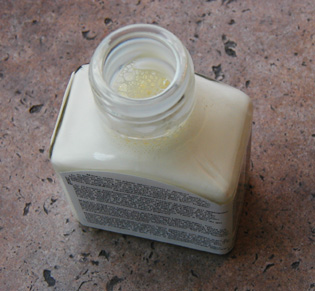

## Les réserves
### Les réserves, usage en arts plastiques
 **Les réserves**  

_Il s'agit d'un procédé finalement très important, utilisé dans plusieurs domaines des arts plastiques et des disciplines voisines (peinture, modelage, graphisme, gravure, infographie, émail au [champlevé](champlever.html), etc.). Il n'est guère éloigné du pochoir._

_LE PRINCIPE : Il s'agit de protéger, d'isoler temporairement une partie d'un support ou une couche peinte (ou imprimée, gravée, émaillée, etc.) des altérations causées par l'application ultérieure de peinture ou d'un autre produit (voir [eau-forte](e.html#eauforte))._

**Sommaire**

[Exemple type](reserves.html#exempletype)

[Problème du retrait des réserves](reserves.html#grandesreserves)

[Problème des réserves de grande dimension](reserves.html#grandesreserves)

**Exemple type**

Voici un exemple classique, facile à transposer à d'autres techniques.

_La plupart des aquarellistes évitent d'employer la peinture blanche. Ils se servent de la blancheur du papier et de la transparence de l'aquarelle._

_Or, ils aiment aussi imbiber leurs tableaux d'une peinture particulièrement dilué, très liquide (c'est dans la vocation de l'aquarelle)._

Comment faire pour conserver intacte la blancheur du papier dans les espaces destinés à rester blancs lorsque l'on souhaite couvrir de larges zones avec un gros pinceau ?

> \* _Les peintres appliquent avec un pinceau légèrement enduit de savon (protecteur), un produit nommé usuellement gomme à masquer, gomme liquide ou drawing gum (image ci-dessus) sur les emplacements à garder blancs ou intacts. Il s'agit d'une sorte de [latex](latex.html).  
> Le pinceau doit être lavé immédiatement après l'application car ce type de produits est très visqueux et alcalin._
> 
> \* _Une fois le produit sec, les "réserves" ne seront pas entachées par les couches ajoutées. **Une bonne gomme à masquer doit être assez voyante** afin que l'aquarelliste visualise d'un coup d'oeil l'emplacement des réserves._
> 
> \* _En fin de travail, la drawing gum est retirée avec une gomme normale - ou mieux : une [gomme crêpe](gommes.html#lagommecrepe) -, découvrant les blancs intacts._

Le principe du masquage peut être utilisé pour protéger des espaces blancs ou des zones déjà peintes à conserver intactes. Rien n'interdit non plus de recouvrir les zones réservées après élimination de la gomme. Ces deux possibilités garantissent à la technique du masquage une souplesse d'emploi qui lui fait conserver son succès et son actualité. Les [réserves à la cire](cirereserves.html) ([paraffine](paraffine.html)) ainsi que quelques autres posent par contre de tels problèmes de mise en oeuvre qu'elles sont aujourd'hui devenues des procédés marginaux.

Un défaut de la gomme à masquer est qu'elle est fortement [alcaline](alcali.html) (présence d'[ammoniaque](ammoniac.html) accompagnant le latex) et malgré le savon dont en enduit les pinceaux, ceux-ci peuvent être abîmés. Il est donc conseillé de ne pas employer de pinceaux fragiles et coûteux pour cette opération.

**Réserves diverses**

On utilise parfois des liquides huileux qui imbibent les supports : la [vaseline](vaseline.html), des huiles diverses, des graisses. Leur fluidité ne va pas sans poser quelques problèmes, tout comme leur retrait, à l'instar des réserves à la cire. Mais le retrait n'est pas toujours effectué et par ailleurs, ces produits présentent aussi quelques avantages. Ils peuvent le plus souvent être appliqués à la brosse, mais aussi avec un [coton](coton.html) ou un [chiffon](chiffon.html). De plus, ils peuvent être légèrement colorés et on tous leur caractère propre qui peut être mis à profit moyennant quelques tests préalables.

Certaines combinaisons de procédés permettent d'obtenir des effets. Exemple : [lire passage in Les réserve à la cire.](cirereserves.html#cirelatex)

Pour l'aérographe, c'est le Frisket ®, plastique adhésif transparent repositionnable assez coûteux, qui est employé, après découpage au ciseau ou au cutter, suivant la méthode du pochoir.

Le pochoir, venons-y, est souvent réalisé à l'aide de feuilles de [Rhodoïd ®](rhodoid.html) (acétates de 100 à 140µ) découpées et plaquées plus que collées.

Avec la peinture acrylique sans compresseur, certains utilisent aussi des rubans de papier adhésif incurvable (type ruban Tesa ®).

La sérigraphie rend nécessaire l'emploi d'[encres inactiniques](encresdiverses.html#lencreinactinique) qui jouent le rôle de masque lors du flashage.

La [gomme gutte](gommegutte.html) est employée en peinture sur soie pour faire barrière à la propagation des substances colorantes.

Enfin, la gravure à [l'eau-forte](e.html#eauforte) est une application remarquable du principe des réserves.

**Problème du retrait des réserves**

La gomme à masquer et le latex ne posent guère de problèmes à ce point de vue.

Par contre, les produits gras (paraffine - [lire _Les réserves à la cire_](cirereserves.html) -, vaseline, etc.) créent des difficultés :

> \* le plus souvent, leur retrait ne peut s'effectuer que par réchauffement (fer à repasser appliqué au dos du support appliqué sur un buvard, eau bouillante dans le cas du [batik](batik.html))
> 
> \* ils laissent fréquemment des tâches
> 
> \* ils peuvent réagir en présence de différents vernis et fixatifs, provoquant des catastrophes.

Le retrait n'est donc pas toujours réalisé. La réserve est parfois laissée telle quelle et le travail n'est ni verni ni fixé.

On note, dans le domaine de la peinture décorative, la possibilité de retirer la paraffine à l'aide de procédés mécaniques comme la ponceuse électrique. Leur efficacité peut cependant être mise en question.

**Réserves de grande dimension**

Ce sujet a été évoqué dans le Courrier des Lecteurs.

[Ici](courrierdeslecteurs2010c100.html#20100923cg) pour la piste latex et [là](courrierdeslecteurs2010c220.html#20101117ar) pour la piste Rubber Cement.

Voir aussi [Gommes](gommes.html).

 [Communication](http://www.artrealite.com/annonceurs.htm) 

