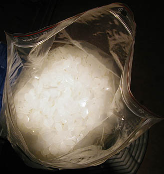

## Les réserves à la cire
### Les réserves à la cire, procété d'usage en arts plastiques
 **Les réserves à la cire**

_Ce procédé à base de cire minérale (ou d'autres corps gras) est un peu l'ancêtre de la "réserve" actuelle qui est effectuée avec de la_ drawing gum _([gomme à masquer](reserves.html#exempledrawinggum)). Le principe est le même : c'est celui de la réserve (lire [article](reserves.html))._

La cire est nettement moins commode à utiliser que la gomme à masquer, mais elle autorise certains rendus typiques.

Deux catégories de produits contenant de la cire peuvent être utilisées :

> \* les produits transparents comme la cire de bougie taillée ou moulée en biseau ou en pointe ou bien la [paraffine](paraffine.html) pure (voir photo) ;
> 
> \* les substances colorées comme les [pastels à la cire](pastelsalacire.html) et certaines encaustiques destinées à la décoration. On s'éloigne là de "la réserve" au sens strict pour se rapprocher des techniques mixtes.

L'important est que le produit repousse l'eau. _Il n'est pas forcément retiré en fin d'ouvrage_ ([lire passage in _Les réserves_](reserves.html#problemeduretraitdesreserves))_._ Mais le cas échéant, l'opération est délicate : il faut plaquer la surface picturale sur un papier absorbant et repasser au fer le verso de la feuille. La chaleur fait fondre la cire qui se dépose sur le papier absorbant.

L'un des intérêts plastiques de la réserve à la cire est qu'elle permet de mettre en valeur le grain du papier. Elle se prête aux grains torchons, aux papiers chiffons et autres variétés "de caractère".

Ces techniques peuvent être appliquées pour n'importe quelle peinture à l'eau non empâtée. Dans les faits, les utilisateurs sont surtout des aquarellistes. La réserve à la cire est quand même aussi utilisée dans certaines techniques traditionnelles comme le batik (peinture polonaise sur soie, sur oeuf).

Mentionnons aussi une pratique assez particulière employée en peinture décorative : l'effet de _peinture écaillée_ peut être obtenu par un complexe jeu de réserves à la cire et au _[latex](latex.html)_ combinées.

Pour terminer, évoquons une technique de teinturerie très particulière qui met largement en oeuvre les réserves à la cire : le [batik](batik.html).

