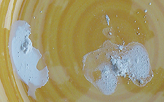

## Les sels, leur formation
### Les sels, leur formation, usage en arts plastiques
 **Les sels,  
leur formation**  > \* ils sont ininflammables
> 
> \* à l'échelle moléculaire, leurs deux principaux éléments constitutifs sont plus ou moins sécables selon les cas. A ce sujet lire _[Electronégativité, liaisons, liaisons polaires](electronega.html)_. Sur la solvatation voir un [passage](chap03caseine.html#mesuredissociations) in _Les dialogues de Dotapea, chap. III_ et un autre [passage](chap17electrolyseions.html#selsbarrieredeau) in _chap. XVIII_). Sur l'aspect ionique des sels, lire un [passage](chap19oxydationsmetaux.html) in _chap. XIX_.

Ils sont l'association de deux types de corps, groupes moléculaires ou atomes singuliers.

Un sel est la réunion d'un [anion](anion.html) et d'un [cation](cation.html). Les [non-métaux](nonmetaux.html) en présence [d'oxygène](oxygene.html), sont normalement anioniques, de charge négative, alors qu'en présence du même oxygène, les [métaux](metal.html) sont cationiques, positifs. Mais l'oxygène n'est pas nécessaire pour que l'échange électronique se maintienne (le couple qu'est le sel de table, NaCl, se maintient très bien tout seul).

Note : les sels [d'ammonium](ammonium.html) ("sels ammoniacaux") ont des propriétés légèrement différentes. Ils peuvent par exemple être inflammables et sont globalement plus instables et dégradables que les sels dont le cation est métallique.

Formation des sels

Typiquement, un sel se forme quand l'hydrogène d'un [acide](acides.html) est remplacé par un [métal alcalin](alcalin.html#metauxalcalins), un oxyde métallique ou par extension quelquefois, une autre [base](base.html) comme de [l'ammonium](ammonium.html), spécialiste des substitutions. De plus, les [non-métaux](nonmetaux.html) [halogènes](annexe1.html#halogene) (_hallos_ \= sel), forment facilement des sels - d'une autre catégorie - avec différents métaux. Exemple : NaCl, où Na est un métal alcalin, le sodium, et Cl un non-métal halogène, le chlore. D'autres non-métaux peuvent également former des sels, comme le sélénium qui s'associe notamment au palladium ou au cadmium ou bien encore le soufre ou le carbone, non-métaux non halogènes très communément associés à différents métaux.

On a donc, sans rentrer dans le détail

ACIDE   +   BASE   \=   SEL   +   _H2O_

(avec un alcool au lieu d'une base, on obtiendrait un ester)

ou

ACIDE   +   MÉTAL ALCALIN OU OXYDE MÉTALLIQUE OU AMMONIUM   \=   SEL   +   _H+_

ou

NON-MÉTAL  +   BASE   \=   SEL   +   _OH-_

ou

NON-MÉTAL   +   MÉTAL ALCALIN OU OXYDE MÉTALLIQUE OU AMMONIUM   \=   SEL

L'union entre deux éléments que constitue n'importe quel sel peut être plus ou moins "solide", ce qui signifie que certains sels peuvent être "cassés" plus aisément que d'autres.

Charge électrochimique d'un sel

Elle résulte de [la force ou de la faiblesse](chap03caseine.html#forcefaiblesse) de ses composants.

Lire [explications détaillées](chap03caseine.html#chargesels) _in Les dialogues de Dotapea, Chap. III, Caséine, phosphore et dissociation._

Sel en solution et dissociation

Lire [passage](chap03caseine.html#mesuredissociations) _in Les dialogues de Dotapea, Chap. III, Caséine, phosphore et dissociation._

Sels et arts plastiques

L'apparition fortuite d'un sel dans un travail pictural est évidemment catastrophique. C'est l'une des raisons pour lesquels une connaissance de la chimie des supports, des pâtes et des diluants (on pense en premier à la qualité de l'eau du robinet) qui sont mis en oeuvre est bien souvent essentielle. Cependant, il ne faudrait pas pour autant "redouter" les sels aveuglément : certains sont absolument indispensables et entrent dans la composition de peintures et d'autres substances. Le [carbonate d'ammonium](carboammonium.html), par exemple, rend encore bien des services aux amateurs [d'émulsions](liantsemulsions.html), de [cire saponifiée](cires.html#ciresaponifiee), etc., sans parler des innombrables pigments qui sont eux-mêmes des sels.

Par ailleurs, il ne faut pas sous-estimer les possibilités plastiques offertes par la formation contrôlée d'un sel.

Une démonstration

Pour donner une représentation concrète de ces propos, on a effectué une expérience dont les résultats apparaissent sur la photo ci-contre. A gauche, une chaux mise en présence d'eau distillée chimiquement neutre. A droite, la même chaux mise en présence [d'eau de Javel](ijk.html#javel) diluée (ce produit contient du chlore). Non seulement l'aspect est très différent, mais il faut signaler en plus

> \* que l'eau de Javel a immédiatement perdu toute odeur alors que le mélange était encore liquide
> 
> \* que cette odeur caractéristique n'est réapparue qu'au moment de nettoyer le support en le grattant, opération qui s'est avérée nécessaire car le mélange à la Javel était vraiment plus tenace que l'autre.

Un sel s'est donc bien formé très rapidement. L'aspect plastique, la résistance matérielle et la viscosité du mélange chloré sont nettement différents. Une transformation de la matière a eu lieu.

Bien entendu, le chlore est beaucoup moins concentré dans l'eau du robinet que dans l'eau de Javel, mais chacun saisira la tendance et agira en conséquence.

Les sels et la roche

On le sait : le sel marin, le sel de table peut aisément être mis en solution.  
Dans les roches de la surface de notre planète, pratiquement tous les sels pouvant être mis en solution l'ont été ! Et cela depuis des milliards d'années, sous l'effet de la pluie. Mises à part quelques poches intactes, la portion superficielle de la croûte terrestre a été débarrassée de ces associations qui se trouvent maintenant dans l'océan. Leur masse se chiffrerait en centaines de milliards de tonnes.

Voir _[Electronégativité, liaisons, liaisons polaires](electronega.html)_, [sels minéraux, sel acide](selsmineraux.html) et surtout [ester](ester.html).

 [Communication](http://www.artrealite.com/annonceurs.htm) 

