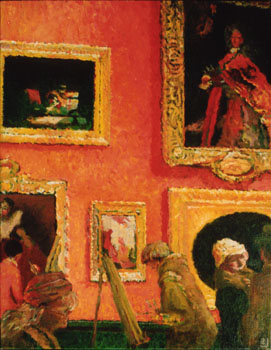

## Les techniques de m�langes de couleurs
### Les techniques de m�langes de couleurs, usage en arts plastiques et autres
 **Techniques de m�lange de couleurs**

_Le m�lange de couleurs �tait interdit dans le Moyen-�ge chr�tien. Ceci ne doit pas forc�ment surprendre le lecteur car diff�rentes civilisations ont pos� des interdits plus ou moins forts dans l'utilisation de la couleur (exemple�: la polychromie fut d�cri�e sous la dynastie Han en Chine). Si les peintres et miniaturistes ont quelquefois pu discr�tement transgresser la r�gle sans trop de difficult�s (ce qu'ils n'ont pas toujours voulu faire), les teinturiers durent attendre la Renaissance pour pratiquer la synth�se dans leurs cuves (m�me le m�lange pratiqu� en deux phases ne r�appar�t - tr�s progressivement - qu'� partir de cette �poque)._ 

_Les ateliers d'enluminure utilisaient en effet tous les pigments alors que dans les teintureries, les couleurs chaudes et les froides �taient trait�s dans des ateliers diff�rents. (� ce sujet et d'autres, [lire un tr�s int�ressant ouvrage d'Anne Varichon, voir R�f�rences](livres.html#annevarichon))_

Sommaire

[Travail alla prima](techmelangecouleurs.html#travailallaprima)

[Glacis](techmelangecouleurs.html#glacis)

[Blaireautage, fondu](techmelangecouleurs.html#blaireautage)

[Putoisage](techmelangecouleurs.html#putoiser)

[Avec ou sans le blanc](techmelangecouleurs.html#avecousansleblanc)

_Le m�lange de couleurs, largement pratiqu� dans l'Antiquit�, repr�sente pourtant une ressource essentielle du peintre, comme l'explosion artistique de la Renaissance et tous les merveilleux travaux qui suivirent en attestent._

__

_Travail alla prima_

(de l'italien, signifiant � peu pr�s _� l'avance_)

En peinture, technique de coloration par un m�lange op�r� sur le tableau, "dans le frais".

Une premi�re couleur est pos�e. Sans attendre qu'elle s�che, une seconde couleur lui est adjointe, puis d'autres, �ventuellement. Les "imperfections" du m�lange qui en r�sulte sont souvent recherch�es. Le proc�d�, de toutes mani�res, souligne la touche et incite celle-ci � danser.

La peinture � l'huile - qui reste fra�che plus longtemps que les autres - est certainement celle qui facilite le plus ce proc�d�. L'acrylique peut convenir, adjointe d'un [retardateur](produitsacryl.html#retardateurs) de s�chage.

L'illustration ci-contre repr�sente un travail � l'huile - inspir� d'un tableau de Vuillard - r�alis� en majeure partie "_alla prima_". Les nuances de rouges sont obtenues par l'adjonction dans le frais d'une multitude de couleurs�: bleus, rouges, verts, bruns, etc.

_Glacis_

C'est un m�lange qui n'en est pas un. Il s'agit plut�t d'une combinaison.

Lire la [description de ce proc�d�](glacis.html) dans la section des techniques d'application.

_Blaireautage_

Un terme qui recouvre plusieurs pratiques.

> \* La premi�re tire son nom d'une analogie avec le pelage de l'animal, blanc et noir  
> Il s'agit de juxtaposer deux couleurs et de les fondre "dans le frais", ce qui fait appara�tre une couleur de transition.  
> Toutes les peintures et encres peuvent �tre employ�es mais elles donnent des r�sultats tr�s diff�rents.  
> La peinture "en p�te" n�cessitera une action m�canique pour forcer la fusion. Le proc�d� s'apparentera alors au travail [alla prima](techmelangecouleurs.html#travailallaprima). Les pinceaux employ�s pour r�aliser le fondu seront g�n�ralement assez doux. La forme "[�ventail](pincformes.html#eventails)" est parfois utilis�e.  
> Les peintures tr�s liquides (aquarelle, lavis, etc.) ne n�cessitent qu'une simple mise en contact des couleurs juxtapos�es, parfois � l'aide d'une seule goutte d'eau.

> \* La seconde provient du poil proprement dit (voir photo de brosse � blaireauter ci-contre). Il ne s'agit pas d'une technique de m�lange de couleurs.  
> On utilise le v�ritable poil de blaireau pour effacer les traces laiss�es lors de brossages ant�rieurs. Il s'agit de lisser m�caniquement des surfaces rest�es irr�guli�res ("coup de brosse" rest� apparent).  
> Nous avons pu rep�rer ce type d'usages dans le domaine du vitrail. 

_Putoiser_

Putoiser a plusieurs sens, bien que les techniques concern�es soient bien circonscrites : porcelaine, c�ramique, vitrail. Il s'agit toujours d'un travail de peinture de toutes mani�res.

Pour certains, il s'agit de m�ler des teintes et de les fondre en douceur avec un pinceau en putois ou en blaireau de sorte � lisser les aplats et les lavis. L'assemblage du pinceau s'apparente � une brosse, un balais.

Pour d'autres, putoiser consiste � donner des aspects granit�s � l'aide de poils durs (putois, blaireau - peinture vitrail). Il s'agit d'une sorte de synth�se par juxtaposition.

Les pinceaux ou tampons en mousse synth�tique et des petits-gris sont �galement utilis�s. En fait, les formes et les poils sont tr�s vari�s ainsi que les proc�d�s et les objectifs.

_Avec ou sans le blanc�?_

C'est une question redoutable en peinture. Le choix peut entra�ner d'innombrables r�percussions sur la mani�re de travailler (voire de penser le travail de peinture) et pas seulement sur l'aspect plastique imm�diat.

Le [blanc](blancs.html), hormis le fait qu'il donne, en m�lange avec les couleurs, un aspect "pastel", une apparence crayeuse pas forc�ment toujours souhaitable, a une autre particularit�: m�me en petite quantit�, il opacifie, il rend la peinture couvrante. Pour cette raison, son emploi en aquarelle et en glacis (huile, acrylique, vinyle, etc.), techniques jouant sur la transparence, est g�n�ralement r�serv� � des interventions tr�s ponctuelles destin�es � renforcer certains motifs pr�cis. Il peut aussi, toujours dans le m�me contexte du glacis et de l'aquarelle, autoriser certains flous nettement vaporeux.

Pour l'emploi en p�te, il faut reconna�tre que le blanc est pratiquement indispensable sauf utilisation de la transparence sur fond clair et emploi de [m�diums-gels](mediumsetvernis.html#lesmediums).

Il existe un troisi�me type d'utilisation du blanc, ancien (peintres primitifs italiens et flamands) mais toujours d'actualit�. Il faut d'abord faire un fond sombre ou mi-teinte (voir [imprimatures](imprimatures.html)) g�n�ralement de couleur froide, puis effectuer un travail pr�cis de mise en place des valeurs � l'aide de teintes obtenues _par m�lange de la couleur du fond et de blanc_. C'est par-dessus cette base que seront install�s les chromatismes sans blanc, _juste illumin�s par transparence_. Ce type de d�marches est encore employ� de nos jours pour certaines peintures traditionnelles d'un haut niveau artistique dont nous citerons l'une des plus remarquables�: l'art pictural balinais.

 [Communication](http://www.artrealite.com/annonceurs.htm) 

