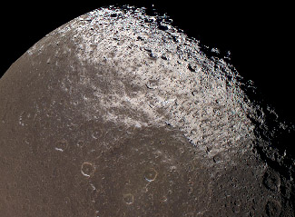
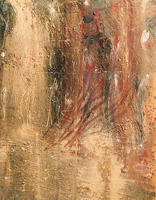

## Les techniques de projection
### Les techniques de projection, usage en arts plastiques
 **Les techniques de projection**  

La peinture par projection peut avoir pour vocation :

> \* la mise en valeur de reliefs (l'exemple cosmique ci-contre prouve que la nature ne s'en prive pas - il s'agit des résultats de la projection d'hydrocarbures d'un violet opaque littéralement soufflés sur le satellite saturnien Japet, faisant apparaître le [modelé](modele.html) de la surface, bien sensible au centre de l'image, et redessinant les murailles des cratères).  
> Nasa, Cassini-Huygens, "You may use NASA imagery, video and audio material for educational or informational purposes, including photo collections, textbooks, public exhibits and Internet Web pages."
> 
> \* l'application de peinture en filaments, éclaboussures et autres formes plus ou moins aléatoires (exemple en fin de page) ou bien de pâtes plus épaisses, créant elles-mêmes des reliefs
> 
> \* l'exécution de flous, de surfaces parfaitement unies ou de transitions pouvant être précises ou lâchées (voir particulièrement ci-dessous [Projection séparée d'un pigment et d'un liant](projection.html#projectiondepigment)).

Il s'agit bel et bien d'une méthode de travail puissante que les artistes contemporains n'ont pas dédaignée, comme les industriels d'ailleurs.

Il existe au moins trois méthodes de projection, dont chacune a des variantes :

> \* Projection de peinture : [compresseur aérographe](compresseur.html), peinture à la [soufflette](soufflette.html), [bombes de peinture utilisées notamment pour les graphes/tags](vaporisation.html), brosses à dents, seringue - utilisée par Pollock -, spatule dégoulinante, [dripping](dripping.html), etc.  
>  
> 
> \* Projection au [compresseur](compresseur.html) (pistolet) d'une poudre préparée pour être vernie au vernis [polyuréthane](polyurethane.html) ou tout autre produit du même type (peinture typique pour carrosseries, métaux, plastiques, etc.). Il existe des applications artistiques de ce procédé.  
>  
> 
> \* Projections séparées d'un pigment (ou autre élément en poudre) et d'un liant, dans cet ordre, l'inverse ou les deux mêlés. Cette technique est accessible à presque tous les procédés de peinture et ne doit pas être négligée car elle est fiable si, à la fin du travail, le pigment est bien protégé, s'il a été correctement imbibé de liant.
> 
> Le pigment peut être jeté à la main ou soufflé. Attention, cela nécessite des précautions particulières. Voir [lien](courrierdeslecteurs2008c010.html#20081116nrm). Par ailleurs sur ce lien, un procédé est expliqué en détail.
> 
> Le liant peut être versé ou bien projeté à l'aide d'une brosse ou tout autre moyen. Un diluant, un épaississant, n'importe quel adjuvant plus ou moins liquide peut également être versé ou projeté.  
> Certains effets peuvent être obtenus par retrait dans le frais (voir photo ci-dessus à droite, huile et Caparol ® sur papier, or et pigments, tableau travaillé à la spatule, puis aux doigts - gantés - au finale).
> 
> \* Projection de [mortier](mortier.html) : voir _[Le crépi](crepi.html)_.

 [Communication](http://www.artrealite.com/annonceurs.htm) 

