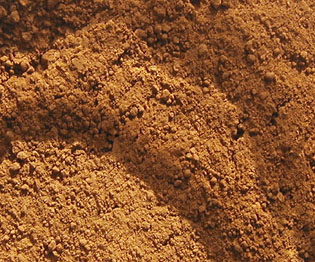

## Les terres
### Les terres, famile de pigments, usage en arts plastiques et autres
 **Les terres**  

Cela se retrouve, par exemple, dans les nuanciers des fabricants de couleurs. Une autre acception du mot d�signe tous les pigments naturels ramass�s, effectivement, en terre. A ce titre, le [jaune de Naples](jaunedenaples.html), par exemple, peut �tre consid�r� comme une terre. Par contre, certaines couleurs appel�es "terres" n'en sont pas r�ellement. Il s'agit en fait de produits d'origine v�g�tale comme la [terre de Cassel](noirs.html#laterredecassel) et la terre de Cologne.

_La [terre verte](vertscomplexes.html#laterreverte) est bien min�rale. Elle contient de l'oxyde de fer parmi d'autres composants mais ne peut pas �tre consid�r�e comme un oxyde terreux au m�me titre que les ocres communs. Elle est donc class�e � part sur ce site, � tort ou � raison. Il en va de m�me pour les [terres blanches](terresblanches.html), tr�s diff�rentes chimiquement._

D'autres terres (dont les [terres de Sienne](terresdesienne.html) notamment, mais en fait la plupart des terres) comportent, outre l'oxyde de fer, un oxyde de mangan�se, des [argiles](argile.html) ou d'autres composants.

DANS L'ENSEMBLE, LES TERRES ONT UNE TENDANCE PRONONC�E � LA [FLOCULATION](pigments.html#aptitudealafloculation). 

**_Fabriquer son propre pigment � l'aide de terres pr�lev�es dans la nature_**

C'est une op�ration qui n'est pas forc�ment tr�s difficile � r�aliser mais qui pr�sente certains risques�: que contient en r�alit� telle ou telle terre pr�lev�e ici ou l�? Quelle va �tre sa miscibilit�, sa permanence, son pouvoir absorbant, sa nocivit� �ventuelle�; quels agents auxiliaires utiliser pour compenser tel ou tel aspect�? Vais-je pouvoir l'employer en peinture � fresque �? En peinture � l'huile ?

Un artiste qui cherche � limiter ces incertitudes peut enqu�ter dans la r�gion, notamment aupr�s des artisans : cette terre a-t-elle servi � enduire des murs�? A-t-elle d�j� �t� exploit�e pour la poterie, pour l'artisanat, la d�coration�? L'opinion d'un g�ologue peut �galement �tre d'un pr�cieux secours. Un premier contr�le avec du [papier tournesol](papiertournesol.html) donne d�j� quelques pr�cieux renseignements.

Toutes les terres ne sont pas bonnes pour la peinture ni pour d'autres arts plastiques�: ce serait trop facile. Qui ach�terait des ocres s'il suffisait de se baisser pour en trouver�? Certes, des milliard d'habitations ont �t� d�cor�es avec ces substances depuis l'aube de l'humanit�, mais chaque r�gion a d�velopp� un savoir-faire mill�naire (extraction, traitement, application, souvent d�finis en termes extr�mement pr�cis) qui ne doit pas, qui ne _peut_ pas �tre d�daign� sous peine de d�sagr�ables surprises.

Mal connue et mal trait�e, une terre peut craqueler, se d�tacher de son support, se fissurer, �clater � la cuisson (arts du feu) ou s'affaler lamentablement (modelage), ne jamais parvenir � s�cher (peinture � l'huile), entrer en interaction avec d'autres substances, etc.

Un exemple de traitement ancien des terres est disponible sur Dotapea. Voir [l�vigation](terresjaunes.html#levigation) dans la page consacr�e aux terres jaunes.

Voir aussi _[Les terres blanches](terresblanches.html)_.

Lecture conseill�e : [L'ocre sur Pourpre.com](http://pourpre.com/chroma/dico.php?typ=fiche&&ent=ocre)

 [Communication](http://www.artrealite.com/annonceurs.htm) 

