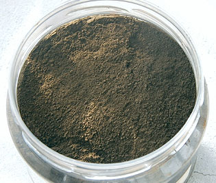
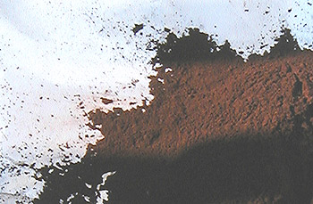
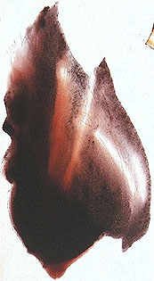

## Les terres d'ombre et autres bruns
### Les terres d'ombre et autres bruns - usage en arts plastiques
 **Les terres d'ombre et autres bruns**  

\[Lectures conseill�es :  
[Le brun dans la langue fran�aise, Pourpre.com](http://www.pourpre.com/langue/expressions.php#brun)  
[Le marron](http://www.pourpre.com/langue/expressions.php#marron), [le chocolat](http://www.pourpre.com/langue/expressions.php#chocolat),  
[La couleur brune, Pourpre.com](http://pourpre.com/chroma/dico.php?typ=fiche&&ent=brun)\] 

_Les pigments bruns contiennent presque le plus souvent des [oxydes de fer](oxydesdefer.html). Leur emploi remonte en Occident � 40 000 BC environ, tout comme les [terres jaunes.](terresjaunes.html)_

_Dans l'ensemble, un brun terreux rougeoyant est assez envahissant sur un tableau. Par exemple, le brun Van Dyck, bien qu'occupant une bonne place parmi les ventes, souvent pr�sent dans les coffrets, n'est en fait gu�re facile � manipuler et ne doit pas �tre conseill� trop syst�matiquement aux d�butants. C'est v�ritablement une couleur "dure", un peu dans tous les sens du terme. La terre d'ombre br�l�e, plus subtile, est d�j� d'une manipulation un peu plus ais�e._

_Les bruns les plus subtils et pleins d'emplois sont plut�t ceux qui tirent vers les couleurs froides et correspondent plus ou moins aux terres non br�l�es. Quelques exceptions sont cependant � mentionner du c�t� des synth�ses contemporaine de type quinacridonique, qui sont chaudes, certes, mais transparentes. Elles m�ritent toute notre attention notamment pour le travail en glacis._

Sommaire

[Les terres d'ombre](terresdombre.html#lesterresdombre)

[Tendances chromatiques](terresdombre.html#tendanceschromatiques)

[Caract�ristiques, comportement](terresdombre.html#caracteristiquescomportement)

[Utilisations](terresdombre.html#utilisations)

[Toxicit�](terresdombre.html#toxicite)

[Autres bruns](terresdombre.html#autresbruns)

[Bruns divers](terresdombre.html#brunsdivers)

[L'oxyde de fer brun pur](terresdombre.html#oxydedeferbrun)

[Le brun Van Dyck](terresdombre.html#brunvandyck)

[Les bruns de quinacridone](terresdombre.html#brundequinacridone)

_Les terres d'ombre_

_Les terres d'ombre contiendraient � l'�tat naturel du dioxyde de [mangan�se](manganese2.html), puissant siccatif des huiles et de l'argile ainsi que des oxydes de fer en quantit� plus faible que dans la terre de Sienne._

Lecture conseill�e : [L'ombre sur Pourpre.com](http://pourpre.com/chroma/dico.php?typ=fiche&&ent=ombre)

Leur nom pr�tent � confusion�: oui, elles sont utiles pour le peintre qui cherche � figurer les carnations ombr�es (avec la terre d'ombre naturelle rehauss�e de blanc et m�l�e � d'autres couleurs - ce type d'emploi est d�j� attest� dans la peinture �gypto-hell�nique du Fayoum) mais leur �tymologie d�coule uniquement, selon toute vraisemblance, de leur provenance, l'Ombrie, une province d'Italie situ�e au Sud de la Toscane et au Nord du Latium. Certaines sources mentionnent une terre d'ombre de Cologne et une terre d'ombre de Chypre (Gr�ce), plus verte, r�put�e de tr�s haute qualit� et dite � tort "'ombre de Turquie", ainsi qu'une terre de Sicile (Italie) dont nous ne connaissons pas les particularit�s. Plusieurs autres vari�t�s proviennent du Vaucluse (France) et de Cassel (Allemagne). 

Cette terre existe � l'�tat naturel sur tous les continents.

**Tendances chromatiques**

En fait, sa tendance � l'�tat non calcin�, _est bleue-verte_�: elle est relativement froide (� cause du mangan�se sans doute), et pourtant assez brune pour que l'on sente en elle la pr�sence d'oxyde de fer anhydre.

D'un point de vue chromatique, elle est tr�s riche et int�ressante (voir photo ci-contre).

Sa vari�t� calcin�e (ci-dessous) donne un marron fonc� relativement proche de ce que l'on pourrait nommer un marron chocolat "standard" mais peut-�tre moins que d'autres bruns chauds.  
Elle fait r�f�rence. Elle est assez utilis�e en m�lange (information obtenue de source commerciale - contredisant quelques auteurs). Tout particuli�rement, le peintre d�butant est g�n�ralement plus attir� par l'ombre br�l�e - et il a tort, mais qu'est-ce qu'un apprentissage ?  
Des modes, au cours de l'histoire de la peinture, on fait �merger p�riodiquement la m�me pr�f�rence.

Chimiquement parlant, la calcination provoque une d�shydratation similaire � celle qui se produit lorsque l'on cuit de l'ocre jaune pour obtenir une couleur rouge. L'ombre br�l�e est nettement plus rouge�tre que sa vari�t� "crue", ce qui lui donne une aspect chocolat que l'on n'a peut �tre pas tort de trouver beaucoup moins subtil quoique non d�nu� d'int�r�t.

**Caract�ristiques, comportement**

La terre d'ombre br�l�e (voir photo�: une terre d'ombre calcin�e � la casserole - lire _[Oxydes de fer](oxydesdefer.html)_) et la naturelle sont plut�t couvrantes - sans exc�s - et tr�s permanentes dans un environnement chimique normal.

Leur pouvoir absorbant un peu sup�rieur � la moyenne leur vaut un rejet par certains auteurs, ce qui est un cas de figure classique (lire le texte consacr� au [pouvoir d'absorption](pigments.html#pouvoirdabsorption) dans l'article sur les caract�ristiques des pigments). En ce qui nous concerne, nous ne voyons aucune raison de d�conseiller ces pigments pour des raisons de cet ordre. Il faut simplement les lier de mani�re raisonnable (ne pas les saturer de liant).

_La Sienne naturelle, recelant elle aussi du mangan�se - soi-disant en moindre quantit�, selon certaines sources discutables -, pose dans les faits bien davantage de probl�mes de siccativation. Lire l'article sur [la famille chimique des pigments au mangan�se](manganese.html)._

On a aussi accus� "les ombres" de noircir avec le temps. Cette hypoth�se, qu'aucun de nous n'a v�rifi�, ne pourrait �tre valable qu'en m�lange avec des �l�ments fortement acides. A ce moment-l�, il n'est pas exclu que des associations se produisent et que des sels se forment. Mais l'�vidence m�me est qu'il vaut mieux se passer d'�l�ments acides que de terres d'ombres�!

**Utilisations**

L'emploi des terres d'ombre en glacis au-dessus d'une couleur chaude est particuli�rement int�ressant. La vari�t� calcin�e donne alors une impression de bois qui a �t� mise � profit de longue date dans la r�alisation... des faux bois, en peinture d�corative. Les deux ombres servent � ternir, vieillir, anoblir toutes sortes d'objets et de surfaces.

L'ombre naturelle est tr�s puissante pour "casser" des colorations trop franches, du blanc au noir, quelle que soit la technique, quel que soit l'emploi (d�coratif ou non). Elle ne pr�sente pas le d�faut de ternir ces couleurs, contrairement au noir pur. Seuls des noirs chauds comme la [terre de Cassel](noirs.html#laterredecassel) tr�s dilu�e peuvent � peu pr�s remplir le m�me office.  
Mais cette couleur remarquable conna�t de nombreux autres emplois depuis des mill�naires, notamment en m�lange sur le tableau (_[alla prima](techmelangecouleurs.html#travailallaprima)_ comme en [glacis](glacis.html)), comme sous-couche locale ou encore comme [imprimature](imprimatures.html).

Comme annonc� en introduction, la vari�t� rouge est un peu plus difficile � ma�triser.

_Autres informations :_

> Il est possible de cr�er un noir chromatiquement "riche" en associant l'une des terres d'ombres � un bleu (de l'outremer au gris de Payne).
> 
> Leur emploi [� fresque](fresque.html) est conseill�, m�me � l'ext�rieur.

**Toxicit�**

Du point de vue de la toxicit�, l'ombre n'est pas compl�tement anodine � cause de sa teneur en mangan�se�: inhal�e ou ing�r�e � une forte dose, elle provoquerait des troubles nerveux de type parkinsonien. Il n'est pas inutile de prendre quelques pr�cautions, notamment lors de l'ouverture des pots de pigments (couvrir d'un plastique), m�me si le risque d'accumulation de m�taux dans l'organisme semble n�gligeable.

_Autres bruns_

**Bruns divers**

La plupart des bruns sont � base d'[oxyde de fer](oxydesdefer.html) et [d'argile](argile.html). Ils sont tr�s r�pandus sur tous les continents. C'est la pr�sence de mangan�se ou d'autres �l�ments qui peut faire l'int�r�t sp�cifique de certaines vari�t�s telles que les terres d'ombre.

**L'oxyde de fer brun pur** est un pigment tr�s int�ressant quoi que d'un emploi malais� : il est couvrant et _colorant � l'extr�me_. De plus, il est extr�mement bon march�. Ses tr�s puissants pouvoirs chromatiques le rendent difficile d'emploi lors des premiers contacts. Par la suite, il devient un auxiliaire utile et transformable (en [violet de Mars](violetsetmauves.html#levioletdemars), par cuisson � la casserole). Il suffit de l'employer � faible dose.

**Le brun Van Dyck**

Plut�t envahissante, ce n'est pas une couleur tr�s facile � employer. M�me sur les tableaux de ce Ma�tre un peu particulier, ils ont gard� une certaine "pr�sence" qui peut d�plaire � certains. Cette couleur correspond bien � l'oeuvre de ce peintre officiel, oeuvre aux accents souvent solennels, parfois tragiques et rarement joyeux. Van Dyck ne recherchait manifestement pas une composition tr�s a�r�e mais mettait plut�t en oeuvre, d'une certaine mani�re, des affirmations chromatiques massives au service de ses [motifs](motif.html) princiers. Soyons justes mais clairs : l'oeuvre de Van Dyck comme le brun Van Dyck ont un grand int�r�t mais ne sont pas "d'un acc�s facile".

Le pigment serait un ocre jaune suffisamment calcin� pour devenir brun, m�l� �ventuellement d'autres �l�ments (de l'humus, selon certains auteurs qui mentionnent �galement le [bitume](noirs.html#lesnoirscombinesadautrescouleurs), pigment ex�crable abandonn� depuis longtemps, et le dioxyde de mangan�se calcin�, effectivement toujours utilis�). D'autres sources indiquent que ce brun proviendrait de Cassel (Allemagne). Si cela semble effectivement possible, il ne faut pas pour autant confondre le brun Van Dyck avec la [terre de Cassel](noirs.html#laterredecassel) car ces couleurs sont profond�ment diff�rentes.

_Dans les faits, les industriels adjoignent souvent au brun initial un noir quelconque._ De toute mani�re, aujourd'hui, la composition de la couleur finale varie en fonction du fabricant. Sa permanence varie de m�me. Elle est souvent moyenne, parfois bonne. Sa transparence varie en fonction de la proportion d'oxyde de fer, substance couvrante.

_En principe, cependant, le brun Van Dyck, sans �tre transparent, n'est pas tr�s couvrant_. Lorsqu'il est conforme � cette sp�cification, il permet de transformer efficacement l'aspect des m�taux - dont les dorures (feuille d'or ou peinture dor�e) -, des faux bois et des faux marbres, sans parler des glacis en peinture dite artistique. Des vari�t�s opaques existent cependant et sont largement disponibles dans le commerce.

Il ressemble assez � la terre d'ombre br�l�e, bien qu'un peu plus rouge.

**Les bruns de quinacridone**, superbes pigments ultramodernes tirant tant�t sur l'orang�, tant�t sur le rouge (photo ci-contre) et vendus sous des intitul�s vari�s. Lire [l'article consacr� aux quinacridones](quinacridones.html).

Ils donnent des glacis magnifiques.

Leur [floculation](pigments.html#aptitudealafloculation) est parfois tr�s int�ressante, comme le montre l'image.

 [Communication](http://www.artrealite.com/annonceurs.htm) 

