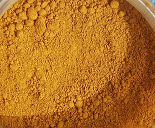
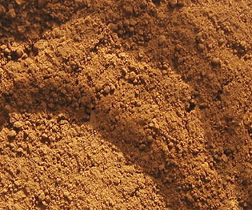

## Les terres jaunes
### Les terres jaunes, famille de pigments, usage en arts plastiques et autres
 **Les terres jaunes**  Certains auteurs signalent cependant que les [terres rouges](terresrouges.html) auraient, selon eux, �t� utilis�es bien avant les jaunes et les bruns (dont les premi�res traces en Occident remontent "seulement" � 40 000 BC environ, utilis�s en peinture pari�tale). La d�couverte du proc�d� d'obtention des ocres rouges par chauffage des jaunes daterait d'ailleurs de la m�me �poque.

Presque pur dans **le jaune de Mars** (ou "oxyde de fer jaune"), le pouvoir colorant de ce min�ral est si grand qu'il peut m�me devenir encombrant. Il n'est pas exag�r� de le consid�rer comme un principe concentr�, essentiel, et de l'utiliser comme tel. Certains fabricants de couleurs ne s'y sont pas tromp�s en proposant un jaune de Mars constitu� d'oxyde de fer jaune _+ une charge_. La nature a fait � peu pr�s le m�me travail en nous offrant des oxydes charg�s [d'argile](argile.html), de [mangan�se](manganese.html) et autres �l�ment.

_L'ocre jaune_

M�l� naturellement � l'[argile](argile.html) (voir [silicate](silicate.html), [kaolin](kaolin.html)), l'oxyde de fer jaune devient le tr�s v�n�rable **ocre jaune** (voir photo ci-dessous) et atteint une forme de perfection par son raffinement. C'est s�rement l'un des pigments les plus remarquables tant par sa beaut� que pour sa stabilit� dans les m�langes (il est compatible avec n'importe quel pigment et la plupart des liants), sa neutralit� chimique, sa permanence, son pouvoir colorant, son pouvoir couvrant et son faible co�t. Il est tr�s int�ressant de d�cliner ses valeurs avec du blanc (il devient majestueux, distingu� et subtil) ou au contraire de le salir pour obtenir d'autres formes chromatiques expressives, de le tester en m�lange avec le bleu outremer comme substitut de la terre verte, etc. Attention�: en m�lange avec des couleurs transparentes, il risque fort de dominer. Il vaut mieux utiliser de petites quantit�s.

Les vari�t�s les plus r�put�s de l'ocre jaune proviennent de l'Yonne et d'autres r�gions de la moiti� nord de la France. Certaines sources mentionnent une appellation "JFLS" signifiant "jaune fine, lav�e, surfine" ("lav�e" correspond au proc�d� de l�vigation, voir [ci-dessous](terresjaunes.html#levigation)) et d�signant un ocre jaune de bonne qualit� - pas exhaustivement car il existe de nombreux proc�d�s et appellations comparable. L'industrie de l'ocre et des terres �voque parfois les hauts artisanats locaux, leurs "AOC", etc.

_L�vigation de l'ocre_

Selon [Kevin Mac Cloud](livres.html#maccloud), le _lavage_ d'une terre correspond � un proc�d� connu des Romains, nomme "l�vigation", correspondant � l'intitul� moderne de terre "lav�e" (voir ci-dessus).

Pendant trente minutes, un petit morceau de terre est mis � mariner dans trois fois son volume d'eau, dans un r�cipient ferm�. Le couvercle doit �tre distant d'au moins trois centim�tres du liquide.

Le m�lange doit ensuite reposer quelques secondes avant d'�tre transvas�. Les impuret�s et m�me les gros morceaux argileux doivent �tre laiss�s au fond du premier r�cipient. L'op�ration est r�p�t�e en augmentant � chaque fois le temps de marinage.

A la fin, il reste � faire s�cher le m�lange et le broyer � la [molette](molette.html) - ou � l'aide d'un moulin, si on en dispose.

Il faut noter �galement que l'ocre est tr�s souvent pr�lev� dans des sols sableux, voire tr�s sableux. Il faut donc extraire le sable qui, plus lourd que l'ocre, se d�pose au long de rigoles en pente douce. La mati�re d�lay�e est ensuite r�cup�r�e dans des bassins de d�cantation, puis s�ch�e ou trait�e, comme indiqu� ci-dessus, par l�vigation, et broy�e.

Ces op�rations sont parfaitement r�alis�es par les artisans et les industriels. Elles ne sont cit�es ici que pour m�moire.

Lire le texte consacr� � la [fabrication "maison"](terrespigments.html#fabriquersonproprepigment) de pigments � partir de terres naturelles.

_Un broyage un peu particulier_

Contrairement � une rumeur d�lirante, il n'est pas du tout n�cessaire de gaver ce pigment d'huile (ni de tout autre liant) lors du broyage.

On remarque, lors de cette op�ration, la pr�sence de _morceaux vraiment tr�s durs, m�talliques, sous la spatule_, m�me quand le broyage est bien fin. Pas d'inqui�tude�: c'est tout � fait normal. La palette sera un peu ray�e mais la spatule n'en sera que mieux aff�t�e. C'est vrai�: l'ocre jaune a cette particularit� d'aff�ter grandement les spatules. Gare aux coupures�!

M�me en tube, cette couleur aurait, selon les t�moignages recueillis, la m�me tendance. Cela ne doit en aucun cas faire douter le peintre de l'int�r�t de ce pigment indispensable et irrempla�able.

_Autres terres jaunes_

La terre de Sienne naturelle, �galement charg�e d'oxyde de fer jaune, est trait�e dans la [page r�serv�e aux deux terres de Sienne](terresdesienne.html).

La terre d'Italie lui ressemble un peu.

Il existe de tr�s nombreuses vari�t�s de terres jaunes provenant d'Italie, de France, d'Am�rique, et plus tellement du Royaume Uni (jaune anglais) o� l'ocre d'Oxford, qui a connu son heure de gloire, n'est plus extrait depuis longtemps.

Selon les cas, elles contiennent plus ou moins d'[argile](argile.html), de l'oxyde de fer �videmment et d'autres composants.

Les gr�s du type "ocre de Puisaye" sont surtout utilis�es en poterie et arts du feu. Voir _[Oxydes](oxydes.html)_.

_Divers_

Aucune toxicit� pr�cise ne semble caract�riser ces pigments. Cependant, �tant donn� la vari�t� de leurs compositions, une certaine prudence pourrait �tre utile en cas d'emploi r�p�titif.

Leur emploi � fresque ne pose aucune probl�me�: leur stabilit� autorise l'association avec des �l�ments alcalins. Ils r�sistent �galement aux �l�ments acides et aux UV. Ils peuvent �tre utilis�s pour colorer notamment le ciment, le b�ton, le pl�tre et le badigeon.

En m�lange aux oxydes de fer rouges, ils donnent une sorte d'orang� particulier.

Ils sont utilis�s en sous-couche pour les dorures � cause de leur affinit� chromatique avec le m�tal pr�cieux (diminuant ainsi la visibilit� des craquelures de la feuille d'or).

 [Communication](http://www.artrealite.com/annonceurs.htm) 

