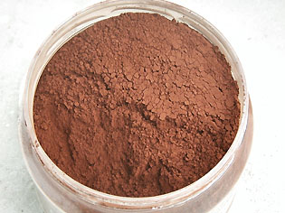

## Les terres rouges
### Les terres rouges, usage en arts plastiques et autres
 **Les terres rouges**  

_Les terres rouges contiennent du fer et s'extraient � l'�tat naturel ou s'obtiennent par calcination artificielle des terres jaunes, oxydes de fer hydrat�s. Selon certains auteurs, l'ocre rouge aurait �t� employ�e avant l'ocre jaune (question, peut-�tre, de localisation g�ographique)._

_Selon [Anne Varichon](livres.html#annevarichon), le premier broyage attest� d'ocre rouge remonterait � 90 000 BC (Nazareth). L'emploi des terres rouges aurait en premier lieu trouv� un usage corporel. Paradoxalement, l'emploi de [terres jaunes](terresjaunes.html) co�nciderait avec les premi�res calcinations de celles-ci, destin�es � les faire rougir (voir [calcination](terresrouges.html#calcination)) �! Faut-il y voir le souhait des artistes anciens, de pouvoir synth�tiser une couleur qu'ils ne pouvaient plus trouver � l'�tat naturel, � cause, peut-�tre, de migrations�? La question reste enti�rement ouverte._

**Sommaire**

[Pigments � base d'oxyde de fer](terresrouges.html#rougedemarsetocrerouge)

\- [Calcination](terresrouges.html#calcination)

\- [Association avec d'autres �l�ments](terresrouges.html#oxydesdeferetautreselements)

[Sienne br�l�e, rouge de Pouzzoles, d'Ercolano, de Falun, rouge Van Dyck, ocre de chair, macra, bol d'Arm�nie](terresrouges.html#siennebruleerougedepouzzolesrougevandyckocredechair)

[La sanguine, l'h�matite](terresrouges.html#lasanguine)

[Terres rouges en m�lange, caract�ristiques, utilisation](terresrouges.html#terresrougesenmelangecaracteristiquesutilisations)

_Rouge v�nitien, rouge indien, rouge anglais_

Le _**rouge v�nitien**_, le splendide _**rouge** **indien**_ ou encore le _**rouge** **anglais**_ sont tous des rouges opaques tr�s colorants.

Elles sont bien plus rouges que _**l'oxyde de fer rouge pur**_ (_rouge de Mars_) ou _**l'ocre rouge,**_ obtenus directement par cuisson de l'ocre jaune ou de l'oxyde de fer jaune, "jaune de Mars".

Ces terres qui n'en sont pas toujours v�ritablement sont cependant tr�s permanentes.

Le v�nitien est aujourd'hui parfois de fabrication synth�tique (ce serait un "sulfate ferreux" adjoint de peroxyde de plomb - un archa�sme - pour certains fabricants, d�nu� de peroxyde de plomb selon d'autres). Un c�l�bre fabricant italien propose un rouge v�nitien nettement plus naturel, fait de trois terres�: une jaune, une rouge et une brune. C'est probablement la meilleure formulation.

Le _**rouge anglais**_**,** en tant que pigment, est aujourd'hui chez les fabricants une sorte de "synth�se � base de terres et d'autres min�raux" si l'on peut se permettre cette expression. Typiquement, c'est un oxyde de fer rouge adjoint d'aluminosilicate de sodium polysulfur�, c'est � dire de... [bleu outremer](outremer.html) (lapis) ! D'o� son aspect assez violac�. Certains fabricants pr�tendent se contenter d'un simple oxyde de fer rouge, mais �tant donn� la couleur obtenue, il est permis d'en douter. Il est probable qu'un [violet de Mars](violetsetmauves.html#levioletdemars) ait �t� discr�tement adjoint, si ce n'est un bleu outremer.

_**Mais**_ il existe un tout autre "rouge d'Angleterre". Il s'agit d'un abrasif utilis� jadis par les lapidaires. Trop colorant, il fut remplac� par la [pot�e d'�tain](poteedetain.html), elle-m�me remplac�e � son tour par diff�rents produits. Le rouge d'Angleterre avait-il la m�me composition et la m�me origine que le "rouge anglais", si l'on peut poser la question de cette mani�re ? Ce dernier �tait-il non pas un pigment, mais une couleur � proprement parler, c'est-�-dire par exemple la teinte d'un objet volontairement color� au rouge d'Angleterre,  _like dyied wood for instance [(\*)](terresrouges.html#notetraduction)_ ?  
Tout cela est plausible, mais nous ne saurions le garantir pour le moment.

Lecture conseill�e : [Le rouge anglais sur Pourpre.com](http://pourpre.com/chroma/dico.php?typ=fiche&&ent=anglaisrouge)

Le _**rouge indien**_ est tr�s proche du rouge anglais, � tel point qu'il est difficile de les distinguer selon les diff�rentes fabrications. Certaines vari�t�s sont r�ellement splendides�: couvrantes, colorantes (probablement tr�s charg�es en oxyde de fer), mais d'un rouge affirm�. Une enqu�te sur ce pigment est en cours.

_**Dans l'ensemble,**_ le terme de "sulfate ferreux", que l'on retrouve de-ci de-l� dans les compositions de ces trois pigments, semble en r�alit� d�signer l'ajout d'un bleu outremer (aluminosilicate de sodium _polysulfur�_) donnant la teinte rouge profonde, un peu violac�e, qui caract�rise ces pigments. Le rouge v�nitien semble cependant un cas � part. Violac� dans les gammes non italiennes, il est plus terreux et probablement plus authentique dans les gammes... italiennes.

_Pigments � base d'oxyde de fer_

**_L'ocre rouge, le rouge de Mars (oxyde de fer pur) et la terre de Sienne br�l�e_** ainsi que de nombreuses autres couleurs contiennent principalement un oxyde de fer naturel ou obtenu artificiellement par calcination (base Fe2O3).

**Tous ces pigments contiennent de l'oxyde de fer d�barrass� de la charge d'eau qui maintient le compos� hydrat� dans sa teinte jaune.**

Ce qui les distingue du point de vue du peintre, ce n'est pas seulement la couleur. Le rouge de Mars, comme toutes les terres de Mars, dispose d'un pouvoir colorant extraordinaire, si intense que les fabricants l'associent avec des charges pour proposer des tubes de couleurs plus faciles � utiliser que le pigment pur. En ce qui concerne ce dernier, il existe trois moyens de l'employer �: 

> \* tel quel, pour former des aplats de couleur intense, sans transparence
> 
> \* tr�s dilu� ou ajout� d'une charge incolore, en glacis
> 
> \* en m�lange avec une autre couleur. Il doit alors �tre dos� en quantit�s hom�opathiques.

D'un point de vue chromatique, l'ocre rouge est assez subtil, � l'instar de son cousin jaune. Comme celui-ci, il peut avoir diff�rentes qualit�s (RCLS, RFLES, RFL, etc.), cuit ou naturel, souvent en provenance du Vaucluse ou de la Ni�vre (_ocre de Puisaye_).

La Sienne br�l�e  (voir photo ci-dessus) est encore plus "sophistiqu�e", plus complexe par sa composition (lire l'article consacr� [aux terres de Sienne](terresdesienne.html)).

> \* Calcination
> 
> Ce proc�d� tr�s simple date du pal�olithique moyen (vers 40000 BC). Il pourrait s'agir du premier proc�d� de transformation chimique r�alis� par un �tre humain.
> 
> La photo ci-contre montre en haut de l'_ocre jaune_ � gauche et de l'_oxyde de fer brun_ � droite_,_ et les m�mes produits apr�s cuisson dans le bas. _Le d�tail du processus est expliqu� dans l'article sur [les oxydes de fer](oxydesdefer.html)._
> 
> Dans cet article-ci, nous nous contenterons d'insister sur le fait que la calcination peut �tre r�alis�e dans une cuisine avec une simple casserole.
> 
> \* Oxydes de fer associ�s � d'autres �l�ments
> 
> Bien souvent, les terres rouges naturelles, moins pures que le rouge de Mars, contiennent aussi de l'[argile](argile.html) et d'autres ingr�dients comme le [mangan�se](annexe1.html#mn). Il existe donc des vari�t�s finalement assez diff�rentes tant par leurs teintes que par leurs comportements et donc par leurs emplois. Les savoirs traditionnels concernant les terres locales sont souvent d'une grande pertinence car ils b�n�ficient d'une exp�rience humaine de dur�e incomparable.

_Sienne br�l�e, rouge de Pouzzoles, d'Ercolano, de Falun, rouge Van Dyck, ocre de chair, macra, bol d'Arm�nie_

_**Terre de Sienne br�l�e**_ -> voir [terres de Sienne](terresdesienne.html).

Le _**rouge de [Pouzzoles](pouzzoles.html)**_ (_terra rosa_ de _Pozzuoli_), du nom d'un ville proche de Naples est une ocre jaune l�g�rement calcin�e, moins rouge que l'ocre rouge. Une synth�se nomm�e orange de Mars ressemble un peu � cette couleur.

Le _**rouge d'Ecorlano**_ (Italie) est un peu plus rouge.

Le **_rouge de [Falun](falun.html)_** (ville de Su�de dot�e d'un gisement) est nettement plus sombre sans �tre brun. Il semble plus ou moins violac� (voir [violet de Mars](violetsetmauves.html#levioletdemars)). Pourtant, il contient du cuivre. Appel�e Falur�d (litt�ralement rouge de Falun), cette couleur de tr�s bonne tenue est extraite depuis le XIII�me si�cle et utilis�e pour la d�coration ext�rieure.

Le _**rouge Van Dyck**_ est une vari�t� sans particularit�s sp�cifiques majeures que nous ne citons que pour m�moire. Plus claire et plus rouge que le [brun Van Dyck](terresdombre.html#brunvandyck), il pourrait s'agir d'une sorte de variante.

_**L'ocre de chair**_ ou _teinte chair_ est cens� offrir des carnations roses d'un go�t discutable. C'est typiquement un ocre rouge m�lang� � du blanc (op�ration r�alisable par un d�butant). A ce sujet lire l'article [La carnation](carnation.html) du glossaire.

Le _**rouge macra**_ proviendrait d'une terre rouge�tre. Tout ce que nous savons � son sujet et qu'il �tait l'un des trois rouges employ�s au moyen-�ge pour peindre les enluminures (les deux autres �tant le cinabre et le minium - voir [vermillons](vermillons-2.html)). Toute information sera [la bienvenue](ecrire.html).

Le _**bol d'Arm�nie**_ --> [lire l'article du glossaire](boldarmenie.html).

_La sanguine, l'h�matite_

La sanguine est trait�e dans un [article s�par�](sanguine.html).

L'h�matite est r�f�renc�e [dans le glossaire](hematite.html) ainsi que [dans l'article consacr� aux oxydes de fer](oxydesdefer.html#lhematite).

_Terres rouges en m�lange, caract�ristiques, utilisations_

En association avec un bleu [outremer](outremer.html), ces terres donnent des violets et des mauves impurs, des bruns int�ressants, gagnant � �tre rehauss�s de blanc. Pures et adjointes de blanc, elles donnent de joyeux roses saumon utilis�s depuis longtemps.

Les couleurs d�riv�es de l'oxyde de fer rouge sont tr�s permanentes, non toxiques et utilisables � l'ext�rieur�: elles r�sistent aussi bien que les [oxydes de fer jaunes](terresjaunes.html).

Comme ceux-ci, elles sont utilis�es en dorure�: elles servent de sous-couche devant recevoir une feuille d'or qui sera brunie par polissage (voir [agate](agate.html)).

Lire aussi [_Terres jaunes_](terresjaunes.html).

\_\_\_\_\_

(\*) "Comme du bois teint pas exemple". Pour revenir au corps du texte, cliquez sur le bouton "Pr�c�dent" de votre navigateur.

 [Communication](http://www.artrealite.com/annonceurs.htm) 

