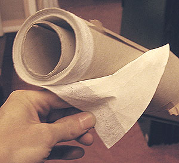

## Les toiles synthétiques
### Les toiles synthétiqus, usage en peinture
 **Les toiles synthétiques**  

_Écrire un article sur ce sujet, c'est forcément entrer dans une polémique._

_Le reproche le plus "consensuel" qui est fait aux toiles synthétiques, c'est leur âge : elles sont trop récentes pour que l'on puisse augurer de leur comportement lors du vieillissement. Ce n'est pourtant pas le seul que l'on peut leur faire, à tort ou à raison, mais non sans arguments._

Présentation

Sommaire

[Présentation](synthetiquetoiles.html#presentation)

[Les nylons](synthetiquetoiles.html#lesnylons)

[La Polytoile ®](synthetiquetoiles.html#lapolytoile)

[Synthèse](synthetiquetoiles.html#synthese)

_Il est à peu près admis que les toiles synthétiques se prêtent parfaitement à certaines types de travaux (lire la [synthèse](synthetiquetoiles.html#synthese) en fin de page)._

_Par ailleurs, nous refusons de nous faire l'écho favorable du bruit selon lesquels le synthétique aurait été "mis en retrait", minoré dans l'intérêt de l'industrie textile (penser que les agriculteurs russes, premiers producteurs de lin à tisser, n'ont sûrement pas l'influence économique planétaire de sociétés géantes telles que Dupont de Nemours dont le nylon n'est qu'une des activités). De toutes manières, ces produits ne sont même pas comparables. Cette opinion ne paraît donc pas crédible._

Les toiles synthétiques se répartissent en deux familles :

Les nylons

Il s'agit en fait de [polyamides](polyamide.html) divers (parmi lesquels le vrai Nylon ®, marque déposée, Dupont de Nemours) aux caractéristiques variées dont les points communs sont

> \* une grande résistance aux tractions (à la cassure, au déchirement) rendue possible par une élasticité notable
> 
> \* l'absence de réaction à l'eau.

Leur élasticité est _a priori_ un inconvénient qui peut faire douter de leur aptitude à être tendus sur châssis, mais ce défaut serait compensé (annulé ?) par leur insensibilité à l'eau. C'est-à-dire que l'on peut supposer qu'une toile de nylon tendue ne sera pas altérée par des variations atmosphériques, ce qui est un avantage majeur, mais uniquement sous l'effet d'actions mécaniques.

Qu'en est-il lorsque des sollicitations mécaniques extérieures ont lieu ? Par exemple : imaginons, dans une exposition, un visiteur indélicat qui, voulant montrer un détail, appuie en un point du tableau avec son doigt. Le nylon, étant élastique, ne s'opposera pas à la pression. C'est la couche de peinture qui l'encaissera. Problème : la peinture sèche n'est pas toujours très élastique !

C'est pour ce genre de raisons que des générations de peintres ont préféré les toiles végétales les moins élastiques (lin, chanvre). Les problèmes liés aux réactions thermiques et hygrométriques ne sont pas les seuls arguments pour la préférence d'une fibre. Le transport et la mise en exposition notamment suscitent des chocs mécaniques _sources de la majorité des accidents_, ce dont tout restaurateur ou conservateur peut témoigner.

La peinture acrylique, particulièrement souple et élastique, semble convenir particulièrement à ce support.

La Polytoile ® _(Lefranc & Bourgeois)_

C'est un corps "intissé" (non tissé) à base de fibres de [polyester](polyester.html) projetées, pressées, soudées, collées. Au toucher, elle ressemble assez à du papier. Son grain est extrêmement fin.

Comme le montre la photo ci-contre, elle aurait tendance à marquer les pliures, [les lunes](lune.html) et les chocs (fibres trop longues  ?) et doit pour cette raison être impeccablement roulée et protégée pour le transport et le stockage.

Il pourrait être judicieux, dans certains cas, de maroufler préalablement cette toile sur support dur (bois, mur)... 

Merci de [nous faire part](ecrire.html) votre expérience de ce support.

Le témoignage récent d'un professionnel nous autorise à écrire que si cette toile rend de très précieux services et constitue manifestement un outil de qualité (fait confirmé par ailleurs), elle pourrait avoir le petit défaut de ne pas se retendre après un enfoncement. Cet inconvénient pourrait être compensé par une réparation simple.

Synthèse

Il est permis d'émettre certaines réserves sur les synthétiques à cause de leurs propriétés mécaniques potentiellement dangereuses pour les peintures épaisses et assez peu élastiques telles que les huiles empâtées. Par contre, collées - et non tendues - elles pourraient être supérieures à certains points de vue aux fibres végétales quelle que soit la peinture utilisée.

Leur emploi actuel est surtout lié aux métiers du graphisme, mais ceci ne doit pas inciter les artistes travaillant dans d'autres domaines à délaisser ces supports.

 [Communication](http://www.artrealite.com/annonceurs.htm) 

