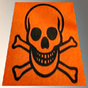
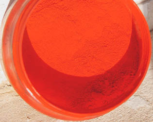
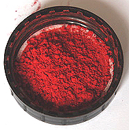
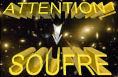

## Les vermillons
### Les vermillons, usage en arts plastiques
 **Vermillon(s) et cinabre**  

_Le vermillon et le cinabre authentiques sont des pigments mais aussi des poisons (voir ci-dessous [Le malfaiteur démasqué](vermillons-2.html#lemalfaiteurdemasque))._

_L'histoire du vermillon est liée à celle du [cinabre](cinabre.html) dont la composition est similaire (sulfure de [mercure](mercure.html) naturel_ HgS_, minerai du mercure), mais aussi à celle du minium (à base l'oxyde de plomb, objet d'un [article séparé](minium.html)__), car dès la Rome antique il y a eu confusion linguistique entre cinabre et minium, tous deux intitulés "_minium_". Cette confusion s'est prolongée durant le Moyen-âge ou le terme cinabre a à son tour désigné différents rouges._

_Sur le fond, le vermillon se situerait plutôt dans la " famille des cinabres" et le minium dans celle, tout aussi sinistre, des pigments au plomb. **Toutes ces substances sont toxiques.**_

**Sommaire**

[Présentation](vermillons-2.html#presentation)

[Naissance du vermillon](vermillons-2.html#naissanceduvermillon)

[Caractéristiques](vermillons-2.html#caracteristiques)

[Le malfaiteur démasqué](vermillons-2.html#lemalfaiteurdemasque)

[Substituts](vermillons-2.html#substituts)

[Type de toxicité](vermillons-2.html#typedetoxicite)

_Le cinabre a probablement été utilisé très tôt en Grèce, en Égypte (Fayoum), en Inde et en Chine ("vermillon de Chine"), puis à l'époque romaine, comme en attestent les fresques de Pompéi. Il était fort coûteux, donc objet de trafics et pratiques délictueuses de la part de certains peintres._

_En Occident, il fut interdit au XIXème siècle à cause de sa toxicité._

A lire absolument : [passage](courrierdeslecteurs2008b040.html#20081030dv)  
important in Courrier des Lecteurs  
Lecture conseillée : [Le cinabre sur Pourpre.com](http://pourpre.com/chroma/dico.php?typ=fiche&&ent=cinabre)

**Présentation**

Attention les yeux, même s'il s'agit ici d'une imitation. D'un point de vue plastique, le cinabre et le vermillon sont extrêmement lumineux dans un premier temps mais s'avèreraient fugaces (ils noirciraient en présence de lumière), bien que ce point précis reste bizarrement sujet à polémique, certains textes prétendant le contraire. Cela est peut-être dû au fait que ces produits ont souvent été mélangés à d'autres colorants et substances diverses.

Au Moyen-âge, en Orient, les plus importants documents étaient signés avec une encre à base de cinabre (à Byzance, l'empereur seul pouvait l'employer) tandis qu'en Occident (certaines sources évoquent le XIIIème siècle, d'autres le XIIème) certaines enluminures étaient réalisées à l'aide d'une encre à base de cinabre et de [sanguine](s.html#sanguine). Les artistes de l'époque prenaient soin d'isoler cette substance trop réactive aux autres pigments à l'aide de vernis et de la protéger des rayons solaires en posant par-dessus des [glacis](glacis.html) ([garance](garance.html)). Curieusement, différentes recettes médiévales évoquent souvent l'adjonction assez dégoûtante de cérumen.

Ci-contre un vermillon vendu comme authentique en 2008 chez un détaillant dans une capitale européenne. Le pot n'arborait aucun avertissement concernant la toxicité de ce produit.

**Naissance du vermillon actuel**

L'étymologie du mot vermillon provient du _ver_ (_vermilium_ = petit ver). Voir [_carmin de cochenille_](laquesanciennes.html#lecarmindecochenille), _[kermès](laquesanciennes.html#kermes)_. Il désigne alors très probablement des pigments [rouges](rouges.html) n'ayant guère de rapports avec le cinabre. Le lien avec ce dernier semble se faire en 1687, lorsqu'un nouveau pigment est créé (Schulte), faisant référence et nommé "vermillon", cette fois en référence au [vermeil](vermeil.html), dit-on. Le terme "vermillon de cinabre" est parfois employé, en principe pour préciser que l'on parle d'une version au mercure.

Il était récupéré sur les parois d'un pot d'argile empli de soufre et de mercure et chauffé. Il s'agissait donc d'un gaz condensé, le sulfure de mercure. Rien de chimiquement différent du cinabre si ce n'est que le vermillon était produit artificiellement alors que le cinabre était disponible à l'état naturel (extrait de parois rocheuses en Espagne à Almaden, également en Italie, en Algérie, notamment à Ferdjioua et l'on nous signale aussi sa présence à Madagascar, information non-confirmée). Dans les deux cas - extraction naturelle ou synthèse, cinabre ou vermillon -, coûtait cher.

**Caractéristiques**

Lecture conseillée : [Le vermillon sur Pourpre.com](http://pourpre.com/chroma/dico.php?typ=fiche&&ent=vermillon)

Le vermillon authentique et le cinabre sont incompatibles avec le [plomb](plomb.html), principal siccatif de la peinture à l'huile, car ils contiennent du [soufre](soufre.html). De plus, ils seraient aussi réactifs, selon certaines sources non confirmées, aux émanations sulfureuses et/ou à certaines conditions atmosphériques, sans parler de l'effet de la lumière : ils virent au noir, dit-on.

Le vermillon peut être préparé par voie sèche (85 parts de mercure pour 15 parts de soufre) ou par voie humide, donnant de meilleurs résultats. Dans ce mode de fabrication (peut-être encore employé en Chine), le mélange de base, brun au départ, est constitué de soufre, de mercure, de [soude](soude.html) et de [potasse](potasse.html) que l'on réchauffe.

En Chine, encore aujourd'hui dit-on (information non confirmée), on produirait un vermillon en mélangeant à feu doux du soufre et du mercure (voir ci-dessus préparation [par voie sèche](vermillons-2.html#voieseche)). Le [vermillon de Chine](rouges.html#lerougevermillondechine) commun que l'on peut trouver en France, imitation de couleur bizarrement rosâtre, n'a probablement qu'un très lointain rapport avec le véritable produit.

Concernant les imitations, chromatiquement parlant le vermillon se décline : dans certaines gammes de couleurs, il est franchement orangé. Une teinte "rouge vermillon" et non "vermillon", un peu plus rouge, est alors parfois proposée. Il existe aussi un intitulé "vermillon de France" et bien sûr comme pour toutes les imitations tout est possible.

Un vert cinabre est disponible dans le commerce. Il n'est pas annoncé comme toxique. Il s'agit possiblement - espérons-le - de l'imitation d'une version de cinabre dont le mercure se trouverait dans un autre état, associé à un autre élément que le soufre. Rien de sûr.

**Le malfaiteur démasqué**

Démasqué, masqué à nouveau, démasqué à nouveau. Comme la [céruse](ceruse.html) (par exemple, les cas n'étant pas rares), le cinabre/vermillon ressemble à un malfaiteur changeant de nom, entretenant un flou sur son identité. Cependant, il semble de plus en plus difficile aujourd'hui de l'ignorer. Lire à ce sujet un [important passage](courrierdeslecteurs2008b040.html#20081030dv) du Courrier des Lecteurs qui examine la situation actuelle.

Utilisés en peinture à l'huile (malgré les incompatibilités), en aquarelle et en gouache, ce redoutable poison ne disparaîtra pour la plus grosse part que progressivement, au début du XXème siècle. De nos jours encore, un cinabre portant l'étiquette "TOXIQUE", dont nous ignorons la composition, se vend dans les magasins (une gouache de marque extra-fine). D'autres ne portent aucune étiquette et l'on trouve des pigments présentés comme authentiques.

L'usage de cinabre/vermillon ou de produits apparentés persisterait aussi dans certaines régions d'Extrême Orient. L'histoire du cinabre n'est donc pas terminée.

On l'a dit, le cinabre est le minerai, c'est en théorie un sel de soufre et de mercure. En fait, comme le souligne [François Perego](livres.html#perego) et différentes autres sources, le [sel](formationdesels.html) HgS (sulf[ure](uresiresates.html) de mercure) serait en soi une forme stable, sans doute la plus stable, ce qui est rassurant. Cependant, du mercure libre peut être présent de même que des composés divers, sans parler des variétés organiques hautement toxiques secrétées par des microorganismes (dans les sols et dans l'eau), tels le mono et le diméthylmercure.

On est en effet dans le domaine de l'extrême. La catastrophe de Minamata a montré les conséquences de l'intoxication au mercure via ses dérivés carbonés, en l'occurrence secrétés et véhiculés au long d'une chaîne alimentaire qui mène à nous, humains. Afin de prendre la mesure de l'ampleur des dégâts induits par ce processus, on peut notamment regarder une vidéo de 1975 accessible dans les archives publiques de l'INA ([lien](http://www.ina.fr/sciences-et-techniques/maths-physique-chimie/video/CAF89045254/minamata.fr.html)) ou une autre sur YouTube ([lien](http://www.youtube.com/watch?v=ihFkyPv1jtU) - attention, images dures), une qui explique l'action du mercure sur les neurones par dénudement des microtubules ([lien](http://www.youtube.com/watch?v=XU8nSn5Ezd8&feature=related)), et une dernière, en japonais mais suffisamment illustrée pour se faire une idée du processus biologique et des contre-mesures mises en oeuvre sur les lieux contaminés ([lien](http://www.youtube.com/watch?v=YBeQeqf6gXc&feature=related)).

Différents textes mentionnent, bien avant cette catastrophe, des maladies des mineurs et autres travailleurs du cinabre ou du mercure. Ces maladies sont identifiées de longue date dit-on ; le problème n'est pas nouveau.

La plupart des nombreux composés dérivés du "vif-argent" (un vieux surnom) sont toxiques. Ce métal est devenu un enjeu de santé publique à l'échelle internationale.

**Substituts**

Le [rouge de cadmium clair](cadmiumsrouges.html#rougedecadmiumclair) authentique est un substitut intéressant : il est stable, couvrant et bien moins toxique quoique légèrement polluant en grande quantité et un peu coûteux. Certaines imitations du vermillon en sont pourvues. Les autres, plus transparentes, sont [azoïques](azoiques.html). Voir _[Imitations](imitations.html)_.

Voir [laques anciennes](laquesanciennes.html).

**Type de toxicité**

Le vermillon de cinabre serait modérément toxique par contact cutané et **radicalement toxique** par ingestion ou inhalation. Le mercure agirait sur le foie et le système nerveux.

Voir aussi _[Minium](minium.html)_.

 [Communication](http://www.artrealite.com/annonceurs.htm) 

