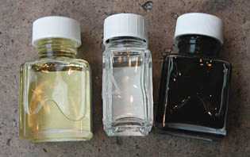

## Les vernis définitifs
### Les vernis définitifs, usage en arts plastiques et autres
 **Les vernis définitifs**  _Le vernis pour la gouache_

Il remplit en fait la fonction de fixatif. Il est moins le protecteur que le "fixateur" de cette peinture réversible. Il ne peut être appliqué au pinceau (ce dernier entraînerait la peinture). Restent donc les aérosols et la [soufflette](soufflette.html). L'internaute trouvera les indications nécessaires à la fabrication d'un vernis gouache maison dans l'article sur la [gomme laque](gommelaque.html#vernis).

_Le vernis-colle_

Il est consacré aux collages et assemblages divers, aux travaux tridimensionnels, etc. A cette heure, nous ignorons presque tout de ses caractéristiques techniques (chimie, vieillissement) mais nous enquêtons ! Un seul détail : il rend nécessaire l'application d'une surcouche d'un second produit destiné à neutraliser la viscosité du premier.

_Les vernis à vieillir et à craqueler_

Destinés, selon les fabricants, à n'importe quel type de peinture, leur composition (jamais affichée) nous est totalement inconnue.

Le vernis à craqueler doit théoriquement être posé au-dessus d'une couche de vernis à vieillir. Certaines sources non confirmées indiquent que la sous-couche n'est pas nécessaire. D'autres, plus sûres, précisent que même avec la sous-couche le produit ne fonctionne pas du tout.

Avouons que pour l'instant nous nageons dans le flou à cause en premier lieu du manque d'informations de la part des fabricants. Il est notablement étonnant qu'aucune précision ne soit apportée en ce qui concerne l'adéquation de ces produits à tel ou tel type de peintures. Nous disposons d'assez de témoignages pour savoir que le client terminal se trouve souvent assez mécontent.

Enquête en cours.

_Le vernis polyuréthane_

Lire la page consacrée aux [polyuréthanes](polyurethane.html).

_Les vernis pour la peinture à l'huile_

Le mot "vernis" étant largement détourné de son sens, précisons pour commencer que les substances qui peuvent véritablement prétendre porter ce nom sont celles qui ont un rôle protecteur ([voir définition](vernis.html)). Ils correspondent sensiblement aux produits que l'on nomme souvent "vernis définitifs". Cependant, ce terme même est abusif car précisément, un vernis doit pouvoir être retiré. Cependant ne jouons pas la fine bouche : l'épithète "définitif" permet de distinguer ce produit des "[vernis à peindre](mediumsetvernis.html#vernisapeindre)", "[vernis à retoucher](mediumsetvernis.html#vernisaretoucher)", etc.

_L'utilisation normale du vernis définitif implique un délai d'attente après finition du tableau de l'ordre d'un à deux ans au moins, sauf peinture extrêmement maigre (six mois peuvent alors suffire)._

_Le vernis est très fortement chargé en résine. Il est très solide. Son diluant est de préférence l'essence de pétrole : celle-ci s'évapore intégralement, n'entraînant aucune viscosité additionnelle._

_Certains peintres l'utilisent dilué comme "vernis à peindre" (médium), ce qui n'est pas forcément une bonne idée (voir [détournement des produits](detournement.html))._

Les résines des vernis définitifs sont très différentes les unes des autres. Sur l'image, nous voyons de gauche à droite

> \* un vernis à base de gomme dammar
> 
> \* un vernis synthétique, dont la composition n'est pas annoncée, comme c'est le cas le plus souvent
> 
> \* un vernis au copal, à diluer amplement comme le suggère la teinte de ce produit (sachant que la plupart des auteurs s'accordent pour dire qu'il va jaunir en vieillissant !). Il est réputé très dur, ce qui n'est pas forcément un avantage.

_**Le dosage des résines est fondamental.**_

Nous ne donnerons pas de recettes de vernis définitif pour l'huile sur ce site, laissant l'internaute choisir entre

> \* la fabrication maison, qui ne se distingue de la [réalisation de médiums](preparationsfaitesmaison.html) que sur quelques points :
> 
> > \* la charge en résine, que l'on peut augmenter
> > 
> > \* la suppression de tout composant poissant. Dans le cas de la résine dammar notamment, il est souhaitable de faire décanter plusieurs fois le liquide ([lire passage in Le médium maigre au dammar](mediumdammar.html#decantation))
> > 
> > \* le choix de l'essence, de préférence minérale ([essence de pétrole](essences.html#lessencedepetrole))
> > 
> > \* la diminution de la quantité d' huiles et siccatifs éventuels. Un vernis n'est pas censé être particulièrement gras
> > 
> > \* l'emploi [d'oléorésines](oleoresine.html) en petite quantité, assez conseillé. [Venise](venise.html) ou [Canada](canada.html), elles sont assouplissantes et peuvent réduire des problèmes [d'embus](embu.html)
> > 
> > \* l'ajout éventuel de cire (voir [ci-dessous](vernisdefinitifs.html#cires)) et autres produits mats nécessitant un [double vernissage](vernisdefinitifs.html#doublevernissage),
> 
> \* l'utilisation de produits du commerce. Attention : combiner plusieurs produits est possible mais nous conseillons de choisir une seule et même marque car les fabricants font parfois des "choix philosophiques" différents, pouvant entraîner de désagréables surprises.

**Des cires dans les vernis pour l'huile**

Comme indiqué dans l'article sur [les cires en tant que liants](cires.html), ces produits sont thermiquement instables à cause de leur point de fusion très bas (voir [_thermosensibilité_](liants.html#thermosensibilite)). Il faut prendre certaines précaution à l'accrochage des tableaux. Ceux-ci doivent être éloignés des sources de chaleur (spots, moteurs, radiateurs, etc.).

Cependant, ces vernis sont remarquables pour leur pouvoir matifiant.

Certains auteurs recommandent un brossage extrêmement doux après apposition, à sec, ce qui peut influer sur l'aspect mat ou satiné. On est effectivement en présence d'une encaustique, donc l'action de frotter pourrait jouer un rôle.

Une réserve importante : _les vernis à la cire sont réputés les plus durs à enlever lors du [dévernissage](devernissage.html) (information provenant des fabricants eux-mêmes)_. La raison en serait que la cire a tendance à pénétrer très intimement la surface picturale (selon certains auteurs).

Il peut donc être salutaire - c'est à tout le moins une mesure de prudence minimale - de pratiquer un double vernissage ([voir ci-dessous](vernisdefinitifs.html#doublevernissage)) afin que la surface du tableau ne soit pas en contact avec un vernis cireux, ce qui permet d'éluder le problème.

**Vernis mats et double vernissage**

Ce procédé est recommandé par les fabricants pour l'emploi des vernis mats (éventuellement satinés), notamment parce que ceux-ci contiennent très souvent de la cire ([lire absolument le passage ci-dessus](vernisdefinitifs.html#unereserveimportante)). Il faut donc passer une première couche de vernis brillant, puis une couche de vernis mat. Lors du dévernissage, les deux couches de vernis sont retirées comme s'il n'y en avait qu'une seule sans que la surface picturale soit endommagée.

Une autre raison d'appliquer un vernis intercalaire brillant est liée au fait que mat sur mat donne flou. Lire une [citation](courrierdeslecteurs2010b170.html#20100607mmxdl) de Xavier de Langlais dans le Courrier des Lecteurs.

_Vernir ou non ?_

Concernant l'emploi _normal_ des vernis, il faut considérer la réalité plus que la théorie :

> \* la théorie veut qu'un vernis dit "définitif" soit retiré régulièrement, après quelques décennies généralement
> 
> \* la réalité est que souvent ce travail n'est pas toujours effectué, que les vernis se comportent mal, jaunissent, craquèlent (emportant parfois des morceaux de peinture) et à terme ne protègent plus rien.

En ce qui concerne la peinture acrylique, il est encore un peu trop tôt pour affirmer que les vernis remplissent mieux ou moins bien leur fonction, mais concernant l'huile, il est permis de s'interroger (de nombreux peintres s'interrogent en effet) sur l'intérêt réel du vernis "définitif".

En effet, le peintre peut se douter que l'acheteur n'aura pas la constance ou les moyens suffisants pour rafraîchir le vernissage régulièrement. Il vaut souvent mieux, dans ce cas, ne pas vernir ou vernir légèrement, avec un [vernis à retoucher](vernisaretoucher.html) par exemple.

Cependant, il ne faut pas oublier l'une des fonctions premières du vernis définitif : réduire les [embus](embu.html). Que faire alors ? Vernir quand même ?

Il existe des procédés alternatifs :

> \* en premier lieu, une bonne connaissance de la siccativité des pâtes employées (_facteur d'absorption des pigments,_ _liant utilisé_), un usage adapté des médiums pour rectifier le degré de brillance ou de matité
> 
> \* pour la peinture à l'huile, l'adjonction finale d'une fine couche d'huile tamponnée (chiffon, Sopalin ®) donne un délicieux satiné. [Xavier de Langlais](livres.html#langlais) mentionne cependant la résurgence des embus à moyen ou long terme, une fois l'huile bue par les pigments fautifs. Ce problème ne se pose que pour des pigments vraiment rebelles.
> 
> \* pour les peintures acryliques, vinyliques ou oléagineuses, l'ajout d'une couche de certains médiums (médium flamand, gel acrylique léger) résout bien mieux le problème des embus que l'emploi de vernis. Les deux procédés ne sont d'ailleurs pas incompatibles. D'une certaine manière, résoudre le problème des embus par les médiums avant le recours au vernis est certainement le procédé le plus correct de toutes manières : quoiqu'il advienne du vernis, le tableau lui-même ne présentera plus d'anomalies sur le plan de l'homogénéité brillance/matité, les résines ayant fait leur office.
> 
> \* une conservation dans des conditions correctes, un ""nettoyage" régulier très doux de la surface à l'eau distillée (vérifier le [pH](papiertournesol.html) qui doit être neutre).

Pour la peinture acrylique, le vernis représente une protection définitive extrêmement solide qui peut être lavée mais difficilement retirée, sauf exceptions. Le peintre peut, pour cette raison, choisir de ne pas vernir, sachant que de toutes manières les acryliques (et la peinture vinylique) peuvent être nettoyées sans danger.

 [Communication](http://www.artrealite.com/annonceurs.htm) 

