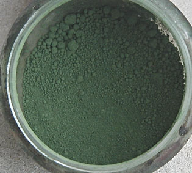
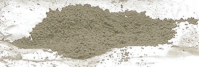
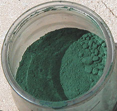

## Les verts complexes
### Les verts complexes, impurs, subtils, usage en arts plastiques et autres
 **Les verts complexes**  

**L'oxyde de chrome**

Il s'agit d'un [sesqui](sesqui.html)oxyde de chrome (le vert émeraude actuel a la même formule, mais hydratée).

Contrairement à ce dernier ([traité dans l'article sur les verts](verts.html#vertemeraudeouviridien)), il est très couvrant. Par contre, il est tout aussi permanent. Il serait assez utilisé en peinture [à fresque](fresque.html).

Il a pu être confondu avec des verts créés à partir de jaune de chrome et de bleus divers. Une chose le différencie : il n'est pas un mélange.

Sa très relative ressemblance avec la terre verte ne doit pas dissimuler une composition chimique radicalement différente ni un caractère couvrant beaucoup plus intense.

Lire l'article consacré à la [famille des chromes](chrome.html).

**La terre verte ou terre de Vérone**

_Utilisée pendant l'Antiquité (au moins à l'époque romaine - elle n'est semble-t-il pas consignée dans les archives des civilisations plus anciennes), elle serait faite de différents composés [siliceux](silice.html), soit d'une manière générale des [argiles](argile.html) associées à différents métaux oxydés : le fer, le magnésium ([magnésie](magnesie.html)), le [manganèse](manganese.html), etc. [Merci de nous communiquer toute information fiable et précise](ecrire.html) sur la composition de terres vertes véritables._

_Le rôle de l'oxyde de fer est évoqué dans un [passage](chap19oxydationsmetaux.html#terreverte) du chapitre XIX des Dialogues de Dotapea._

_La terre verte a une forte personnalité chromatique, associant chaleur et froideur, pénombre et lumière sourde (voir photos ci-contre et ci-dessous)._

**Provenance**

Ses variétés sont nombreuses. Les plus réputées proviennent de Vérone (d'où l'intitulé de _terre de Vérone_, dit "_Brentonico_" - c'est de loin l'espèce la plus courante), de Bohème - [voir ci-dessous](vertscomplexes.html#terredeboheme) - et de Chypre. Toutes celles-là contiennent du [protoxyde](protomonobidi.html) de manganèse. Les Romains se seraient également servis de variétés de la région de Nice (France). Le géologue averti peut découvrir dans des zones plus circonscrites en Europe ou ailleurs (jusqu'en Amérique) des variétés qui ont été utilisées tant en décoration qu'en peinture artistique ou rituelle.

**Intérêt porté à cette couleur au cours de l'histoire**

Bien que ce pigment semble avoir été boudé pendant la préhistoire, dans la Rome de l'Antiquité, l'extraction et la préparation de la terre verte étaient quand même parvenues à maturité. Il faut dire que les pigments verts étaient rares (cf. [introduction de l'article sur les verts](verts.html)) et les besoins importants. La recherche s'était donc concentrée et intensifiée sur les rares variétés disponibles.

Rome s'est servie des différences entre les variétés pour constituer une palette étonnement riche de verts. La terre verte est également signalée à Ajanta (Deccan, Union Indienne, IIème siècle BC - VIIè AC), utilisée avec le même talent qu'à Rome.

Le Moyen-âge occidental ignorera cette couleur trop subtile, sauf pour la réalisation des travaux de fond (voir _[Comment s'en servir ?](vertscomplexes.html#commentsenservir)_). La Renaissance occidentale sera aussi la renaissance de la terre verte, qui ne cessera plus d'intéresser les peintres. De nouveaux verts sont apparus, aidant notre regard à se débarrasser de l'aspect nécessaire, quasiment obligatoire, de la terre verte, au profit de sa beauté intrinsèque et de son aptitude à rendre sensibles les plus subtiles variantes de verts ([voir plus loin](vertscomplexes.html#interetpourlesvariationsduvert)).

De nos jours, on trouve encore des terres vertes très variées. Comparer par exemple la photo ci-contre et celle qui se trouve [ci-dessus](vertscomplexes.html#phototv1). Leur point commun est un aspect toujours cendré, lunaire, qui est d'ailleurs magnifié par la calcination (voir [ci-dessous](vertscomplexes.html#terrevertecalcinee)).

**Comment se comporte-t-elle ?**

_Elle est un pigment très permanent._

Au registre des défauts - ou plutôt des particularités -, elle est relativement peu couvrante et, selon certaines sources, susceptible de provoquer des craquelures (peinture à l'huile). Nous n'avons jamais constaté ce genre d'accidents. De même, l'accusation quelque peu excessive selon laquelle la terre verte "rejetterait l'huile" nous semble totalement infondée, infirmée par l'expérience (à moins qu'il s'agisse d'une variété très particulière ou d'une contrefaçon). Enfin, elle n'est pas particulièrement [siccative](sechagesiccativation.html) (toujours en peinture à l'huile), contrairement à ce qu'annoncent certains auteurs (alors que d'autres affirment le contraire), se fondant probablement sur la présence théorique d'oxyde de manganèse, produit siccatif, dans ce pigment. La variété des provenances de la terre verte peut expliquer en partie les importants écarts entre les jugements des peintres. Certains auteurs mentionnent en effet une simple "_petite quantité de manganèse_" dans la terre verte. Plus encore que sa composition, la transparence de ce pigment peut expliquer certains écarts de jugements : elle induit un léger risque d'erreur au moment du broyage dans certaines conditions. Mais ce type de propos discordants n'est pas rare (voir _[Pigments dits "douteux"](pigmentsdouteux.html)_).

**Comment s'en servir ?**

_Elle est généralement sans grand intérêt en mélange massif, sinon avec le blanc - en pâte ou en transparence. On la mêle surtout à d'autres pigments introduits en petites quantités._

La terre verte est un élément important du [verdaccio](imprimatures.html#verdaccio). Chez les primitifs italiens, les carnations sont peintes sur une ébauche très travaillée à base de _terra verde_ et de blanc. Aujourd'hui encore, ce procédé est utilisé par certains peintres. D'autres lui préfèrent un fond uni, une [imprimature](imprimatures.html) qui a effectivement tendance à magnifier les carnations.

Elle est souvent utilisée, on l'a compris, pour les carnations, mais aussi pour les feuillages ou tout autre type de travail supposant des variations de verts car elle donne une base chromatique particulièrement  intéressante que l'on pourrait presque dire "adulte" ou estivale, pas tellement printanière, aucunement acidulée - ce qui donne encore plus d'impact aux interventions locales de teintes fraîches. Cette base puissante peut être altérée par des ajouts très subtils d'autres pigments, pratique typique lorsqu'il s'agit de traiter cette couleur dont l'oeil humain repère par nature le maximum de variantes par rapport aux autres gammes chromatiques.

En [glacis](glacis.html), elle est excellente avec l'huile ou l'acrylique. A fresque également : elle ne réagit guère aux substances alcalines des mortiers et plâtres. En décoration intérieure, elle est intéressante d'autant plus qu'elle est assez peu coûteuse.

En [patine](patines.html) ( à la cire notamment), elle rend des services pour réaliser des imitations de vert-de-gris.

**Terre verte calcinée**

Selon certains auteurs, calcinée (débarrassée de son eau par cuisson), la terre verte deviendrait plus brune et jaunâtre ("_terre verte brune_") et donnerait de beaux gris, fort permanents.

En fait, nous avons effectué cette classique expérience de calcination et à la température maximale d'une plaque de cuisinière, le résultat n'a rien de brunâtre ; il est à peine plus jaune. Comme on le voit sur l'image, il s'agit d'un gris-vert beau comme une cendre lunaire.

Le pigment originel ayant servi à l'expérience dont on voit le résultat ici est celui qui apparaît sur [l'image située plus haut](vertscomplexes.html#phototv2).

**Les imitations**

Nous signalons l'existence _d'imitations de la terre verte__, y compris dans certaines gammes extra-fines !_ Exemple : oxyde de fer jaune + noir d'ivoire + chlorate de phtalocyanine de cuivre. Guère plus permanente que l'original, cette imitation a l'avantage - ou l'inconvénient - d'être nettement plus couvrante. La couleur est superbement rendue.

La teinte de la terre verte naturelle est répertoriée dans la nomenclature pigmentaire internationale (Colour Index) sous l'intitulé [PG23](nomenclaturepig.html#pg23). Sur un pot de pigment ou un tube, l'absence de cette référence et la présence de plusieurs autres ("_PYxx, PBkxx_") signalent toujours une imitation. 

**Terre de Bohème**

On signale une terre de Bohème de couleur verte, proche de la terre verte véronaise mais plus pâle. Nous en ignorons la composition. Toute information à son sujet sera [la bienvenue](ecrire.html).

**Toxicité**

Elle est faible, mais il faut faire attention au manganèse qu'elle peut contenir en quantité variable selon sa provenance. Sous forme pulvérulente uniquement, il existerait un danger d'intoxication. L'inhalation répétée (quotidienne) est à éviter, comme avec les [terres d'ombre](terresdombre.html). L'exposition est maximale lors des dizaines de secondes qui suivent l'ouverture des pots. Couvrir les pots d'un plastique transparent lors de cette opération n'est pas une précaution inutile pour l'utilisateur régulier.

**Vert de cobalt**

Il s'agit tantôt d'un [titanate](titanes.html) de [cobalt](annexe1.html#co) (ci-contre), tantôt d'une combinaison zinc/cobalt. Nous le connaissons fort mal. Comportant du cobalt, il implique peut-être les mêmes précautions pour la peinture à l'huile que le [bleu de cobalt](bleusfroids.html#lebleudecobalt) (information non confirmée). Il est réputé permanent. Sa couleur est peu franche ; elle paraît même assez impure, emprunte de bleu et de gris. Les imitations sont courantes étant donné le prix du cobalt.

[Xavier de Langlais](livres.html#langlais) écrit au sujet de la version au zinc : "Très stable dans tous les mélanges, siccativité moyenne", ce qui a de quoi surprendre. Il est possible que nous soyons en effet en présence d'un sel très solide qui n'aurait pas la "siccativité" du bleu de cobalt ou du céruléum, mais nous ne saurions l'affirmer pour le moment.

Il faut en effet souligner le fait que cette couleur, très présente dans les gammes de peintures acryliques, est pratiquement absente des peintures à l'huile.

[Lire l'article consacré à la famille des cobalts.](cobalts.html)

**Vert céladon**

C'est une sorte d'arlésienne : tout le monde en parle - et les experts en marketing en abusent quelque peu de nos jours - mais personne n'en voit... la couleur, un comble ! Le véritable céladon est, à notre connaissance, assez peu courant voire indisponible en France, même chez les fournisseurs les mieux approvisionnés. Certains professionnels le produisent eux-mêmes.

Il faut dire qu'il ne s'agit pas à proprement parler d'une couleur pigmentaire. Il s'agit avant tout d'un "[oxyde](oxydes.html)" destiné aux arts du feu.

Son origine est extrême-orientale. La Chine maîtrisa progressivement la fabrication de glaçures au céladon. Les premières réalisations dateraient du IIIème siècle AC, à Yue, Province de Zhejiang. D'abord craquelées, elles devinrent si parfaites vers le XIème siècle que les poteries s'exportèrent, suivies des potiers eux-mêmes (lire un intéressant article de Dauphine Scalbert sur [Eurocéramique.com](http://www.euroceramique.com/ateo/francaisateods/articlesceramique/celadonscoreens/celadonscoreens.html)).

Fort étrangement, le principal élément colorant du céladon - pourtant d'un bleu-vert légèrement "rompu" et clair - serait le fer, cuit "en [réduction](reductionreducteur.html)". Cependant, une telle glaçure ne se réduit pas à un seul élément et il y a de fortes chances pour que la composition mise en oeuvre dans les ateliers impériaux fasse intervenir d'autres composants s'associant chimiquement lors d'une cuisson contrôlée aussi rigoureusement qu'il est possible de l'imaginer.

Sur le rôle du fer dans la terre verte et le céladon,  
lire un [passage](chap19oxydationsmetaux.html#terreverte) du chapitre XIX des Dialogues de Dotapea.

L'étymologie poétique du terme occidental "céladon" est tirée du nom de l'un des personnages du roman pastoral du XVIIème siècle "_L'Astrée_", ouvrage à la mode antique (l'action se situe dans la Gaule du Vème siècle). Il s'agit d'un succès littéraire de l'époque signé par Honoré Durfé et comptant rien moins que cinq mille pages. A la question : "_mais quel peut bien être le rapport entre le beau pâtre de l'époque druidique, imaginé par un romancier vivant douze siècles plus tard, et les glaçures asiatiques du premier millénaire AC ?_", on répondra qu'un ruban vert, arboré par la belle Astrée et arraché fortuitement par le beau Céladon, fut ensuite porté par celui-ci lors des innombrables aventures de ce héros imaginaire. Une association a posteriori, purement poétique, liée à un publication littéraire en vogue.

L'utilisation pigmentaire du céladon pose d'autre questions. Des céramiques glacées au céladon auraient côtoyé des cargaisons de [smalt](bleusfroids.html#lesmalt) sur les jonques chinoises de l'époque Yuan. Aussi est-il permis de se demander si un "pigment céladon" a pu être réalisé sous la forme d'un genre de [fritte](fritte.html) broyée, à l'instar du smalt, ça et là, sur le continent eurasien. La question reste posée. [Merci de nous communiquer toute information à ce sujet.](ecrire.html)

Lecture conseillée : [Le céladon sur Pourpre.com](http://pourpre.com/chroma/dico.php?typ=fiche&&ent=celadon)

 [Communication](http://www.artrealite.com/annonceurs.htm) 

