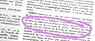
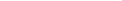

## Lettres Q et R
### Glossaire lettres Q et R
 Navig. page/section

  
  

\_\_\_\_\_

**Sous cette page**

\_\_\_\_\_

**Pages soeurs**

[Lettre A](a.html)  
[Lettre B](b.html)  
[Lettre C](c.html)  
[Lettre D](d.html)  
[Lettre E](e.html)  
[Lettre F](f.html)  
[Lettre G](g.html)  
[Lettre H](h.html)  
[Lettres IJK](ijk.html)  
[Lettre L](l.html)  
[Lettre M](m.html)  
[Lettres NO](no.html)  
[Lettre P](p.html)  
Lettres QR  
[Lettre S](s.html)  
[Lettre T](t.html)  
[Lettres UV](uv.html)  
[Lettres WXYZ](wxyz.html)  
[Annexe 1 - table des éléments](annexe1.html)

\_\_\_\_\_

Copyright © www.dotapea.com

Tous droits réservés.  
[Précisions cliquer ici](droitscopie.html)

**Lettres Q et R**

Accès direct aux autres lettres :

 **_[A](a.html)   [B](b.html)   [C](c.html)   [D](d.html)   [E](e.html)   [F](f.html)   [G](g.html)   [H](h.html)   [IJK](ijk.html)   [L](l.html)   [M](m.html)   [NO](no.html)   [P](p.html)   [S](s.html)   [T](t.html)   [UV](uv.html)   [WXYZ](wxyz.html)_**

**[Accès direct lettre R](qr.html#r)**

**Index lettre Q**

**Commentaires**

Destinations  
(cf. [légende](qr.html#legendeicones))

 

 

 

**[Quartz](quartz.html)**

 

**Quercitrin et quercitron**

[Passage _in Les jaunes._](jaunes.html#quercitrin)

**Quintessence**

[Passage _in Le raffinage._](raffinage.html#quintessenceether)

 

 

 

**Index lettre R**

[Accès index alphabétique](glossaire.html)

 

 

 

 

**[Raisin](raisin.html)**

 

**[Raffinage](raffinage.html)**

 

**[Raku](raku.html)**

 

**[Rayon atomique](rayonsatomiques.html)**

 

**Rayon de covalence**

[Passage _in La covalence_.](covalence.html#rayondecovalence)

**[Réalgar](realgar.html)**

 

**[Rechampi, rechampir](rechampir.html)**

 

**[Réduction, réducteur](reductionreducteur.html)**

 

**[Réfractaire](refractaire.html)**

 

**[Réfraction, réfringence](refraction.html)**

 

**[Régule](platdetain.html)**

 

**[Réserve](reserve.html)**

 

**[Résilience](resilience.html)**

 

**[Résine](resine.html)**

 

**[Réticulation](reticulation.html)**

 

**[Retrait](retrait.html)**

 

**Réversibilité**

[Passage in Les liants font les procédés.](liants.html#reversibilite)

**[Rhodoïd ®](rhodoid.html)**

 

**Rinzaffo**

[Passage in _Courrier des Lecteurs._](courrierdeslecteurs2009c020.html#rinzaffo)

**[Roches basiques _vs_ roches acides](rochesbasiquesacides.html)**

 

**[Rocou ou roucou](roucou.html)**

 

**[Rompu](rompu.html)**

 

**[Ronde-bosse](rondebosse.html)**

 

**[Rough](rough.html)**

 

**[RTV, RTV2](elastomeresilicone.html)**

 

**[Rutile](rutile.html)**

 

\_\_\_\_\_

**Légende des icônes/liens (destinations)**

_Pour éviter toute surprise lors de la navigation, nous avons créé cette signalétique :_

article du glossaire

article hors glossaire

_passage_ situé dans un article du glossaire

_passage_ situé dans un article hors du glossaire

  liens en "portail", ouvrant sur différentes adresses

 

 

 [Communication](http://www.artrealite.com/annonceurs.htm) 

