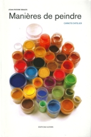
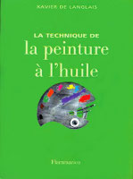

## Livres
### Livre, bibliographie
 **Bibliographie**

Ne figurent ici que les ouvrages qui nous ont réellement convaincus parmi une offre très riche, trop riche peut-être. Toute proposition est vraiment bienvenue, mais sans garantie d'insertion.

A lire absolument : cette liste remarquablement complétée [ici.](courrierdeslecteurs2011a180.html#20110321jllistejp)

_Manières de peindre, carnets d'atelier,_ Jean-Pierre Brazs, 2011, éditions Notari, Genève.

Tout y est ! C'est la pratique - ou plutôt les pratiques - de la peinture sur la base d'un intérêt soutenu porté au matériau pictural. La démarche est très sensiblement partagée avec celle de Dotapea mais se présente d'une part comme une approche "transversale" dans le sens où elle évoque l'usage dans les faits des produits et des phénomènes et d'autre part comme de nouvelles propositions synthétiques du plus haut intérêt.

Un must.

 

 



_La technique de la peinture à l'huile_, Xavier DE LANGLAIS, 1959 et ult., Flammarion. Une référence fondamentale qui a l'avantage d'être concise et peu coûteuse. La contribution de cet ouvrage à l'art pictural est, ni plus ni moins, essentielle. Xavier de Langlais, à travers son livre, continue à former des artistes - du Japon à l'Armorique - et représente toujours un recours, une présence amicale et salutaire pour les peintres professionnels.

Une annexe est consacrée aux peintures acryliques et vinylique.

 

 



_Couleurs, pigments et teintures dans les mains des peuples_, Anne VARICHON, Seuil octobre 2000. Un superbe ouvrage, des informations aussi passionnantes que pertinentes. **_Un livre de rêve_** et un vrai _must_. Exceptionnel et précieux. Nous adorons et conseillons sans la moindre réserve ce remarquable ouvrage de référence.  
Signalons par ailleurs sur ArtRéalité.com un texte collectif auquel l'auteure a participé : _Des teintures, de la pourpre... et de la couleur comme nourriture,_ [cliquer ici](http://www.artrealite.com/teinturepourprecouleur.htm).

 

 

 

_Traité des couleurs,_ Libero ZUPPIROLI, Marie-Noëlle BUSSAC, 2001, Presses Polytechniques et Universitaires Romandes (PPUR). Lausanne, Confédération Helvétique. Une précieuse approche scientifique sur le thème de la couleur, de la perception et de l'évolution.

 

 

 

_Dictionnaire des matériaux du peintre,_ François Perego, 2005, Belin, Paris. C'est une référence hors de l'ordinaire, véritablement un must dans le domaine de la peinture.

 

 

 

_Dictionnaire technique de la peinture_, André Béguin. Six tomes initialement, refondus en deux (A-I et J-Z) aux Editions André Béguin. L'oeuvre a été créée sur une longue période, à la charnière des années 70 et 80. Une nouvelle édition a été publiée en 2001. Signalons le lien [andre.beguin.free.fr/html/technique/index.htm#peinture](http://andre.beguin.free.fr/html/technique/index.htm#peinture).

 

 

 

_Technique de la peinture,_ Que sais-je ?, Jean Rudel, 1974-1999, Presses Universitaires de France, Paris. Un très bon ouvrage.

 

 

 

_La Peinture à partir du matériau brut et le rôle de la technique dans la Création d'Art,_ Nicolas Wacker, 1998, éditions Allia, Paris. Une référence de premier plan.

 

 

 

_Artist's handbook of materials and techniques_, Ralph Mayer, 1940 et ult., Viking Books. Une référence chaudement conseillée par Hugues Delbergue, webmaster de l'excellent ETFA ([http://eggtempera.free.fr/fr](http://eggtempera.free.fr/fr)).  
Il est difficile de se procurer cet ouvrage en France. Le plus simple est d'utiliser le site d'achat en ligne de L'University Bookstore de Washington. Accès direct à l'ouvrage : [cliquer ici](http://www4.bookstore.washington.edu/ubs_gb/ShowTitleUBS.taf?ISBN=0-670-83701-6&ActionArg=TITLE).

 

 

 

_Peindre et décorer au naturel,_ Nathalie Boisseau, 2009, Editions Alternatives, Paris. Beaucoup de talent dans ce petit livre. Le talent de donner envie, par quelques mots et quelques images, d'essayer des procédés aussi tentants que le badigeon à la brique et à la farine de sarrasin, la peinture à l'argile, la lasure à la bière, la patine à l'huile d'olive, ... Une belle synthèse et un bel esprit de découverte. Très agréable à lire... et à essayer.

 

 

 

_Couleur, manuel pratique pour l'artiste,_ Simon Jennings, 2005, Dessain et Tolra. Une approche pédagogique qui brille par sa concision. Beaucoup d'informations sont fort bien regroupées et synthétisées dans cet ouvrage de taille pourtant modeste.

 

 

 

_Un ouvrage sur internet :_ [Lisière](http://lisiere.free.fr/), de Patrick Depoix.

Remarquable travail sur les sources possibles d'approvisionnement en matériaux destinés à la peinture. Formidable et utile. Bravo !

 

 

 

_Le monde des teintures naturelles,_ Dominique Cardon, 2003, Belin (cf. [http://www2.cnrs.fr/presse/journal/853.htm](http://www2.cnrs.fr/presse/journal/853.htm)). Une référence dans le monde de la teinture et des couleurs naturelles.

 

 

 

_Techniques picturales anciennes - peintures décoratives et artistiques,_ Jean-Claude Misset, 2000, Editions Charles Massin. Un bon petit livre synthétique et fort instructif sur les techniques de fresque, du badigeon, etc.

 

 

 

_Qu'est-ce que l'esthétique ?_, Marc JIMENEZ, 1997, 2002, Folio Essais. Un ouvrage lumineux, accessible aux non-philosophes. Jimenez aborde sous un angle historique de nombreux questionnement sur [l'art](art.html) au travers des réflexions des auteurs et des artistes de tous temps.

On lira notamment "(...) _le retard de l'esthétique n'est pas un handicap ; venir après les oeuvres signifie qu'elle prend le temps de réfléchir sur son histoire passée et présente. Au moment où l'art d'aujourd'hui perd, dit-on, tous ses repères et ses critères, un tel retard devient même un privilège._" (p. 28)

 

 

 

_Le guide de la peinture décorative_, Kevin Mac Cloud, 1997, Armand Colin, 12 av. d'Italie, 75013 Paris. Ouvrage très instructif dont l'intérêt déborde largement du seul domaine de la décoration. On peut reprocher de petits défauts du côté de la traduction, empreinte d'anglicismes prêtant parfois à de graves confusions et contresens. Il y a de quoi être surpris lorsque l'on lit : "_Le médium huile n'est pas vraiment un liant comme les gélatines. Ces dernières ne sont qu'un additif , tandis que l'huile forme l'essentiel de la peinture. Elle est plutôt le "véhicule" des pigments._" !!! Les concepts anglo-saxons ne peuvent être ainsi transposés. Nous notons par ailleurs quelques opinions alarmistes concernant les dangers des substances, souvent non confirmées par les centres de recherches et institutions officielles. Ce livre est cependant d'un intérêt de premier plan.

 

 

 

_Techniques du latex_, Jean-Pierre DELPECH, Marc-André FIGUERES, Nicole MARI, 2002, Eyrolles. C'est un ouvrage de référence bien construit et bien documenté.

 

 

 

_Terres et glaçures_, Daniel RHODES, 1999, Dessain & Tolra. Consacré à la poterie, cet ouvrage concerne en fait de nombreuses disciplines artistiques. Ouvrage très précis, quasi professionnel - et bien connu dans la profession -, parvenant cependant à maintenir l'intérêt du profane grâce notamment aux illustrations et à une construction intelligente.

 

 

 

_Pratique des émaux de grès_, Daniel de MONTMOLLIN, éditions La revue de la céramique et du verre. Grand ouvrage technique de référence pour qui travaille à haute température.

 

 

 

_Le métier du peintre_, Pierre GARCIA, 1990, 1994, Dessain & Tolra, Paris. Il existe une version abrégée et une version complète, nettement plus volumineuse, que nous n'avons pas eu l'occasion de consulter. L'abrégé est assez intéressant car il évoque des aspects du... métier qui sont boudés par la plupart des auteurs.

 

 

 

_L'art de la composition et du cadrage_, DUC, 1992 et ult., Éditions Fleurus, Paris 6é. Cet ouvrage n'est plus édité, mais doit être encore présent dans quelques bibliothèques en attendant une hypothétique relance de la publication. Il s'agit d'une introduction fort complète aux vastes problématiques de la composition. L'habileté de l'auteur consiste à aborder ce sujet central essentiel, aussi technique qu'artistique, au fil d'une agréable ballade pluridisciplinaire, avec rigueur et sans jamais lasser. Une très bonne référence malgré quelques points discutables, ce qui est inévitable dans ce domaine dont une petite partie seulement relève de la science cognitive. Nous conseillons très vivement cet ouvrage.

 

 

 

_La sculpture - Toutes les techniques_, Philippe CLERIN, 1988 et ult., Dessain & Tolra, Paris. Une somme considérable, des informations de qualité.

 

 

 

_Gravure et impression - Techniques et création_, Judy MARTIN, trad. Irène Lassus, 2001, Eyrolles, Paris. Une belle introduction, un panorama très intéressant.

 

 

 

_Modelage d'argile, cent astuces_, Philippe CHAZOT, 1999, Ulisseditions, 2 bis pl. du Puits de l'Ermite, 75005 Paris. Un sympathique petit livre bien pratique. La problématique de l'évidement des pièces en vue de la cuisson est abordée de manière simple.

 

 

 

_Préparation des couleurs_, Yvan THIELE, 1949, Henri Laurens, Paris. Encore un ouvrage de référence, cité par [Xavier de Langlais](livres.html#langlais).

 

 

 

_Phénomènes physiques et peinture artistique,_ Gilbert DELCROIX et Marc HAVEL, 1988, Erec, Puteaux, France. Cet ouvrage scientifique de référence mais d'une lecture réellement ardue est davantage un document destinée aux restaurateurs, aux conservateurs et aux industriels de la peinture qu'aux artistes et aux amateurs.

 

 

 

_De l'enluminure médiévale,_ in _Arts & métiers du livre n°220_ - [voir site internet](http://www.art-metiers-du-livre.com/) -, Mireille Marlier, 2000. Une très belle promenade historico-technique qui déborde avec bonheur (et talent) du seul thème de l'enluminure.

 

 

 

_La France d'avant la France - Du néolithique à l'âge du fer_, Jean GUILAINE, 1980 et ult., Hachette/Pluriel, Paris. Une référence qui pourra intéresser les passionnés de l'histoire des arts du feu et de la taille de pierre, entre autres. 

 

 

 

_Il libro dell'arte_, Le livre de l'art, Cennino CENNINI, 1998 et ult., Berger-Levrault, Toulouse (France). Un ouvrage du XIVème siècle qui continue à faire référence.

 

 

 

_The materials and methods of sculpture_, J.C. RICH, 1947, Oxford University Press, New York. Un ouvrage de référence, cité notamment par [Philippe Clérin](livres.html#philippeclerin).

 

 

 

_La science de la peinture_, VIBERT, Albin Michel, Paris. Un ouvrage de la fin du XIXème siècle décrivant entre autres _la "résine normale"_ (voir _[Le médium Vibert](mediumspourlhuile.html#lemediumvibert)_ [in _Les médiums pour l'huile_](mediumspourlhuile.html#lemediumvibert)).

 

 

 

_Comment dessiner avec fusains, sanguines et craies_, J.M. PARRAMON, 2002, Dessain & Tolra, Paris. Un bon ouvrage d'introduction.

 

 

 


 [Communication](http://www.artrealite.com/annonceurs.htm) 

[](index-2.html#20131014)


```
title: Livres
date: Fri Dec 22 2023 11:27:36 GMT+0100 (Central European Standard Time)
author: postite
```
