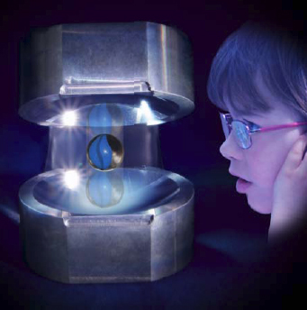

## Lumière, chats et miroirs in chapitre XXV des Dialogues de Dotapea
### Lumière, chats et miroirs in chapitre XXV des Dialogues de Dotapea
   

**4\. Lumière, chats et miroirs**

dial   dial   dial

Cette page qui fait partie du [chapitre XXV](chap25lumiereetmatiere.html) est une discussion entre Charles, physicien « opticien » au CNRS, et Emmanuel, candide.

Emmanuel : Nous venons de discuter avec Jean-Louis et Jean-Claude d'une particularité du photon qui m'a fait penser à une avancée apparemment très importante due à Serge Haroche et son équipe qui leur ont valu la médaille d'or du CNRS.

  
Charles, vous êtes physicien au CNRS, vous êtes ce que l'on nomme un « opticien », pouvez-vous nous en dire un peu plus sur cette « boîte à photons » ?

  
Charles : D'abord quelques rappels pour resituer les enjeux.

  
La mécanique quantique s'applique dans le cas général à des échelles très petites (de l'ordre au plus de la centaine de nm). La mécanique classique s'applique à notre échelle. Que se passe-t-il entre les deux ? Sachant que d'étranges propriétés inexistantes à notre échelle ont été observées et théorisées à l'échelle atomique :

> \* incertitude : on ne peut pas connaître à la fois la position et la vitesse d'une particule alors que pour une voiture on peut connaître les deux (GPS + vélocimétrie)
> 
> \* effet tunnel : une particule a une probabilité non nulle de passer à travers un mur (une barrière de potentiel) ce qui n'est pas notre cas. 
> 
> Voir aussi :
> 
> [développements](http://subaru.univ-lemans.fr/enseignements/physique/02/divers/qbarr.html) en vidéo interactive sur le site de l'université du Mans
> 
> et [autres liens](http://www.google.fr/search?hl=fr&q=%22barri%C3%A8re+de+potentiel%22&meta=)
> 
> \* non localité : une particule peut ne pas être localisée. On sait créer des paires de photons ayant une description unique (fonction d'onde unique) qui s'éloignent l'un de l'autre et on ne sait plus qui, quoi est où. Cet effet est en jeu dans la télétransportation.
> 
>   
> \* intrication : un atome unique peut être préparé dans deux états d'énergie différents. Au moment d'une mesure (influence de l'observateur qui, macroscopique, fait partie de l'expérience quantique) l'état devient unique et bien défini.

Il est de la plus haute importance pour la physique actuelle d'essayer de comprendre comment notre monde macroscopique peut-être construit sur le monde quantique.

J'en viens à Serge Haroche. Il s'est intéressé aux problèmes d'intrication en faisant de nombreuses expériences d'interaction lumière-matière. Il a pour cela d'abord travaillé sur les atomes de Rydberg. Les atomes de Rydberg [\[liens externes\]](http://www.google.fr/search?hl=fr&q=%22atomes+de+rydberg%22&meta=) sont des atomes dont l'électron extérieur est dans un état d'énergie très élevé (nombre quantique principal n = ± 80). À ces énergies d'excitation la taille de l'atome (souvent un [alcalin](alcalin.html#metauxalcalins), sodium ou rubidium) est de l'ordre du centimètre. On voit bien leur intérêt pour étudier le passage de l'atomique à l'humain ! 

  
Emmanuel : Comment des électrons aussi éloignés peuvent-ils ne pas se perdre ?Charles : La durée de vie de tels atomes de Rydberg n'est pas nécessairement très longue. Il suffit qu'ils durent suffisamment longtemps (10 microsecondes par exemple) pour qu'on puisse les utiliser dans une expérience.  
À ces niveaux d'excitation une transition de l'électron entre deux niveaux se fait à très faible changement d'énergie (micro-ondes).

Lire le [dossier de presse](http://www2.cnrs.fr/presse/communique/1606.htm) du CNRS

Serge Haroche a construit ce que nous appelons des cavités optiques [\[liens externes\]](http://www.google.fr/search?hl=fr&q=%22cavit%C3%A9+optique%22&meta=) d'une très grande finesse constituées d'une paire de miroirs, en niobium refroidi à la température de l'hélium liquide, se faisant face et tellement réfléchissants qu'une assemblée de photons peut s'y réfléchir pendant des temps très longs. En plaçant un atome de Rydberg dans la cavité, Serge Haroche a pu montrer qu'on pouvait « observer » l'état d'un atome sans détruire de photon.

Observer un champ peut figer son évolution

Visuel Cnrs © Michel Brune / LKB

À partir de ses travaux, ses collègues et collaborateurs ont réalisé une démonstration de la boîte à photon imaginée par Einstein et un déploiement expérimental de l'expérience du chat de Schrödinger \[[lien externe](http://www.nature.com/nature/journal/v448/n7155/abs/nature06054.html) journal Nature sur le célèbre félin (en anglais) / [autres liens](http://www.google.fr/search?hl=fr&q=%22chat+de+schrodinger%22&meta=)\].  
La boîte à photon a été utilisée par Einstein pour contester le principe d'incertitude de Heisenberg [\[liens externes\]](http://www.google.fr/search?hl=fr&q=%22principe+d%27incertitude%22+Heisenberg&meta=).

Observer sans toucher

Le chat de Schrödinger, placé dans une boîte, est à la fois mort et vivant. Ceci est une description allégorique d'un atome intriqué qui se trouve simultanément dans deux états différents. La question est : pourquoi le chat ne peut-il pas être dans deux états à la fois comme un atome ? La réponse : parce que tout système interagit avec l'univers et avec lui-même.

Tout état intriqué d'un atome ne peut être observé que si on limite ses interactions avec l'univers, comme dans une cavité de Haroche par exemple, car un tel état est très fragile et dès qu'un champ ou une particule interagit avec lui, il retourne dans son état normal. Un atome a peu de degrés de liberté et peut rester longtemps intriqué dans une telle cavité. Un chat contient environ 1021 atomes qui interagissent entre eux de sorte que même si on pouvait préparer un chat dans l'état mort-vivant son temps de désintrication serait si court qu'on ne pourrait pas l'observer.

La boîte nous empêche seulement de voir l'état du chat tant qu'on ne l'a pas ouverte. On limite les interactions avec l'univers pour un atome quand on le met dans une cavité, le truc avec le chat c'est que le fait de le mettre dans une boîte ne change en rien les interactions de ses atomes entre eux. L'univers de chaque atome du chat est constitué de tous ses autres atomes. Encore autrement : un atome du chat peut être mis dans un état intriqué et pour cet atome l'univers proche est l'ensemble de ses autres atomes.

Superposition de destins

Emmanuel : Jean-Claude nous a appris au cours de ce chapitre \[[Sommaire](chap25lumiereetmatiere.html)/article _[Une évanescence ?](chap25evanescence.html)_\] qu'à proximité de la matière, en plus de la composante « transverse » du champ électromagnétique il existe une composante que l'on dit « évanescente »...

  
Charles : C'est elle qui permet l'effet tunnel.Emmanuel : Outre le fait que la portée de cette composante soit vraiment très petite (1nm), elle a une particularité : elle ne transmet pas d'énergie et donc sans doute pas d'informations.Charles : Elle ne transmet pas d'informations, cela est sûr.Emmanuel : Nous en étions là lorsque j'ai entendu parler de la boîte à photons de Serge Haroche, tout simplement à la radio, à l'occasion de la remise de la Médaille d'or du CNRS.

  
Une journaliste expliquait que cet outil allait permettre d'étudier la transition encore méconnue entre les états quantiques « intriqués » et la décohérence qui nous ramène à la physique classique.  
J'ai alors fait un rapprochement (sûrement candide mais c'est mon rôle !) avec ce champ proche où coexistent un champ « évanescent » par lequel aucune information n'est transmise et un autre champ par lequel elle se transmet infiniment loin. Il est bien troublant que cette coexistence se situe pour ainsi dire sur les lieux de la décohérence.

J'ai donc quelques questions : quel peut être le sens, le rôle ou la cause d'un champ qui ne transmet pas d'informations ? Et au fond est-il juste de dire qu'il n'en transmet pas, dans la mesure où son existence est peut-être à elle seule une information au sens « ontique » [(1)](chap25lumierechatsmiroirs.html#note1), non au sens de la transmission spatiale et temporelle de quelque chose ?

Charles : Pour le champ évanescent, il est une mesure de probabilité de présence d'une particule ou d'un photon à l'intérieur d'une barrière de potentiel et en tant que tel il n'est pas propagatif et donc ne « transporte » pas d'information.

À la sortie d'une barrière de potentiel cette probabilité de présence d'une particule ou d'un photon est très faible mais s'il y a beaucoup de particules qui arrivent sur la barrière à chaque instant, une faible fraction d'entres elles vont se retrouver de l'autre côté de la barrière sous la forme habituelle qui peut à nouveau transporter de l'information/énergie.  
Le rapprochement que vous avez fait tient simplement à ce que les deux effets sont quantiques et se produisent donc à la même échelle du nanomètre.

  
Emmanuel : Fascinant. Le champ évanescent mesure une probabilité et pourtant il est réel, si le mot est adapté.  
En l'occurrence, le cas envisagé par Jean-Claude est typiquement la transmission d'une onde électromagnétique par un électron (frappé par un photon par exemple).  
Selon vous c'est l'onde évanescente qui permet l'effet tunnel, mais selon Jean-Claude elle coexiste avec la transverse et ne semble pas lui faire obstacle, qu'en pensez-vous ?Charles : L'expression « champ proche » qui semble être à l'origine d'une interprétation hétérodoxe du « champ évanescent » signifie simplement que l'on regarde la surface d'un objet à l'échelle quantique (quelques nanomètres toujours). Dans ce cas on se heurte à ce que j'ai appelé plus haut le principe d'incertitude : lorsqu'un photon s'approche très près d'une surface on a une bonne connaissance de sa position (près de la surface) de sorte qu'on ne connaît plus sa vitesse avec précision.

Attention la valeur numérique de la vitesse d'un photon est fixée par la relativité d'Einstein et cette valeur est intangible. Ce qui n'est pas connu avec précision c'est la direction de propagation du photon ; on ne peut plus parler de propagation on parle alors de « champ évanescent » qui permet de continuer à calculer des probabilités de présence. Si le photon se retrouve au bout d'un certain temps éloigné de la surface alors l'incertitude ne s'applique pas et on a de nouveau un champ transverse propagatif.

  
Emmanuel : C'est troublant : on a l'impression de retrouver la thématique des _yeux de merlans frits_ introduite par Claude [(lien)](chap25symetrie.html#merlansfrits) : la direction inconnue comme le mal/entendu radical, l'évanescence comme la complétude où communiquer devient inutile, etc... C'est ressemblant.

Le travail de Serge Haroche peut-il apporter quelque chose sur notre regard sur l'incertitude que vous évoquez ?Charles : Oui, bien sûr, il a prouvé expérimentalement qu'à l'échelle quantique on ne peut pas savoir si le chat de Schrödinger dans sa boîte est mort ou vivant, il est difficile de trouver plus incertain.

Reparlons d'évanescence

\_\_\_\_\_

  
(1) Le terme ontique réfère à _l'étant_. Celui-ci est défini par l'Académie comme « _être en sa réalité, par opposition à son principe et son essence_ ». Dans ce contexte-ci, le chat de Schrödinger est un étant par excellence. La réalité du chat est qu'il peut être ou ne pas être indépendamment de l'extérieur.

(s) Emmanuel

Pour revenir dans le corps du texte, cliquez sur le bouton "précédent" de votre navigateur

[Suite](chap25diffusionetatome.html)

 

  [Communication](http://www.artrealite.com/annonceurs.htm)