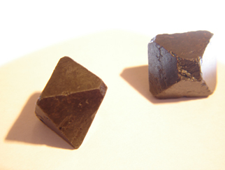

## Magnétite
### Magnétite, article du glossaire
 [](chap26magnetisme.html#magnetite)

Comme son nom l'indique, la magnétite a des propriétés magnétiques. Comme il ne l'indique pas, il n'a aucun rapport avec le [magnésium](magnesium.html).

Il s'agit d'un minerai d'oxyde de [fer](fer.html) noir (Fe3O4) présent dans d'innombrables roches qu'il a tendance à assombrir. Les mines de magnétites sont particulièrement riches en fer.

**Importantes précisions** dans le chapitre XXVI des Dialogues de Dotapea. [Cliquer ici](chap26magnetisme.html#magnetite) ou sur l'image.

A lire aussi : les [ferrofluides](ferrofluides.html).


```
title: Magnétite
date: Fri Dec 22 2023 11:27:38 GMT+0100 (Central European Standard Time)
author: postite
```
