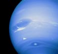

## Méthane
### Méthane, article du glossaire
 CH4. Gaz inodore, [saturé](saturation.html) (comme l'indique le suffixe _ane_) semblant incolore, il est très inflammable et explosif. Son "m" initial - m comme moitié - pourrait signifier qu'il s'agit en quelque sorte de la moitié d'un [éthane](ethane.html).

C'est le premier membre de la série des [hydrocarbures aliphatiques](carbure.html#carbaliphsat) [saturés](saturation.html), les [alcanes](alcane.html). Voir aussi [Méthyle](methyle.html).

Le méthane se retrouve en associations multiples dans les [polyuréthanes](polyurethane.html), mais aussi, plus prosaïquement, dans le gaz de ville et les gaz issus de décompositions organiques diverses. C'est un gaz "à effet de serre".

Le méthane absorbe les couleurs chaudes (rouges et avoisinantes). Très présent dans l'atmosphère de Neptune, il lui donne une couleur bleue magnifique.

_Image Nasa - "You may use NASA imagery, video and audio material  
for educational or informational purposes,  
including photo collections, textbooks, public exhibits and Internet Web pages."_

Exposé aux ultraviolets, il produit de l'éthane, comme par exemple dans l'atmosphère du satellite saturnien Titan où il aurait une certaine importance dans le système météorologique.

Oxydé, il devient [méthanol](methanol.html#lemethanolcommeproduitpur).


 [Communication](http://www.artrealite.com/annonceurs.htm) 

[](index-2.html#20131014)


```
title: Méthane
date: Fri Dec 22 2023 11:27:43 GMT+0100 (Central European Standard Time)
author: postite
```
