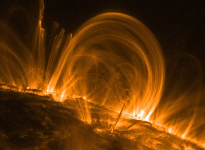

## Nature et évolution des résines - Chapitre XXI des Dialogues de Dotapea
### Nature et évolution des résines - Chapitre XXI des Dialogues de Dotapea
 **Les dialogues sur la physique-chimie  
appliquée aux arts**

**Chapitre XX****II** **- Annexe**

**Le moment, les pôles**

**Précisions**

dial   dial   dial

Ce texte est l'annexe du chapitre XXII des [Dialogues de Dotapea](dialoguesdotapea.html). C'est une discussion entre Jean-Louis, physico-chimiste au CNRS, et le candide, Emmanuel.

Le concept de moment nous a semblé mériter quelques éclaircissements. Il permet en effet une réflexion fondamentale d'une portée surprenante. Nous abordons aussi dans cet article le thème de la polarité, déjà abordée ailleurs sur ce site, mais sous un autre angle ([lien](electronega.html#liaisonpolaire)).

Cette annexe est importante pour la compréhension du [chapitre XXII](chap22mouillage.html).

Emmanuel : « Les molécules peuvent être classées en fonction de leur polarité.  La polarité c'est, pour simplifier un peu, la présence ou l'absence d'un moment dipolaire. », écris-tu au début de ce chapitre. La polarité nous amène donc au concept de moment. Commençons par ce dernier. L'Académie française en donne la définition suivante :

> « _Moment : (...) PHYS. En général, grandeur vectorielle qui est le produit d'une grandeur physique par une distance ou par une puissance de cette distance (.)._ »

Concernant la polarité, un corps polaire peut avoir deux pôles (dipolaire) ou davantage. Dans ce chapitre nous parlons de champs électriques donc il semble que nous ayons deux pôles, c'est bien ça ?

Jean-Louis : C'est à la fois plus simple et plus compliqué. Il suffit en fait d'une seule charge pour faire un champ électrique. Deux charges vont créer un champ dipolaire... Un ensemble de charges va créer un champ qui peut se décomposer en une somme de champs « simples ». On aura une partie du champ qui sera de type dipolaire, une partie quadrupolaire, une partie octupolaire, etc... Les contributions d'ordre supérieur sont de plus en plus faibles et de plus courte portée.

Emmanuel : Tant de pôles avec deux signes au maximum, c'est difficile à imaginer. Comme on a l'habitude de se représenter des pôles en référence à ceux de la terre, là je me représente un champ multipolaire comme ce que l'on peut imaginer autour d'une planète-patate (n'importe quelle forme en fonction de celle du corps dont il est question, une molécule par exemple) avec des pôles + et des - ici et là. Est-ce que c'est correct ou est-ce que ce n'est pas sur le même plan ?

  
Conceptuellement c'est peut-être une erreur, ces représentations planétaires qui évoquent un monde « fermé », typiquement un planète avec un pôle + et un pôle - et ça boucle. Alors qu'avec la gravitation qui est unipolaire (enfin je crois), il est plus facile d'imaginer que tout cela est continu de loin en loin comme de proche en proche.  
Dit autrement, on n'a pas tendance à penser qu'un champ gravitationnel est quelque chose de fini. Qu'en est-il d'un champ électrique ?

  
Jean-Louis : Si tu mets deux astres près l'un de l'autre, tu auras un champ gravitationnel dipolaire. Si tu en mets quatre, il sera quadrupolaire. Pour les molécules, en effet, si leur forme est compliquée et si il y a des charges un peu partout, le champ acquiert des moments d'ordre supérieur (quadrupolaires, octupolaires, ...).

**Arches solaires** \- Image GSFC/TRACE-Nasa

_« You may use NASA imagery, video and audio material for educational or informational purposes,  
including photo collections, textbooks, public exhibits and Internet Web pages. »_

Les champs électriques et gravitationnels sont en principe de portée infinie. Je dis en principe parce que 1) on ne peut pas vérifier, 2) il y a évidemment des théories qui disent que la décroissance en 1/r2 n'est plus vraie à grande distance, ça serait notamment un test de l'existence de dimensions cachées dans l'univers. On essaie de vérifier ça avec les sondes Voyager qui sortent du système solaire.

Emmanuel : Donc si je comprends bien, il peut y avoir dipôle sans qu'il y ait circulation de. quelque chose entre les deux ?

Jean-Louis : Circulation, je ne vois pas ce que tu veux dire, mais il faut qu'il y ait des lignes de forces ou des lignes de champ entre et autour des objets.

  
Emmanuel : Je regarde les définitions du Robert pour « pôle ». Toutes sont liées à une dipolarité +/- et la seule qui semble correspondre en partie à notre propos, c'est sauf erreur celle du sens figuré : « _Ce qui attire, entraîne ; centre d'activité, d'intérêt._ » (au détail prêt que dans certains cas il peut aussi y avoir répulsion).

Jean-Louis : Oui, c'est le plus courant. Les deux planètes vont créer un champ gravitationnel dont les lignes ressembleront à celles du champ électrique (ou magnétique) créé par un dipôle.

Emmanuel : Fichtre. Ainsi même de la terre à la lune il y a des lignes de champ comme autour des pôles d'un aimant. on en apprend tous les jours.

Est-ce que un champ unipolaire a des lignes ou est-ce réservé aux champs « pluripolaires » ?

Jean-Louis : Non, c'est assez universel. Tous les champs, scalaires ou vectoriels ont des lignes.

**Aimant et limaille de fer** - Image [Palais de la Découverte](http://www.palais-decouverte.fr/) - Paris

Emmanuel : En fait pour donner une définition synthétique, un pôle semble être ce qui fait motion, quelle que soit la direction impliquée. Es-tu d'accord avec ça ?

  
Jean-Louis : Assez d'accord, oui. Une force d'attraction ou de répulsion.  
 

\_\_\_\_\_

**1\. La notion de polarité**

\[accès direct [La notion de moment](chap22momentpoles.html#moment)\]

La notion de moment : si je veux fermer une porte en la poussant près des gonds il me faudra exercer une force beaucoup plus grande que si je pousse près de la poignée. La réalité est plus complexe, mais sous certaines conditions, on peut dire que le moment=force x distance à l'axe est constant. Si je me rapproche de l'axe des gonds, je diminue la distance et la force augmente, si je m'éloigne des gonds, la distance augmente et la force diminue.

Emmanuel : Pour un même effet donné ?

Jean-Louis : Pour un même effet de porte fermée/claquée avec la même énergie, oui.

Un ensemble de charges électriques sera défini par le signe et l'amplitude des charges, mais aussi par leurs distances respectives. Une disposition particulière est omniprésente dans la nature, c'est une paire de charges de signes opposés proches l'une de l'autre. On appelle moment la valeur commune de la charge q multipliée par la distance intercharges d.

La nature du champ créé par le dipôle est évidemment fonction des charges et de leur séparation, on l'écrit en fonction du moment dipolaire P1\=qd. Un autre dipôle placé dans le champ du premier va subir des forces, proportionnelles à son moment P2. Ces forces sont du même genre que celles qui ferment les portes, elles font notamment tourner le moment P2 pour l'aligner suivant le champ de P1. D'autant plus facilement que P2 sera grand, ce qui s'obtient soit en augmentant les charges, soit la distance entre les charges.  
 

Emmanuel : Très intéressante, cette opposition charges/intercharges dont le produit est un « moment ».  
Pourquoi a-t-on choisi ce mot intrigant, « moment », quel rapport vois-tu avec le temps ?

  
Jean-Louis : Moment viendrait du latin _momentum_, contraction de _movimentum_ « impulsion », et signifiant « poids léger suffisant pour déterminer le poids de la balance ». J'ai trouvé cette phrase sur le web. Je ne garantis pas son exactitude. Mais il est sûr que « moment » vient de _momentum_, mot latin. Le rapport, me diras-tu ? Eh bien le _momentum_ (encore utilisé en anglais, en français on dit « impulsion ») d'un objet de masse m et de vitesse v c'est p=mv. Le moment d'une force par rapport à un axe, c'est Fd, d étant la distance (au sens mathématique) à l'axe. Tu vois apparaître cette notion de produit que l'Académie t'avait donnée ([lien](chap22momentpoles.html#acadmoment))  : moment=produit d'une grandeur physique par une distance. Depuis le _momentum_ originel, la notion a été affinée et généralisée. Et en toute rigueur, le momemtum, l'impulsion, n'est plus un moment selon la définition actuelle !  
 

Emmanuel : L'impulsion (alias momentum donc) est le produit d'une masse et d'une vitesse alors que le moment est le produit d'une grandeur physique par une distance. Est-ce que cela veut dire que le moment est - paradoxalement - indépendant du temps ?

Jean-Louis : Les deux seront indépendants du temps si tu ne fais rien. « L'impulsion se conserve ». Si un objet se déplace dans un espace dit « newtonien », il garde sa vitesse constante en intensité et en direction, au sens physique c'est donc indépendant du temps (en l'absence de forces appliquées).

Emmanuel : Ah oui je ne voyais pas les choses comme ça.  
Le moment, c'est de l'intemporel alors, en quelque sorte. Un peu comme s'il ignorait une dimension : il serait « aveugle au temps ». Finalement, par là il rejoint en partie l'acception commune du mot : un moment n'a pas de durée.  
 

Jean-Louis : Le moment n'est « aveugle au temps » que si rien ne lui arrive. Une particule qui traverse l'espace conserve son moment et son énergie, mais si elle rencontre un obstacle, tout change.

Emmanuel : Ca évoque furieusement le _clinamen_ d'Épicure.

**2\. La notion de moment**

 

 [Communication](http://www.artrealite.com/annonceurs.htm)