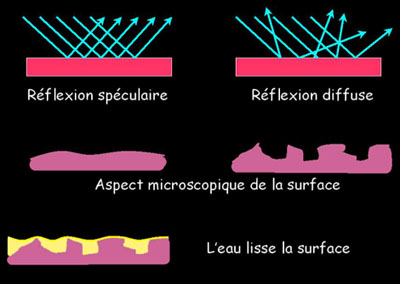
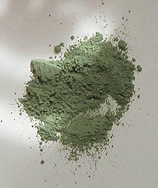

## Oxydation, métaux - Chapitre XIX des Dialogues de Dotapea
### Oxydation, métaux - Questionnements et applications - Chapitre XIX des Dialogues de Dotapea
 Navig. page/section

  
  

\_\_\_\_\_

**Pages soeurs**

[I, A propos des liants](chap01liants.html)  
[II, Bulles, siccativ., struct. élec.](chap02bullessiccativation.html)  
[III, Caséine, phosphore, dissociation](chap03caseine.html)  
[IV, Les orbitales](chap04orbitales.html)  
[V, L'aérogel](chap05aerogel.html)  
[VI, Polarisation de la lumière](chap06polaris.html)  
[VII, Sfumato et diffusion Rayleigh](chap07rayleigh.html)  
[VIII, Les interférentielles](chap08interferences.html)  
[IX, Dextrine, farine et chiralité](chap09dextrine.html)  
[X, L'ocre bleue](chap10ocrebleue.html)  
[XI, Les métamatériaux](chap11metamateriaux.html)  
[XII, Le jaunissement](chap12jaunissement.html)  
[XIII, Laser etc.](chap13laser.html)  
[XIV, L'holographie](chap14holographie.html)  
[XV, L'holographie numérique](chap15holographienum.html)  
[XVI, Extérieur, intérieur, chaux](chap16interieurexterieurchaux.html)  
[XVII, L'électrolyse et les ions](chap17electrolyseions.html)  
[XVIII, L'électricité, un peu plus loin](chap18electriciteplusloin.html)  
XIX, Oxydation, métaux  
[XX, Les échelles](chap20echelles.html)  
[XXI, Nature et évolution des résines](chap21resines.html)  
[XXII, Le mouillage pigmentaire](chap22mouillage.html)  
[XXIII, La molette](chap23molette.html)  
[XXIV, Blanche neige](chap24blancheneige.html)  
[XXV, Lumière et matière](chap25lumiereetmatiere.html)  
[XXVI, Magnétisme](chap26magnetisme.html)  
[XXVII, Ambre et vieilles branches](chap27ambre.html)  
[XXVIII, L'origami miroir](chap28origamimiroir.html)  
[XXIX, Le feu](chap29feu.html)  
[XXX, Peau du métal](chap30peaudumetal.html)  
[XXXI, La ville en un souffle](chap31bellastock.html)  
[XXXII, Oxyder des matériaux](chap32oxydermateriaux.html)  
[XXXIII, Ocre bleue, une solution](chap33ocrebleuesimulation.html)

\_\_\_\_\_

Copyright © www.dotapea.com

Tous droits réservés.  
[Précisions cliquer ici](droitscopie.html)

**Les dialogues sur la physique-chimie  
appliquée aux arts**

**Chapitre XIX**

**Oxydations, métaux**

**Questionnements et applications**

dial   dial   dial

Ce chapitre des [Dialogues de Dotapea](dialoguesdotapea.html) est une discussion entre Jean-Louis, physico-chimiste au CNRS, et un candide, Emmanuel..

Oxydation, métaux, transmission de l'électricité, galvanisation, et même **_"l'éclat ou le terne"_**, le poli et le mat, la pile, l'encre d'or, les pointes métalliques, voici quelques uns des sujets de cet article qui s'inscrit dans un triptyque (voir les chapitres [XVII](chap17electrolyseions.html) et [chap. XVIII](chap18electriciteplusloin.html)).

En vous souhaitant bonne lecture de ce dialogue fortement "transversal" et plutôt rebondissant.

Emmanuel : Qu'est-ce qui se passe quand un métal s'oxyde?

Jean-Louis : Commençons par rappeler ce qu'est un métal pour un chimiste. Un métal est un élément qui perd facilement ses électrons pour former un ion positif ([cation](cation.html)), et qui forme des liaisons dites "métalliques" avec des atomes de métal du même genre, par exemple Fe-Fe, ou d'un autre genre, par exemple Fe-Cu (alliages).

Emmanuel : Je ne savais pas que les liaisons d'un alliage étaient si intimes. Est-ce le cas de tous les alliages ?

Jean-Louis : Tous les métaux et alliages, oui.

Emmanuel : Autre chose concernant les définitions : qu'est-ce qui distingue la circulation électronique métallique de celle des plasmas dont on a parlé récemment [\[lien\]](gazliquidessolides.html#plasma) ? Les électrons semblent là aussi circuler assez librement.

Jean-Louis : Les métaux sont des solides. Les ions métalliques sont fixes, c'est la structure même, les électrons seuls se déplacent. Un plasma est un gaz, _les ions et les électrons sont mobiles._ Les vitesses de déplacement sont aussi sans commune mesure, mm/sec pour les électrons d'un métal, km/sec pour les ions chauds.

**Distinguer les métaux des plasmas**

La plupart des métaux sont chimiquement réactifs, en particulier vis à vis de [l'oxygène](oxygene.html) de l'air avec lequel ils forment des oxydes. Les temps de réaction varient toutefois énormément : le [sodium](sodium.html) s'enflamme spontanément dans l'air, le [fer](fer.html) pur rouille sur des années. Les métaux les plus réactifs sont les [alcalins](alcalin.html#metauxalcalins) (sodium, [potassium](potassium.html),...). Les métaux dits "de transition" (fer, cuivre, nickel, zinc...) s'oxydent plus lentement. Il existe des métaux qui ne s'oxydent pas dans des conditions ordinaires, les métaux "nobles" ([or](annexe1.html#au), [palladium](annexe1.html#pd), [platine](annexe1.html#pt)).

\[Au sujet des métaux nobles, lire [passage](courrierdeslecteurs2009a090.html#metalnoble) in Courrier des Lecteurs\]

Emmanuel : Si je regarde la table de Mendeleïev de Dotapea ([lien](annexe1.html)) pour situer ces différents métaux, ceux qui s'oxydent le moins semblent situés parmi ceux qui ont [l'électronégativité](electronega.html) la plus forte. C'est ça ?

 

**Un paysage des métaux**

Jean-Louis : L'électronégativité est la tendance pour un corps à attirer les électrons, donc à se comporter en oxydant. Les métaux ont tendance à donner des électrons, à se comporter en réducteurs. Une définition empirique des métaux et des non métaux est que les oxydes des métaux sont basiques, ceux des non-métaux acides. [\[voir définitions dans l'article _L'oxygène_\]](oxygene.html)

\[Lire absolument l'article [Synthèse](oxyreducacidesbases.html)  
(Concepts physico-chimiques)\]

Pour certains métaux la couche d'oxyde est imperméable, et protège donc le coeur du matériau de l'oxydation. Ces métaux restent brillants et conducteurs de l'électricité (chrome, nickel,...) pendant des années.

**Une oxydation protectrice**

Emmanuel : Ne s'agit-il pas des métaux qui précisément servent à réaliser des électrolyses ? Dans le chromage, le nickelage ou le cuivrage, les couches de métaux semblent très fines et pourtant très « robustes ».

Jean-Louis : Oui, c'est l'idée de base. Protéger et améliorer l'aspect avec une fine couche inaltérable. La version métallique de la peinture anti-rouille.

Emmanuel : La protection imperméable que constitue la couche oxydée doit avoir une épaisseur vraiment infime, non ?

Jean-Louis : Quelques couches atomiques, oui.

 \[sur l'électrolyse,lire le _[Chap. XVII](chap17electrolyseions.html)_\]

Emmanuel : Ces questions ont apparemment préoccupé beaucoup de gens depuis des siècles. En art contemporain également. On peut citer l'exemple célèbre de Claude Lalanne qui s'est beaucoup attachée à ces procédés.

J'ai depuis appris que les Égyptiens aussi semblaient pratiquer la [galvanoplastie](galvaniser.html).

Qu'est-ce qu'ils faisaient ?

Sur ces thèmes on citera deux références liées aux légendaires piles de Bagdad :  
\* [une en anglais](http://en.wikipedia.org/wiki/Baghdad_Battery)  
\* [une en français](http://coll-ferry-montlucon.planet-allier.com/pilebagd.htm)

Jean-Louis : On a découvert des vases et des statuettes dorées, la technique employée étant très probablement [électrolytique](chap17electrolyseions.html). On a aussi trouvé des pièces en bois et en céramique qui étaient cuivrées. J'ai entendu parler d'une statue en cuivre représentant un homme et qui ne pesait que 6kg. La théorie est que l'on a cuivré une statue de bois par électrolyse, le bois a depuis disparu.

Je ne peux cependant pas juger du sérieux scientifique de ces informations.

Emmanuel : D'accord. Des perspectives mais pas de certitudes alors que pour Bagdad ça a l'air plus sûr.

**Bois et céramiques galvanisés très précocement**

Dans l'ensemble, cela fait un peu penser à l'expérience scolaire classique des pommes de terre qui permettent d'allumer une toute petite ampoule. De petits moyens mais une certaine efficacité.

Et puis même si les voltages en jeu dans la galvanisation restent assez faibles (quel que soit le procédé), est-ce que c'est comparable à l'expérience des patates ?

Jean-Louis : L'expérience des patates, ou mieux des pommes Granny Smith fonctionne réellement. On peut produire du courant en plantant des lamelles métalliques de nature différente (ex. cuivre et zinc, fer et aluminium,.) dans une solution saline ou dans un fruit acide.

Emmanuel : Est-ce que tu peux dire quelques mots sur la nécessité d'utiliser des lamelles faites de métaux différents ?

Jean-Louis : Pour qu'il y ait une différence de potentiel, il faut forcément qu'il y ait une dissymétrie quelque part. Deux éléments différents ou deux molécules n'ont pas les mêmes structures électroniques, quand on les met en contact on crée une différence de potentiel.

C'est essentiellement le nombre total d'électrons qui compte. On appelle ça "le niveau de Fermi".

Emmanuel : Ca rejoint ce [schéma](chap04orbitales.html#couches) du chapitre IV où tu représentes les électrons par paires dans des sortes de cases ?

Jean-Louis : Oui, c'est lié. Chaque électron est lié à son noyau par une certaine énergie dite "de liaison". Si on fait la somme des énergies de liaison pour tous les électrons, on a la quantité d'énergie qu'il a fallu pour construire l'atome (lire [passage](chap04orbitales.html#energiedeliaison) in chap. IV). Et chaque atome (pour des éléments différents) est différent.

Emmanuel : Est-ce que l'énergie de liaison diffère si peu en fonction de la couche ?

Jean-Louis : Elle diffère plutôt beaucoup, toutes proportions gardées.

 

**Comme avec les patates de notre enfance ?**

Emmanuel : D'accord. En rappel d'un [passage](chap03caseine.html#forcefaiblesse) du chapitre III lié à la force ou la faiblesse des acides et des bases, dans le cas où l'on parle de solution saline, le [sel](formationdesels.html) en solution doit-il comporter un acide fort et une base faible ? Jusqu'à quel point un sel doit-il avoir une tendance acide pour pouvoir rivaliser avec un acide libre ? Je veux dire au fond « comment est-ce que ces point-là jouent sur la circulation des petits électrons ? »

Jean-Louis : Du moment qu'il y a des ions, quelle que soit leur origine, on a une conduction électrique. Une solution de chlorure de sodium (résultat de l'action d'un acide fort sur une base forte) sera conductrice au même titre qu'une solution [d'acétate](acetate.html) [d'ammonium](ammonium.html) (acide et base faibles). Après ça cela dépend d'autres paramètres comme la solubilité et la mobilité des ions.

**Force, faiblesse, comment cela joue-t-il ?**

Emmanuel : Un oxyde métallique simple peut-il être considéré comme un sel ? Au fond, ce n'est jamais qu'un [métal](metal.html) associé à un [non-métal](nonmetaux.html), non ?

Jean-Louis : Un sel est toujours ionique. Un oxyde est généralement neutre. Insoluble et isolant la plupart du temps.

Emmanuel : Curieux. Pourquoi un sel ne peut-il être neutre ?

Jean-Louis : Le sel est neutre, puisque les charges + et - sont en nombre égal. Mais il est formé d'espèces chargées, il est ionique.

Emmanuel : D'accord.

**Distinction oxyde/sel : l'aspect ionique**

Et la circulation électronique est-elle, elle aussi, fondamentalement différente dans le cas des oxydes et celui des sels ?

Jean-Louis : Ca se complique encore. Quand il y a des ions, c'est une conduction ionique. Dans les métaux c'est généralement électronique. Dans les oxydes et les semi-conducteurs, c'est soit des électrons, soit des "trous", définis comme une "absence d'électron", c'est à dire une charge positive... Ca dépend du matériau.

**Galvanisation/métallisation : une technique particulière**

**Conduction électronique _vs_ conduction ionique**

Pour revenir à la galvanisation, il est possible de recouvrir certains métaux simplement en les plongeant dans une solution contenant les sels d'un autre métal. Si tu trempes un morceau de fer dans du sulfate de cuivre, le fer se couvre d'une pellicule de cuivre. On dit qu'un métal "déplace" les sels d'un autre métal plus électronégatif.

Pour ce que j'en sais cette couche métallique est très faible et peu adhérente. Mais j'ai entendu parler de nickelage et de chromage "sans électrolyse". Je ne sais pas comment ça fonctionne.

**Retour sur l'oxydation**

L'oxyde de fer est poreux, il ne protège pas le métal, comme chacun sait.

Bien qu'ayant des propriétés communes, tous les métaux ne s'oxydent pas de la même façon. Pour le chimiste, il n'y a pas d'oxydation, d'ailleurs, mais une oxydation et une réduction simultanée, on dit [oxydoréduction](oxydoreduction.html).

Le fer métal Fe est un réducteur, il perd deux électrons quand il s'oxyde, l'oxygène O est un oxydant, il gagne deux électrons quand il se réduit.

**Quand l'électronégativité fait le travail toute seule**

Emmanuel : Pas si simples, ces termes, pour les profanes. Déjà réduire et oxyder sont à prendre dans le sens réflexif, pas dans le sens transitif, ce n'est pas une évidence.

> \* le réducteur ne réduit que son propre nombre d'électrons. Il n'est pas réducteur d'un autre atome. On dirait qu'il est simplement « le donateur ».
> 
> \* l'oxygène n'est pas le seul « oxydant » ce qui ajoute encore un petit peu de confusion. Les [oxydants](oxygene.html) « augmenteurs » n'augmentent que leur propre cheptel d'électrons. Ce sont simplement « les récipiendaires ».

Non ?

Jean-Louis : Oui !

Emmanuel : Est-ce que l'on peut dire que ces deux tendances ont un rapport direct avec le sujet des couches électroniques que l'on a déjà abordé plusieurs fois [\[lien\]](chap04orbitales.html) ?

Jean-Louis : Encore oui ! Toutes les réactions chimiques sont des histoires d'électrons qui se promènent.

 

**Des sens à bien saisir**

\[voir [Synthèse](oxyreducacidesbases.html)\]

L'oxyde formé est FeO, un des oxydes de fer. Car il peut y avoir plusieurs oxydes, par exemple FeO et Fe2O3, selon le nombre d'électrons perdus par l'atome de fer. Deux dans le premier cas, trois dans le deuxième. On parle de degré d'oxydation 2 ou 3, on a alors du Fe++ ou du Fe+++. Certains métaux ont beaucoup de degrés d'oxydation possibles, d'autres moins. Le chrome(III) est biologiquement indispensable, le chrome(VI) est fortement toxique. On voit que le degré d'oxydation change les propriétés de l'ion.

La couleur de l'oxyde est elle aussi fonction de son degré d'oxydation, les peintres le savent depuis longtemps : la [calcination des "terres"](oxydesdefer.html#variationparcalcination) (i.e. oxydation supplémentaire par action de l'air et de la température) aux temps préhistoriques permettait déjà d'élargir la palette chromatique de nos ancêtres.

Emmanuel : En éliminant H2O des ocres jaunes tels que celui-ci on va radicalement vers le rouge [\[lien\]](oxydesdefer.html#variationparcalcination).

On a parlé récemment du [jaunissement des polymères](chap12jaunissement.html), mais sur un cas de rougissement comme celui-là, quelle peut être la raison à ton avis ?

Jean-Louis : C'est encore et toujours la structure électronique.

 

**Degrés d'oxydation, couleurs**

Emmanuel : Autre chose. Un métal non oxydé a généralement un « aspect métallique ». En fait il existe des non-métaux qui ont cet aspect aussi mais peu importe pour ce que je veux dire.

Lorsqu'une oxydation se produit, l'aspect miroitant a tendance à s'estomper. Alors, comme aurait pu dire la méchante reine (celle qui avait un problème de miroir), pourquoi l'eau qui n'a rien a priori d'un métal - ou aussi bien une [laque de Coromandel](gommelaque.html) solidifiée -, arrive-t-elle à réfléchir une image si fidèlement ?

 

**Qu'est-ce que l'éclat ?**

Jean-Louis : On va de plus en plus loin. Les métaux sont caractérisés par leur "éclat métallique". C'est en effet à cause de leurs propriétés de conduction électroniques qu'ils sont brillants : les champs électriques (i.e. la lumière, qui est une onde électromagnétique) n'y pénètrent pas.

Les oxydes sont le plus souvent isolants (au mieux semi-conducteurs), les métaux oxydés sont donc plus ternes.

La réflexion de la lumière est aussi fonction de l'état de la surface. Les surfaces polies fonctionnent mieux que les surfaces mates. L'eau, le verre, les laques ne sont pas de bons conducteurs mais la qualité du poli de leur surface les rend capable de réfléchir plus de lumière que le commun des matériaux.

 

\--> Sur le sujet, lire [passage plus développé](chap28origamimiroir.html#metauxchampselectriques) in chap. 28

Emmanuel : Très intéressant. Je pense au [Chapitre XVI](chap16interieurexterieurchaux.html), Clothilde Bernair et son galet à tadelakt.

Donc le poli - défini par le Robert par deux mots : « lisse et brillant », contraires : mat, rugueux - correspondrait à une capacité de ne pas laisser entrer la lumière ?

Jean-Louis : Le poli c'est d'abord un état de surface, le fait de pouvoir avoir une réflexion spéculaire et non diffuse de la lumière.

Emmanuel : Mais comment par une simple action mécanique, chiffonner une [encaustique](cires.html), « serrer » un [tadelakt](tadelakt.html), etc, arrive-t-on à modifier des facteurs aussi microscopiques ? Et comment l'eau y parvient-elle sans intervention extérieure ?

Jean-Louis : Le polissage est un art, on parvient à polir le verre et à obtenir que sa surface n'ait pas d'aspérité (creux ou bosse) plus grande que quelques 10\-10 mètres alors que les grains de l'agent polissant font au minimum 10\-7 mètres.

**Un autre rôle de l'eau**

 

**Le poli et le mat**

L'eau présente dans l'atmosphère joue très souvent un rôle dans les phénomènes d'oxydation. On peut ainsi former des hydroxydes, par exemple Fe(OH)2 qui est vert, FeO(OH) qui est rougeâtre, Fe(OH)3 qui est brun.

Emmanuel : Tiens je ne connaissais pas la variété verte. Elle est stable ?

Jean-Louis : Je crois. Il faudrait que je vérifie mais n'est-ce pas la "[terre verte](vertscomplexes.html#laterreverte)"?

Emmanuel : La terre verte, cette inconnue.

[Perego](livres.html#perego) insiste sur la présence de [glauconite](http://en.wikipedia.org/wiki/Glauconite) (lien externe) ou « _d'autres phylosilicates, comme la [céladonite](http://en.wikipedia.org/wiki/Celadonite)_ \[lien externe\] _par exemple_ » (p.725). Il précise que certaines terres vertes sont « _de la céladonite presque pure_ » (notamment vers Vérone).

Le vrai [céladon](vertscomplexes.html#vertceladon) lui-même est effectivement à base de fer mais c'est une glaçure. En plus je n'ai pas assez d'informations pour conclure à la présence ou l'absence de manganèse dans le mélange.

Concernant la terre verte et ses « tribus de silicates », va savoir, à la variété près, ce qui donne la coloration, y compris dans la céladonite : le fer ou le manganèse ? D'autant plus qu'un oxyde de fer jaune+un bleu manganèse donnent une espèce de vert assez proche. Ça devient difficile de s'y retrouver.

Enfin c'est une piste, justement, que tu donnes : si le fer peut produire un oxyde vert ça peut expliquer d'emblée la tendance vert-bleu du céladon et vert-un-petit-peu-bleu de la terre verte.

  
Jean-Louis : Je me souviens aussi que le sulfate de fer est verdâtre.

 

**Terre verte**

Le rôle de l'eau est multiple et complexe. Par exemple, le gaz carbonique de l'air se dissout dans l'eau d'une surface humide et forme de l'acide carbonique qui contribue à l'oxydation.

 

A ce sujet voir aussi [passage](anhydride.html#anhydridenm) in _L'anhydride_

Emmanuel : Tiens justement ! Comment un acide - qui transporte son proton H+ -, contribue-t-il à l'oxydation ?

Jean-Louis : Le processus de formation de la rouille comprend trois étapes :

> \* formation d'hydroxyde de fer \[Fe(OH)2\] par action sur le fer des ions hydroxydes (OH-) formés par réaction de l'oxygène de l'air avec l'eau.
> 
> \* oxydation de ces ions fer(II) en hydroxyde de fer(III) sous l'action de l'oxygène de l'air.
> 
> \* transformation spontanée de ce solide en oxyde de fer hydraté.

Quand le fer entre en contact avec l'eau, un processus électrochimique lent commence à la surface du métal. Le fer est oxydé :

Fe + 2OH- → Fe(OH)2 + 2 électrons

et pendant que l'oxygène de l'air est réduit en ion hydroxyde.

Emmanuel : « et pendant » ou juste « pendant » ?

Jean-Louis : En même temps. C'est une oxydoréduction, l'un s'oxyde, l'autre se réduit.

2H2O + O2 + 4 électrons → 4OH-

Ensuite l'hydroxyde de fer II est immédiatement oxydé d'un degré supplémentaire :

4Fe(OH)2 + 2H2O + O2 → 4Fe(OH)3

Enfin, cet hydroxyde de fer se transforme spontanément en oxyde de fer hydraté :

2Fe(OH)3 → Fe2O3·3H2O

Le "point" dans la formule ci-dessus signifie que l'eau est présente dans la structure cristalline mais n'est pas liée chimiquement à l'oxyde.

On comprend la nécessité de la présence d'eau liquide, qui intervient à chaque étape de la réaction chimique (sans eau on forme de l'oxyde de fer mais c'est pas de la rouille !). La corrosion tend à progresser plus rapidement dans l'eau de mer que dans l'eau douce car l'eau de mer (solution saline) est plus conductrice et favorise donc les déplacement ioniques et les réactions d'oxydoréduction. La formation de la rouille est également accélérée en présence d'acides pour la même raison. L'acide nitrique concentré a au contraire un rôle de passivation, il empêche temporairement la corrosion du fer.

Emmanuel : Il y a de si grosses différences dans l'action des acides sur les métaux ? A quoi est-ce dû ?

Pour illustrer ça concrètement, peux-tu donner des exemples de composés acides susceptibles d'agir chromatiquement dans des délais raisonnables sur :

> \* du fer
> 
> \* du cuivre
> 
> \* du bronze ?

 

**Acide et rouille**

Jean-Louis : On trouve assez facilement des formules pour patiner les métaux avec différentes couleurs (cf. antiquaires).

Par exemple pour le fer, on trempe très rapidement la pièce dans un bain (acide sélénieux 10gr, sulfate de cuivre 10gr, eau 1 litre) et on obtient jaune, pourpre, violet, bleu.

Pour verdir le cuivre : 1 litre de [vinaigre](vinaigre.html) (acide acétique dilué), 33gr [d'ammoniaque](ammoniac.html), 33gr sel de cuisine, 33gr chlorure [d'ammonium](ammonium.html).

Verdir le bronze : 100gr vinaigre, 12gr chlorure d'ammonium, 4gr [acide oxalique](oxalique.html).

L'idée, au bout du compte, est d'obtenir en surface un sel ou un oxyde de la bonne couleur et qui soit adhérent (c'est la partie délicate.).

 

**Patines métalliques**

Si on a affaire à un alliage ou à un métal contenant des impuretés, on peut former des "couples électrolytiques" (i.e. des piles électriques) qui vont favoriser la corrosion (on dit alors que la surface "se pique").

Emmanuel : Cette formation de couples électrolytiques, c'est à cause de quoi ?

 

**La pile : l'image des petits bidons**

 

**L'encre d'or**

 

**La coloration anodique**

 

**Définition de la galvanisation**

 

**Désoxyder un métal en le cathodisant**

Sur ce sujet lire un [passage](courrierdeslecteurs2009a260.html#desoxydationmetaux) du courrier des lecteurs (application pratique)

Jean-Louis :  Il y a des [acides aminés](acides.html#acidesamines) sulfurés, oui. Les composés soufrés sont toujours très "odorants". Pense à la légendaire odeur des oeufs pourris.

Jean-Louis : On forme un sulfure ou un sulfate. Sulfure de fer, FeS ou pyrite. Sulfate de cuivre, sulfate de fer, CuSO4, FeSO4.

Emmanuel : Est-ce qu'il y a une raison pour que quelquefois ça noircisse, d'autre fois ça donne des couleurs si vives comme avec le [cadmium](cadmiums.html) par exemple ? J'imagine que c'est encore une histoire de champs électroniques mais comment ça se passe pour donner des résultats aussi différents au point de vue chromatique ?

Jean-Louis : Oui, c'est vraiment à cause des niveaux électroniques. Selon leur position, c'est coloré dans le visible ou pas.

Emmanuel : D'accord.

Est-ce que ça confirme le fait qu'un couple n'est pas la juxtaposition de deux personnalités séparées ?

Jean-Louis :  ???

Emmanuel : C'est une blague idiote et en même temps pas tant que ça. Ce qui se passe chromatiquement - entre autres - dans un couple d'atomes, ça n'a aucun rapport avec une juxtaposition. A tel point que l'on se demande si le concept d'atome n'est pas un peu trop « individualisé ».

Jean-Louis : Oui, les couples moléculaires sont fusionnels. On partage tout ou presque.

 

**Métaux et soufre**

Lire en complément une réponse à un courrier des lecteurs qui développe un sujet très proche. [Lien.](courrierdeslecteurs2009a090.html#20090130jc)

Emmanuel : Le soufre semble donner des résultats particuliers sur le papier. On s'en sert pour fabriquer des [calques](papiersspeciaux.html#papiercalque) par exemple. Dans le cas de la [carta tinta](pointedargent.html#cartatinta) utilisée pour « révéler » les traces des pointes métalliques, penses-tu que :

1) la colle d'os que l'on emploie contient du soufre

> Jean-Louis : Je ne pense pas.
> 
> Emmanuel : Mais alors d'où pouvait provenir ce soufre ?
> 
> Jean-Louis : De la pollution atmosphérique ? En particulier aux temps historiques où l'on se chauffait au charbon.
> 
> Je pense que les acides (sulfurique notamment) utilisés pour la fabrication du papier peuvent aussi constituer une bonne source de soufre....
> 
> Emmanuel : C'est vrai que l'on se sert de soufre pour certains papiers. Le [calque](papiersspeciaux.html#papiercalque) est le plus connu mais il en existe d'autres. Le calque est relativement récent. On s'est plutôt servi, longtemps, de [parchemin](parchemin.html) puis de [papier huilé](papiersspeciaux.html#calquespasses).
> 
> Le procédé de sulfuration est plutôt simple (trempette dans un bain d'acide sulfurique) mais il a eu du mal à émerger, vraisemblablement pour des raisons de coût de fabrication (comparés aux anciens procédés, également très efficaces). Il a fait quelques apparitions aux XIXème mais c'est à la fin de ce siècle et surtout au suivant qu'il s'est répandu.
> 
> Donc j'ai envie de dire qu'il a pu être inventé bien avant et employé pour un usage précis, limité, tel que la carta tinta. Le dessin à la pointe est un procédé chic. Étant donné le coût des pointes métalliques, on peut imaginer que l'investissement d'un papier à la fabrication coûteuse se justifiait. Cette piste paraît crédible a priori.
> 
> Autre indice : [François Perego](livres.html#perego) indique que « _Un papier-calque très fin posé sur un fond d'or ou autre métal poli, permet de très bien discerner les moindres taches, usures et irrégularités_ ». Serait-ce pour des raisons chimiques ? Il ne le précise pas.
> 
> Jean-Louis : Aucune idée...
> 
> Emmanuel : Donc pour commencer, je vais faire quelques essais simples de contacts métalliques avec du calque et nous verrons bien.
> 
> Jean-Louis : Tu sors l'argenterie?
> 
> Emmanuel : Je vais tenter avec du cuivre en poudre et de l'or en poudre. Mais je n'ai pas d'argent sous la main. \[quelques années plus tard, l'expérience n'a pas donné un résultat probant\]

2) que [l'osséine](noiranimal.html#osseine) peut jouer aussi un rôle en tant qu'oxydant ?

> Jean-Louis : Le charbon est plutôt réducteur, mais de l'os calciné, si c'est à ça que tu penses, oui. Il sera capable d'absorber une grande quantité d'oxygène et pourrait donc avoir des propriétés oxydantes.

 

**Papier, soufre et oxydants**

Emmanuel : Une dernière chose continue à me titiller.

L'oxygène et le soufre sont voisins sur le [tableau de Mendeleïev](annexe1.html) alors que le chlore et le sodium par exemple ne le sont pas du tout. Ca semble correspondre à des phénomènes assez différents.

Partant de là, à quoi ressemblerait une table des éléments où l'on distinguerait les oxydants et les réducteurs comme on peut le faire avec les métaux et les non-métaux ?

Jean-Louis : Ben ça ressemblerait à la table périodique ! Les éléments sont classés en fonction du nombre d'électrons de leur couche externe, celle qui les rend réactifs. Selon que la couche est presque pleine ou presque vide, ils sont oxydants ou réducteurs.

 

**Lire la table de Mendeleïev dans la perspective oxydants/réducteurs**

[Chapitre suivant](chap20echelles.html)

 

 [Communication](http://www.artrealite.com/annonceurs.htm)