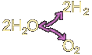

## Oxydoréduction
### Oxydoréduction, portée en arts plastiques
 **L'oxydoréduction**

Processus chimique jouant sur deux corps et par lequel :

> a. un oxydant cède de l'oxygène
> 
> b. un réducteur accueille l'oxygène cédé par l'oxydant.

Ce qui s'ensuit peut déboucher sur la formation d'une molécule d'eau... ou en partir. Notons comme exemple type que :



[L'oxydation](oxygene.html) et la [réduction](reductionreducteur.html) sont les deux demi-réactions de l'oxydoréduction, mais elles peuvent aussi se produire individuellement.

Lire absolument [passage](chap19oxydationsmetaux.html#oxydationreduction) in _Les Dialogues de Dotapea, chap. XIX._ Un courrier des lecteurs aborde également ces questions et fournit des informations complémentaires. [Lien.](courrierdeslecteurs2011b010.html#20110505lf)


```
title: Oxydoréduction
date: Fri Dec 22 2023 11:27:55 GMT+0100 (Central European Standard Time)
author: postite
```
