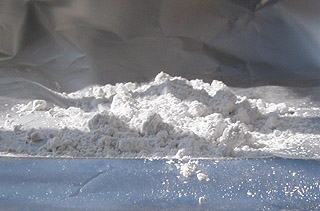

## Pâtes et agrégats
### Pâtes, agrégats, charges, usage en arts plastiques
 **Pâtes, charges et agrégats**

L'incorporation de charges, fines poudres de marbre ou galets de dix centimètres de diamètre (photos), dans une pâte "[plastique](plastique.html)" est soumise à certaines règles physiques.

D'abord, il faut distinguer les charges liantes de celles qui ne le sont pas. Puis, parmi ces dernières, on peut séparer les produits [cristalloïdes](cristalloide.html) des [colloïdes](colloide.html).

Enfin, on se trouve en face de règles élémentaires qui sont bien connues dans le domaine des [ciments](ciment.html). Ceux-ci nous offrent un exemple simple et aisément transposable.

Situons en premier les éléments concrets dont il est question.

Les agrégats sont des éléments fort solides que l'on introduit en grand nombre dans le ciment alors qu'il est encore en poudre, dans différents buts : consolidation (cf. _[Le béton](beton.html)_), coloration, allègement, granulation, réduction des coûts, etc. Ils ne sont pas liants et, à ce titre, peuvent tout à fait être comparées, à d'autres échelles, à ce qu'en peinture on nomme des [charges](epaissiempatcharg.html) [cristalloïdes](cristalloide.html) et, en modelage d'argile, à la [chamotte](chamotte.html).

Les agrégats du béton sont très souvent de simples gros cailloux.

Les règles qui s'appliquent aux agrégats ne sont pas sans rapport avec le théorème d'Archimède. Elles sont les suivantes :

_Pour enrober l'agrégat correctement, le liant (le ciment, en l'occurrence) a besoin que celui-ci lui présente une surface pas trop importante, faute de quoi la pâte se trouve fragilisée._

_La surface de l'agrégat détermine la quantité proportionnelle nécessaire de liant._

_Cette surface est d'autant plus importante que l'agrégat est fin._

Ainsi, si une part de ciment est suffisante pour "supporter" trois à six parts de gros morceaux de pierre de type "cailloux et galets", trois parts de ciment environ sont nécessaires pour incorporer une seule part de poudre de marbre fine !

Bien sûr, ces chiffres sont seulement des indications car à poids égal, un "agrégat" de forme irrégulière a une surface supérieure à un autre de forme sphérique et nécessitera encore plus de liant. De plus, certains traitements du ciment supposent un "débullage" par vibration qui peut accentuer ces différences. Il est alors conseillé de s'orienter vers des agrégats plus fins.

Transposition dans le domaine de la peinture

C'est pratiquement la même chose, même si le processus de séchage n'occasionne pas une [cristallisation](cristal.html) mais une [polymérisation](polymere.html) dont la rapidité est bien plus déterminante que dans le cas du ciment, liant très épais, non soumis à ces contraintes.

Illustration : une quantité trop importante de charges cristalloïdes (comparables directement aux agrégats) telles que [la poudre de marbre fine](chargesincolores.html#pdrmarbregfin) ou [l'hydrate d'alumine](chargesincolores.html#lhydratedalumine) ne permet pas à [l'huile de lin](huiledelin.html) d'enrober à temps les grains microscopiques qui chutent purement et simplement, obligeant le peintre à recourir à des substances accélérant le solidification. Les mêmes charges, adjointes à une peinture à l'eau séchant vite comme [l'acrylique](acrylique.html) ou [le vinyle](vinyle.html), ne poseront pas ce problème. Avec ces dernières comme avec l'huile de lin "solidifiée" par une très petite dose de [cire d'abeille](cirecommeadjuvant.html), on constate qu'il faut vraiment une grande quantité d'alumine ou de poudre de marbre fine pour fragiliser la peinture. La robustesse de ces liants autorise quelques audaces, mais non sans "effets secondaires".

D'autres liants moins épais comme [le méthylcellulose](methylcellulosiqueliant.html), [la gomme laque](gommelaque.html) ou [la gomme arabique](gommearabaquar.html) n'ont pas la viscosité suffisante pour enrober efficacement une grande quantité de charges de ce type.

 [Communication](http://www.artrealite.com/annonceurs.htm) 

