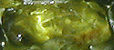

## Péridot
### Péridot, article du glossaire
 _Étymologie incertaine._

[](quinoussommes.html#catherinelisack)

Pierre semi-précieuse.

Contrairement à ce que certains auteurs annoncent, le péridot pourrait faire partie de la famille (non reconnue scientifiquement) des [olivines](olivine.html) et non le contraire.

C'est bien un cristal précis, de système orthorhombique (voir [cristal](cristal.html)), de couleur verte à jaune-vert. Dans l'exemple ci-contre, la cristallisation est imparfaite.

Composition : (Mg, Fe)2SiO4. Une proportion de moins de 15% de fer et la présence de traces de chrome et de nickel déterminent les qualités supérieures de ce minéral.

Le péridot est parfois présent dans les météorites. Il l'est bien davantage dans certains [granits](granit.html) et de nombreuses autres pierres de la croûte terrestre.


 [Communication](http://www.artrealite.com/annonceurs.htm) 

[](index-2.html#20131014)


```
title: Péridot
date: Fri Dec 22 2023 11:28:00 GMT+0100 (Central European Standard Time)
author: postite
```
