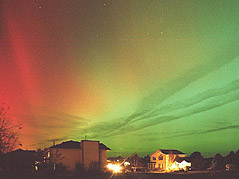

## Photoluminescence ou luminescence
### Photoluminescence, luminescence, portée en arts plastiques
 **La photoluminescence  
ou luminescence**

\[note : d'importantes précisions ont été apportées  
à ce sujet dans le cadre d'un courrier nommé  
"_Photoluminescence : histoire et matériaux_".  
[Lien](courrierdeslecteurs2011b170.html#20110713ca)\]

Contrairement à [l'incandescence](corpsnoir.html#lincandescence), la photoluminescence est provoquée par l'apport direct d'énergie non-thermique en provenance de l'extérieur : photons, champs électriques, contacts mécaniques ou chimiques. Pour plus de précisions sur ce point important, lire absolument un [passage illustré](chap13laser.html#incandlumin) du chapitre XIII des _Dialogues de Dotapea_.

Plus globalement un apport énergétique excite des électrons (les fait s'élever vers des couches supérieures), ce qui les place dans un état instable. Plus ou moins instable. Il en résulte plusieurs possibilités :

> 1) redescente progressive (plusieurs paliers) et restitution de l'énergie sous forme de chaleur,
> 
> 2) redescente directe vers le niveau de départ et restitution de l'énergie sous forme lumineuse.

Si la désexcitation est rapide (inférieure à la milliseconde) on parle de fluorescence, si la désexcitation est lente (jusqu'à plusieurs minutes) on parle de phosphorescence. Cela est dû au fait que certains états excités sont plus ou moins stables pour des raisons quantiques.

Lors de la désexcitation, les électrons restituent dans tous les cas - mais dans une mesure variable comme on le verra juste ci-dessous - l'énergie absorbée. La couleur renvoyée est donc originale : elle est émise par l'objet désexcité - donc absorbée dans un premier temps - et non renvoyée à l'identique.

Sauf dans le cas très particulier des [lasers](chap13laser.html), les photons qui sont réémis lors du processus de désexcitation sont normalement d'énergie inférieure. Typiquement, un corps excité avec des ultraviolets (énergétiques) réémettra dans le rouge (peu énergétique) ou un peu plus généralement, un rayonnement électromagnétique puissant (X ou UV) provoquera en différé l'émission d'un rayonnement visible.

\[rédigé avec une importante contribution de [Jean-Louis](quinoussommes.html#jeanlouis)\]

Moins typiquement, on pourrait imaginer (pure hypothèse) que le délai de désexcitation autorise une "montée en énergie" par l'apport de nouveaux photons ou autres sources d'énergie. Cependant la chose est douteuse : en principe - et cela a été constaté dès la découverte de l'effet photoélectrique -, sauf lumière cohérente, un électron ne change d'état que sous l'effet de l'absorption d'un seul photon suffisamment énergétique et multiplier les photons incidents n'a strictement aucun effet. Cette constatation a d'ailleurs été fondatrice car c'est elle qui a amené Max Planck à introduire le concept de quantum d'action, ce qui déboucha du même coup sur la première expression de la théorie des quantas (1900).  
Cependant, un premier témoignage nous est parvenu allant bien dans le sens d'un phénomène de photoluminescence visible initié par un rayonnement infrarouge. Nous ne pouvons écarter d'un revers de main ce type de possibilités mais il faudrait l'expliquer.  
N'hésitez pas à [nous écrire](ecrire.html) pour nous faire part de tels cas, ce qui permettrait d'avancer sur ce sujet.

D'une manière générale, malgré ces incertitudes il semble important d'indiquer ici que des phénomènes de photoluminescence ont lieu sur des fréquences variées. Ainsi, des uv ou X incidents peuvent susciter une luminescence uv (ex. : la "chevelure" de l'étoile Mira), des rayons visibles incidents peuvent susciter une luminescence infrarouge, des infrarouges incidents peuvent déclencher une luminescence micro-ondes ou radio. La luminescence visible n'est qu'une petite partie d'un phénomène plus général.  
 

Voir aussi [Pigments fluo et phospho](phosphofluo.html).

 [Communication](http://www.artrealite.com/annonceurs.htm) 

