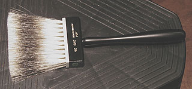

## Pinceaux : les poils
### Pinceaux : les poils - arts plastiques
 **Pinceaux : les poils**  

_Dire que le choix du poil est essentiel dans le choix d'un pinceau est une évidence. Il ne s'agit pas seulement de propriétés mécaniques, d'adéquation technique avec le style de peinture ou le support._

_La dimension psychologique est encore plus importante : dois-je utiliser l'animal ? Et lequel : l'animal de boucherie, dont le poil est récupéré à l'abattoir ou chez les éleveurs, l'animal à fourrure dont le poil est prélevé en pelleterie, l'animal d'élevage, l'animal chassé ? Tout cela n'est pas anodin et l'information s'avère rarement transparente au moment du choix, d'autant plus que les changements climatiques mondiaux modifient certains facteurs comme par exemple la longueur des poils des martres sibériennes._

_Historiquement parlant, les premiers poils utilisés en Europe étaient vraisemblablement la soie de porc (brosses rondes) et l'écureuil (pour les lavis). Selon certaines sources (non confirmées), on employait un peu plus tard, au XVIIème, le blaireau, le putois, le chien, le loup, le lièvre, l'écureuil, le chevreau et le porc._

_Les pinceaux synthétiques n'ont apparu qu'aux alentours de 1975._

_Le poil animal nécessite un important travail réalisé à la main consistant par exemple à tourner tous les poils dans le même sens ou à disposer sélectivement les poils dans un "moule" permettant de donner une forme à l'ensemble._

Sommaire

[Conditionnement, usure, coût](pincpoils.html#conditionnementusurecout)

[Détournement](pincpoils.html#detournement)

[Conservation, longévité](pincpoils.html#conservationlongevite)

[La fleur](pincpoils.html#fleur)

[Variétés de poils](pincpoils.html#varietesdepoils)

[La fleur](pincpoils.html#fleur)

[Le synthétique](pincpoils.html#lesynthetique)

[Le poil animal](pincpoils.html#poilanimal)

[La soie de porc](pincpoils.html#lasoiedeporc)

[La martre](pincpoils.html#lamartre)

[La mangouste](pincpoils.html#lamangouste)

[Le putois](pincpoils.html#leputois)

[Le blaireau](pincpoils.html#leblaireau)

[La zibeline, en anglais "sable"](pincpoils.html#lazibeline)

[Le petit-gris](pincpoils.html#lepetitgris)

[La chèvre](pincpoils.html#lachevre)

[L'oreille de boeuf](pincpoils.html#loreilledeboeuf)

[Le poney](pincpoils.html#leponey)

[Autres types de poils](pincpoils.html#autrespoils)

[Le chiendent](pincpoils.html#lechiendent)

[Le métal](pincpoils.html#lemetal)

_Conditionnement, usure, coût_

La plupart des pinceaux sont "gommés" (enduits d'une espèce de colle) afin de maintenir leur forme durant leur stockage et leur présentation en magasin.

Beaucoup de peintres aquarellistes s'initiant à la peinture à l'huile ou acrylique sur toile sont surpris de constater à quel point les poils s'usent vite et mettent en cause à tort la qualité de leurs pinceaux. La friction sur la toile est infiniment plus importante que sur le papier, les dimensions ne sont pas les mêmes et les brosses doivent être remplacées plus souvent.

(en complément, voir [passage](courrierdeslecteurs2009c110.html#20091229jpm) in courrier des lecteurs)

Concernant le coût indépendamment de l'usure et même du type de poils, ce qui le détermine fondamentalement, c'est _la longueur de sa [sortie](sortie.html) et sa [réserve](reserves.html)_ (impliquant une quantité plus ou moins importante de poils "rares" et un assemblage plus ou moins compliqué).

_Détournement_

De nombreux pinceaux destinés normalement à l'aquarelle peuvent être utilisés pour la gouache, voire même en peinture à l'huile (martre). Des pinceaux en synthétique destinés à l'acrylique peuvent parfaitement être employés pour la peinture à l'huile. Le détournement ne pose pas de problèmes sauf dans deux cas :

> \* le petit-gris doit vraiment être réservé aux peintures de type gouaches et lavis car il est beaucoup trop mou pour être utilisé pour l'huile et l'acrylique
> 
> \* certaines peintures dites "à solvants" nécessitent l'emploi de pinceaux supportant les produits agressifs. Il s'agit souvent de poils synthétiques.

Le détournement nécessite cependant un [nettoyage](nettoyage.html) particulièrement doux et attentionné. Éviter les produits [aromatiques](aromatique.html).

_Conservation, longévité_

Se procurer des pinceaux de bonne qualité est une chose, les garder en bon état en est une autre. La conservation dépend avant tout

> \* de la qualité du nettoyage (lire [l'article qui lui est consacré](nettoyage.html#cascourants))
> 
> \* du stockage pendant la séance de peinture. Les [séchoirs à pinceaux](outilspinceaux.html#lesechoirapinceaux) permettent d'éviter l'écrasement des poils au fond d'un pot.

Variétés de poils

_La fleur_

Une première manière de catégoriser les poils des pinceaux est de les distinguer par leurs types de [fleurs](fleur.html) :

Nous verrons au fil de ce texte que cette distinction s'avère importante dans l'usage concret.

_Le synthétique_

Généralement composé de [polyamide](polyamide.html), il est et n'est pas une catégorie à part : il peut atteindre un haut degré de finesse et de souplesse ou de résistance vraiment comparable au poil animal, mais sa [réserve](reserve.html) est généralement bien inférieure. Son insensibilité à l'eau en fait un bon pinceau pour les procédés aqueux, mais de manière non exhaustive : certaines variétés résistent très bien à l'action de dissolvants agressifs et la plupart tolèrent fort bien la peinture à l'huile et son solvant, l'essence. Généralement, l'offre des fabricants se subdivise en deux parties :

> \* pinceaux d'usage artistique normal : acrylique, huile. Lorsqu'un poil est censé être destiné à l'acrylique, son usage en peinture à l'huile n'est généralement pas impossible.
> 
> \* pinceaux destinés aux "peintures à [solvants](diluantssolvants.html)", plus agressives. Ceux-là peuvent évidemment être employés aussi avec des peintures moins agressives. Généralement, ils sont plus solides et peuvent être utilisés avantageusement par des peintres ayant coutume de malmener leurs pinceaux.

De coût très modéré et de bon rapport qualité-prix, le synthétique a autorisé les fabricants à créer des [queues de morue](spalter.html#laqueuedemorue) et [spalters](spalter.html#lespalter) à poils très fins, autorisant l'artiste à appliquer [glacis](glacis.html), [laques](gommelaque.html) et [vernis](vernisdefinitifs.html) sans qu'apparaisse la trace, l'empreinte des poils (contrairement à ce qui se produit presque immanquablement avec la soie de porc).

Il existe d'excellents pinceaux, mélanges de martre et de synthétique. Ce compromis est financièrement très intéressant et peut être de bonne qualité.

_Le poil animal_

_Des questions se posent forcément._

_Concernant certains poils, le fournisseur est l'abattoir. Pour d'autres par contre, les conditions dans lesquelles l'animal est élevé, chassé et tué - s'il est élevé, chassé et tué - soulèvent naturellement des interrogations tout à fait comparables à celles que suscite l'industrie de la fourrure vestimentaire._

_Qu'en est-il exactement du respect de l'animal, voilà une question a priori légitime pour l'artiste, l'amateur, l'acheteur de pinceaux. N'y aurait-il pas lieu, pour les fabricants de pinceaux, de communiquer davantage, le plus possible à ce sujet ?_

_Sans mettre de côté ces questionnements, faisons un petit tour d'horizon des différents poils animaux utilisés dans la fabrication des pinceaux._

_La soie de porc_

Ce n'est pas un poil fin. Contrairement aux autres, il a de multiples [fleurs](fleur.html). Sa résistance et sa rigidité en font de bons pinceaux pour de nombreux usages, tant en préparation de surfaces que pour la peinture proprement dite. Sa couleur est blanche.

Généralement, les fabricants proposent trois qualités de soie de porc. Toutes sont cuites dans l'eau bouillante durant deux heures pour assouplissement. Elles sont :

> \* la qualité basique (type demi-blanc), en provenance d'Europe. Son défaut : le poil est trop gros pour être vraiment bien enserré par la virole. Le pinceau perd donc des poils.
> 
> \* la qualité moyenne (type beau-blanc), venant de Chine et d'Europe centrale. Ce type de pinceaux perd quelques poils.
> 
> \* l' extra-fine (type beau-blanc de Tchounking), faite de poils d'origine sélectionnée venant souvent de Chine. Le manche est souvent vernis.

Seul l'extra-fine est susceptible de ne pas trop perdre de poils.

On nous signale une pratique _d'une efficacité non certifiée_ permettant théoriquement d'évacuer les poils mal fixés. Cela consiste à placer le pinceau dans l'eau bouillante une vingtaine de minutes. Au sortir de l'eau, essorer et nettoyer au savon.

_La martre_

Il existe deux sortes (au moins) de martres :

> \* la martre rouge Kolinsky, donnant un poil particulièrement résistant, de couleur plus jaune que rouge, de très haute tenue. Bien assemblés, les poils ne s'écrasent pas et reprennent toujours leur forme. Pour cette raison, ils sont le plus souvent assemblés en forme ronde pointue et très rarement en forme plate.  
> A notre connaissance, les Kolinsky à sortie courte sont les pinceaux les plus précis. Les autres variétés sont plus ou moins longues (jusqu'à la taille "[traceur](pincformes.html#traceurs)") et plus ou moins ventrues.  
> Ce type de poils coûte vraiment cher (proche du prix de l'or au poids), mais peut faire un long usage.  
> Pourquoi ce terme "Kolinsky" ? Possiblement parce que les martres de cette variété vivaient originellement sur la presqu'île de Kola. Ceci aurait plusieurs implications :
> 
> > \* "Kolinsky" ne serait pas un nom propre mais un simple adjectif auquel il n'y aurait pas lieu de mettre une majuscule. Information non confirmée. Amis russophones, n'hésitez pas à [nous écrire](ecrire.html).
> > 
> > \* contrairement à ce qui est fréquemment annoncé par les fabricants, il ne s'agirait pas - du moins à l'origine - d'une martre sibérienne. La presqu'île de Kola est en effet partie intégrante de la péninsule scandinave. Elle jouxte directement la Finlande, à des milliers de kilomètres à l'Ouest de l'Oural. Quels sont les lieux d'implantation actuels ? [Toute information fiable est bienvenue.](ecrire.html)
> > 
> > \* si certaines martres Kolinsky étaient encore chassées dans cette région de nos jours, il faudrait rappeler que celle-ci est très surveillée (par la Finlande et la Norvège qui contrôlent notamment la radioactivité des animaux sauvages terrestres) suite aux essais nucléaires atmosphériques de l'ère soviétique, mais aussi à cause de la présence d'un stock de déchets fissiles qui pourrait être le plus important au monde et à l'ancrage ou à l'échouage de sous-marins et brise-glace appartenant à une flotte atomique sans équivalent mondial. La transparence de l'état russe sur ces sujets extrêmement polémiques ne semble toujours pas faire l'unanimité.
> > 
> > \* par ailleurs, cheveux et poils ont une tendance particulièrement marquée à concentrer les minéraux et notamment les métaux lourds.
> 
> ...aussi les fabricants de pinceaux pourraient-ils avoir intérêt à communiquer sur ces points : lieu d'origine de l'animal et contrôle de l'innocuité du produit vendu.
> 
> \* la "martre rouge", non désignée "Kolinsky". Son poil est bien roux et se distingue effectivement. Il est plus souple que celui de la martre Kolinsky. A peine moins cher, il est parfois monté en forme plate. Son origine précise suscite questionnement. [Toute information fiable à ce sujet est bienvenue.](ecrire.html)

Les martres sont apparentées au vison et à la [mangouste](pincpoils.html#lamangouste). Leurs poils autorisent un travail d'application de grande précision. De bonne qualité, ils ont du "ressort", c'est-à-dire une capacité particulière à retrouver leur forme originelle.

Certains fabricants proposeraient des pinceaux à poils de martre de Chine ou de weasel (visel) de qualité inférieure.

_La mangouste_

C'est un très beau poil lisse présentant des nuances sombres et claires. L'animal est généralement une mangouste indienne.

Monté à plat ou en rond, présentant une souplesse moyenne, ce poil est de prix raisonnable.

_Le putois_

C'est un poil plutôt fin, assez dur et court. Le plus souvent, il est monté à plat.

L'animal provient généralement d'Europe centrale (notamment l'Allemagne) ou de Russie.

Le terme de putois désigne aussi un type de brosses destinées à la peinture décorative.

Voir aussi [putoiser](techmelangecouleurs.html#putoiser).

_Le blaireau_

D'origine française ou européenne, son poil est assez dur. Utilisé en peinture à l'huile et acrylique ainsi qu'en peinture décorative (notamment pour le vitrail). Voir photo ci-contre.

Voir aussi [blaireauter](techmelangecouleurs.html#blaireautage).

_La zibeline (en anglais, "sable")_

Il n'est pas très facile de s'en procurer en France. Son prix est très élevé.

Il s'agit, nous dit-on, d'un poil doux et souple tout à fait remarquable, recherché par certains peintres.

Il peut être utilisé en peinture à l'huile ainsi qu'un peu toutes les peintures, à la condition, comme toujours, d'un nettoyage attentif.

_Le petit-gris_

Destiné exclusivement aux peintures à l'eau non empâtées - [l'aquarelle](gommearabaquar.html) particulièrement, mais aussi les [lavis](lavis1.html) -, c'est le poil le plus souple et aussi celui dont la [réserve](reserve.html) est la plus importante : il est semble-t-il le plus fin et offre de ce fait une capillarité inégalable. De même, la pointe est d'une finesse extrême si le pinceau est bien assemblé. 

Ce poil provient de la queue de l'écureuil. L'origine de l'animal peut être

> \* la Russie (trois variétés très réputées) :
> 
> > \* petit-gris brun de Kazan assez précis (contours, détails, coloriage), monté en rond à pointe fine,
> > 
> > \* variété bleue de Saccamina à très grande [réserve](reserve.html)
> > 
> > \* variété longue et dure de Talaoutky ;
> 
> \* l'Espagne, la France et la Scandinavie (variété rouge très molle) 
> 
> \* le Canada (variété dorée, courte et molle, ayant une bonne réserve, souvent montée sur virole plate et de forme carrée pour faciliter le travail des fonds et les traits exécutés par la tranche).

Généralement, ce poil est sombre.

Il est le plus souvent assemblé en forme ronde ([mouilleur](pincformes.html#lesmouilleurs)) ou en [rond pointu](pincformes.html#lesrondspointus). Le mouilleur est aussi pointu que le rond pointu mais sa sortie est proportionnellement plus longue, ce qui signifie concrètement que le tracé fin est plus difficultueux - mais pas irréalisable. Par contre, sa réserve est extraordinaire.

On le trouve plus rarement en plat extrêmement fin carré ([plat court](pincformes.html#lesplatscarresouplatscourts)) ou ovale ([mouilleur ovale](pincformes.html#mouilleursovales), dit aussi [langue de chat](pincformes.html#languesdechat) - une forme qui, mouillée, fait aussi la pointe).

Son prix augmente _très sensiblement_ en fonction de la longueur de sa [sortie](sortie.html).

Pour des raisons de coût, le petit-gris est parfois associé au poil de poney (lorsqu'il est monté en forme de mouilleur particulièrement). Dans ce cas, il ne fait plus la pointe. C'est à cela que l'on peut aisément reconnaître les composites de ce type.

_La chèvre_

Elle donne un poil blanc, le plus souvent assemblé sous forme ronde pointue en ce qui concerne l'usage artistique, dédié à certaines calligraphies asiatiques. Il existe également des pinceaux destinés au maquillage. Le poil de chèvre est peu coûteux ou du moins devrait l'être. Avec les assemblages habituels, la perte de poils en grand nombre est courante. L'alibi de l'exotisme ne devrait certainement pas autoriser la pratique de prix élevés que l'on constate malheureusement en France.

_L'oreille de boeuf_

Ce poil provient du fond de l'oreille du boeuf. Sa couleur peut varier considérablement indépendamment de sa qualité. Nous n'avons pas beaucoup d'échos le concernant. Il serait résistant, nerveux et peu coûteux.

_Le poney_

On l'appelle aussi "chameau". En réalité, il provient du poney ou du cheval. En Chine, il n'a été utilisé que pour l'écriture.

Apparemment semblable au [petit-gris](pincpoils.html#lepetitgris), il n'a vraiment pas la qualité de ce dernier. Il ne fait pas la pointe. Il a cependant une [réserve](reserve.html) relativement importante et est pour cette raison employé dans la fabrication de brosses à [chiqueter](chiquetis.html).

_Autres types de poils_

_Le chiendent_

Eh oui ! Ne l'oublions pas. Le poil d'un vulgaire balai-brosse peut être utile par exemple pour les techniques [mouchetées](mouchete.html), sur de vastes surfaces.

_Le métal_

Les brosses métalliques sont très utilisées en ébénisterie et dans quelques autres domaines des arts décoratifs. Différents métaux sont disponibles.

Elles peuvent intéresser l'artiste dans le cadre de la préparation de certains supports qu'elles permettent de nettoyer. Autre emploi : des stries peuvent être imprimées à l'aide de cet outil sur un support tendre ou frais.

 [Communication](http://www.artrealite.com/annonceurs.htm) 

