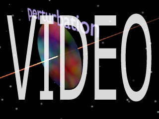
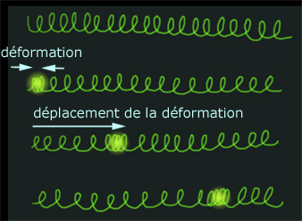
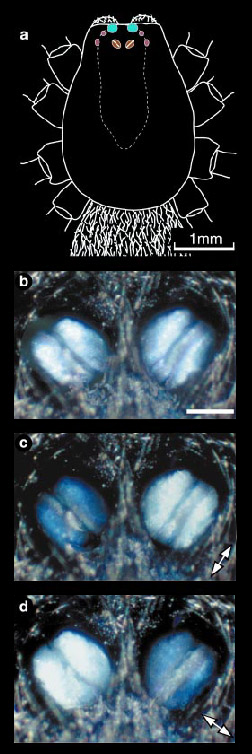
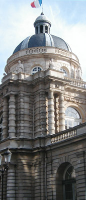
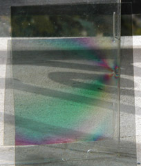

## Polarisation - Chapitre VI
### La polarisation - Les dialogues de Dotapea - Chapitre VI
 Navig. page/section

  
  

\_\_\_\_\_

**Pages soeurs**

[I, A propos des liants](chap01liants.html)  
[II, Bulles, siccativ., struct. élec.](chap02bullessiccativation.html)  
[III, Caséine, phosphore, dissociation](chap03caseine.html)  
[IV, Les orbitales](chap04orbitales.html)  
[V, L'aérogel](chap05aerogel.html)  
VI, Polarisation de la lumière  
[VII, Sfumato et diffusion Rayleigh](chap07rayleigh.html)  
[VIII, Les interférentielles](chap08interferences.html)  
[IX, Dextrine, farine et chiralité](chap09dextrine.html)  
[X, L'ocre bleue](chap10ocrebleue.html)  
[XI, Les métamatériaux](chap11metamateriaux.html)  
[XII, Le jaunissement](chap12jaunissement.html)  
[XIII, Laser etc.](chap13laser.html)  
[XIV, L'holographie](chap14holographie.html)  
[XV, L'holographie numérique](chap15holographienum.html)  
[XVI, Extérieur, intérieur, chaux](chap16interieurexterieurchaux.html)  
[XVII, L'électrolyse et les ions](chap17electrolyseions.html)  
[XVIII, L'électricité, un peu plus loin](chap18electriciteplusloin.html)  
[XIX, Oxydation, métaux](chap19oxydationsmetaux.html)  
[XX, Les échelles](chap20echelles.html)  
[XXI, Nature et évolution des résines](chap21resines.html)  
[XXII, Le mouillage pigmentaire](chap22mouillage.html)  
[XXIII, La molette](chap23molette.html)  
[XXIV, Blanche neige](chap24blancheneige.html)  
[XXV, Lumière et matière](chap25lumiereetmatiere.html)  
[XXVI, Magnétisme](chap26magnetisme.html)  
[XXVII, Ambre et vieilles branches](chap27ambre.html)  
[XXVIII, L'origami miroir](chap28origamimiroir.html)  
[XXIX, Le feu](chap29feu.html)  
[XXX, Peau du métal](chap30peaudumetal.html)  
[XXXI, La ville en un souffle](chap31bellastock.html)  
[XXXII, Oxyder des matériaux](chap32oxydermateriaux.html)  
[XXXIII, Ocre bleue, une solution](chap33ocrebleuesimulation.html)

\_\_\_\_\_

Copyright © www.dotapea.com

Tous droits réservés.  
[Précisions cliquer ici](droitscopie.html)

**Les dialogues sur la physique-chimie  
appliquée aux arts**

**Chapitre VI**

**Polarisation de la lumière**

dial   dial   dial

Ce chapitre des [Dialogues de Dotapea](dialoguesdotapea.html) est une discussion entre Jean-Louis, physico-chimiste au CNRS, et un candide, Emmanuel.

Les personnages sont réels, la discussion aussi. Elle peut reprendre à tout moment et ce texte peut s'allonger.

Tout d'abord une introduction vidéo par le biais du canal web de ArtRéalité.

Ces animations sont schématiques, forcément simplificatrices, mais elles peuvent favoriser la compréhension des concepts exposés dans cet article.

Emmanuel : On a tendance à confondre le phénomène de la polarisation avec celui des [interférences](chap08interferences.html), mais on reviendra à celui-ci dans un autre chapitre. Il y a aussi [l'effet rayleigh](chap07rayleigh.html) et d'autres phénomènes en relation directe avec les arts plastiques. Parlons de polarisation exclusivement pour ce texte.

Ce phénomène étrange, qui peut caractériser intrinsèquement la lumière, nous est imperceptible directement, contrairement à certains animaux (voir ci-contre). Des artistes s'y sont intéressés de près et il semblait nécessaire d'évoquer la polarisation dans les Dialogues physique/chimie.

De quoi s'agit -il ?

Jean-Louis : L'introduction de la notion simple de polarisation demande de préalablement définir et comprendre plusieurs autres notions.

Une "onde" est une perturbation spatio-temporelle d'un milieu. Ca commence fort ! Prenons tout de suite l'exemple de la pierre lancée dans une étendue d'eau calme.

Partant du point d'impact, on observe des vaguelettes concentriques qui se propagent de façon centrifuge.

Lors du passage de l'onde (de la perturbation) l'eau de la surface monte et descend avant de retourner petit à petit à son état initial non perturbé. On parle _d'onde amortie_.

La distance entre deux crêtes est la "longueur d"onde", elle est fonction notamment de la vitesse de l'onde dans le milieu considéré. Si la perturbation est continue et répétitive, on parle _d'onde entretenue_.

Son amplitude est alors constante, un même point de l'espace bougera toujours de la même quantité. Enfin, toujours dans le cas des ondes crée par cette pierre qui tombe dans l'eau, on note que l'onde (la perturbation) se propage horizontalement (les cercles concentriques)  mais que les points de la surface se déplacent verticalement, soit à 90° de la direction de propagation.

On dit d'une telle onde qu'elle est "_transversale_".

C'est le cas le plus courant, c'est notamment le cas des ondes lumineuses, par contre les ondes sonores sont des ondes "_longitudinales_" : les particules du milieu de propagation se déplacent dans le même sens que l'onde.

Le meilleur exemple c'est celui d'un ressort à boudin très long, que l'on pince brièvement à une extrémité. Le pincement se propage le long du ressort. Ce pincement est une déformation du milieu propagatif (le ressort) parallèle au déplacement de l'onde.

**Une perception difficile pour l'humain mais naturelle pour certains animaux**

La lumière provenant de la voûte céleste est faiblement polarisée, principalement dans la direction perpendiculaire aux rayons solaire.

L'oeil humain n'y est pas sensible, mais certains animaux ont la possibilité physiologique de détecter cette polarisation, qui leur sert notamment à s'orienter.

Les abeilles et les fourmis s'orientent généralement à partir de la position du soleil, mais en l'absence de celui-ci (nuages,...) elles peuvent utiliser la polarisation de la lumière céleste. D'autres animaux, en particulier les criquets _Schistocerca gregaria_, n'utilisent que la polarisation de la lumière, et ont même développé des photorécepteurs spécialisés situé à la périphérie de leurs organes de vision ordinaire. Enfin, l'araignée _Drassodes cupreus_ a même développé des "yeux" uniquement dédiés à la détection de la polarisation de la lumière.

\[courtoisie de/courtesy of Marie Dacke et/and Dan Nilsson, Lund University, Suède/Sweden © Copyright\]

La preuve que les yeux en question sont bien sensibles à la polarisation apparaît clairement quand on éclaire ces organes avec une lumière polarisée (photos c et d), la lumière réfléchie est plus ou moins intense selon que la polarisation est identique à celle de l'oeil ou perpendiculaire.

\[Note : en complément d'information,

on peut lire l'article _[L'onde](onde.html)_ de la section des

concepts physico-chimiques mais ce

n'est pas indispensable à la compréhension

de cet exposé\]

Revenons à la polarisation. Quand la direction de déplacement des particules du milieu (je continue avec mon exemple d'une onde dans un milieu liquide, mais c'est pareil pour la lumière qui se propage, même dans le vide) est constante et bien définie, on dit que l'onde est "polarisée". Si la direction du déplacement des particules varie sans cesse, l'onde n'est pas polarisée.

La lumière est une perturbation propagative et périodique du champ électrique (et magnétique aussi d'ailleurs, c'est une onde électromagnétique). Dit comme ça, c'est moins joli, non ? Le champ électrique de cette onde perturbe les petits électrons de tout matériau qui se trouve sur son passage, et c'est donc la nature électronique des matériaux qui leur confère _in fine_ les propriétés optiques particulières lien vers futur nouveau chap JC qu'ils possèdent : transparents, colorés, métalliques,...

Les ondes électromagnétiques sont des ondes transversales, le champ électrique (le responsable de la perturbation, je le rappelle) est toujours perpendiculaire à la direction de propagation ou sa direction décrit une ellipse connue (polarisation elliptique). Une lumière non polarisée a un champ électrique perpendiculaire à la direction de propagation mais dont la direction (celle du champ) varie en permanence sans schéma particulier. Un coup à droite, un coup à gauche, un coup en rond, etc... à l'échelle de la nanoseconde.

[\[voir vidéo\]](chap06polaris.html#video)

Les ondes lumineuses ordinaires, de tous les jours, ne sont pas polarisées : le champ électrique varie en permanence dans tous les sens, tout en restant perpendiculaire à la direction de propagation.

Contrairement à celui de certains animaux, l'oeil humain n'est pas sensible à la polarisation de la lumière.

**Exemple du caddie**

Il y a schématiquement trois façons de polariser la lumière : par réflexion sur une surface, par absorption dichroïque, par l'utilisation de matériaux [biréfringents.](birefringence.html) 

**Trois façons de polariser la lumière**

L'histoire veut que ce soit Etienne-Louis Malus (1775-1812) qui ait découvert le phénomène de polarisation de la lumière par réflexion. La lumière du soleil couchant se reflétait dans les vitres du Sénat avant d'atteindre son laboratoire après avoir subi une deuxième réflexion sur sa fenêtre.

Malus s'aperçut alors qu'en modifiant l'orientation qu'il donnait à sa fenêtre il pouvait diminuer l'intensité de la lumière réfléchie : la lumière solaire était polarisée par sa première réflexion puis par la seconde. Cette deuxième réflexion étant perpendiculaire à la première, elle ne produisait plus de lumière. Il n'existe de nos jours plus de polariseurs fonctionnant sur ce principe, en tout cas pour la lumière visible, mais le phénomène est facile à mettre en évidence en utilisant des _polaroïds_. \[note : il s'agit de feuilles plastiques particulières, voir [image en fin d'article](chap06polaris.html#imagepolaroids)\]

Le moyen le plus simple et le plus économique de polariser la lumière ou d'observer sa polarisation est l'utilisation de polaroïds. On en trouve dans les afficheurs à cristaux liquides, les filtres photographiques, les lunettes de soleil,... Ces dispositifs sont basés sur l'absorption dichroïque de certaines molécules.

**1\. par réflexion**

Parenthèse :

En fonction de sa nature moléculaire, un matériau peut être coloré ou transparent. Un matériau coloré absorbe sélectivement certaines longueurs d'ondes et laisse passer les autres. On parle de bande d'absorption. Par exemple, un matériau qui absorbe les longueurs d'onde rouge-orangé apparaîtra vert. Cette absorption est généralement isotrope, c'est à dire qu'elle ne dépend ni de la direction d'observation ni de l'état de polarisation de la lumière incidente. Certains matériaux ont une absorption qui dépend de la direction d'observation, ils sont "_dichroïques_" (du grec "deux couleurs"). A la base il s'agit de molécules possédant une certaine anisotropie de forme, ce qui fait que l'onde lumineuse incidente (un champ électrique, je le rappelle) ne sera pas absorbée de la même façon selon que sa polarisation est longitudinale (dans le sens de la grande longueur de la molécule) ou transversale (dans le sens de la largeur).

Deux conséquences immédiates :

> \* une lumière incidente non polarisée sortira polarisée du matériau,
> 
> \* une lumière incidente polarisée sortira plus ou moins affaiblie du matériau.

Terminologie : lorsqu'un matériau polarisant est placé sur le chemin d'une onde lumineuse déjà polarisée il prend le nom d'_analyseur_. Un analyseur permet de détecter l'état de polarisation d'une onde incidente.

Une dernière remarque : l'utilisation d'un polaroïd pour polariser la lumière naturelle conduit nécessairement à la perte de 50% de l'intensité de cette dernière, puisque qu'elle sera absorbée dans le matériau. Les polaroïds sont donc toujours très colorés (gris-bleu, pour les plus courants, à base [d'iode](iode.html)).

Emmanuel : Est-ce que tu peux donner des exemples de matières polarisantes du même type que cette iode ?

Jean-Louis : Je ne suis pas expert... Dans le cas de polariseurs à base d'iode, c'est pas directement l'iode qui apporte le dichroïsme. En fait il y a un polymère orienté, c'est-à-dire dont les chaînes sont étirées dans la même direction, qui devient électriquement conducteur grâce à l'iode. Les chaînes de polymère se comportent alors comme des "courts-circuits" optiques dans le sens de leur longueur. Ca se complique...

Quelques illustrations :

> La lumière naturelle est polarisée par sa réflexion sur des surfaces, par exemple une carrosserie de voiture, le vernis d'un tableau, une étendue d'eau. Après réflexion la polarisation est linéaire et parallèle au plan de la surface réfléchissante.
> 
> Les lunettes polaroïd utilisent des verres polarisants orientés verticalement. En effet, la lumière solaire, réfléchie par une surface d'eau (généralement horizontale...) donnera des reflets polarisés horizontalement. Le fait de les observer à travers des polariseurs orientés verticalement fait que la lumière de ces reflets sera absorbée sélectivement dans les verres de lunette, donc plus de reflets !
> 
> Un photographe qui veut reproduire un tableau et se trouve gêné par les reflets de lumière utilisera un filtre polarisant pour s'en débarrasser. Enfin, si on possède un polariseur dont on ne connaît pas le sens, il suffit de regarder une surface brillante au travers du polariseur et de faire tourner celui-ci. Quand les reflets sont au minimum d'intensité, la direction de polarisation du polariseur est verticale.

**2\. par absorption dichroïque**

Pour finir  :

> Un matériau optiquement transparent est caractérisé entre autres par son indice de réfraction, qui est une mesure de la vitesse de la lumière dans ce matériau.

Emmanuel : Quand tu parles de mesure de la vitesse de la lumière dans un matériau, à quoi cela correspond-il concrètement ? Pourquoi n'est-ce pas 300 000 km/s ? Y a-t-il des champs électriques « sur le déclin » qui paressent ou qui se fanent ?

**3\. par biréfringence**

Jean-Louis : La lumière ne va à sa vitesse maximale que dans le vide. Dans l'air c'est presque pareil. Mais dans les matériaux solides elle interagit avec les électrons du milieu et la conséquence est qu'elle va moins vite. La vitesse est alors égale à 300 000 km/s divisé par l'indice de réfraction. Dans l'eau (n=1.33) la lumière va à 225 000 km/s. Dans le verre 200 000, dans le diamant 120 000.

> La plupart des matériaux n'ont qu'un seul [indice de réfraction](refraction.html), ils sont optiquement isotropes. Certains matériaux ont un indice de réfraction qui varie en fonction de l'angle d'incidence de la lumière entre une valeur minimale et une valeur maximale. Ils sont appelés biréfringents.  
> \[lire un [complément à ce dialogue](birefringence.html) dans l'article _La biréfringence_ du glossaire\]

**Vitesse de la lumière et réfraction**

Plus d'informations dans l'article du glossaire.

[Cliquer ici](refraction.html)

Emmanuel : Ce sont les [cristaux](cristal.html), non ?

Jean-Louis : Tous les cristaux ne sont pas biréfringents. Le diamant est isotrope. Le [quartz](quartz.html) et la tourmaline sont biréfringents du fait qu'ils donnent lieu au phénomène de double réfraction : un rayon incident ressort double ! L'exemple archi-connu du cristal de [calcite](calcite.html), si on pose un cristal de calcite sur un texte écrit, le texte apparaît dédoublé.

Outre le fait que ce phénomène de biréfringence est utilisé pour fabriquer des polariseurs et des analyseurs de très bonne qualité, il donne lieu à de spectaculaires interférences lorsque le matériau biréfringent est observé entre deux polariseurs. Applications en minéralogie et en analyse des structures.

**Cristal et biréfringence**

Emmanuel : Des artistes ont utilisé ces effets dans les années 1970/80. Je ne parviens qu'à cela, on peut sûrement faire beaucoup mieux.

.

Jean-Louis : Prendre le boîtier d'un CD. En lumière naturelle tu vois un matériau transparent. Si tu mets le boîtier entre les deux polariseurs, en faisant un peu tourner (dans son plan) un des polariseurs pour maximiser le contraste tu vois de magnifiques franges colorées. C'est parce que le plastique du boîtier a subi des contraintes lors du moulage, les contraintes l'ont rendu biréfringent. Dans les coins, en particulier, tu verras très bien les lignes d'écoulement du plastique fondu dans son moule.

Emmanuel : La lumière est-elle polarisée lorsqu'elle traverse simplement une vitre ?

  
Jean-Louis : Partiellement, si l'incidence est oblique.

**Psychedelic works**

[La suite : chapitre VII](chap07rayleigh.html)

 

 [Communication](http://www.artrealite.com/annonceurs.htm) 

