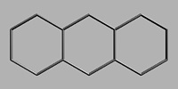

## Polycyclique
### Polycyclique, article du glossaire
 _Adjectif_

Un composé moléculaire [organique](organique.html) peut présenter plusieurs [cycles](cyclique.html). Le cas n'est pas rare.

On citera par exemple [l'anthracène](anthracene.html), base des colorants [anthraquinoniques](anthracene.html).



Plus complexe et d'origine synthétique, le graphène peut aussi être évoqué (sous toute réserve si l'on ne doit conserver qu'un sens restreint au terme polycyclique). Ci-dessous, une "feuille" de graphène.

[](images/graphene800x400.jpg)  
Cliquer pour agrandir  
www.dotapea.com ©

... de même, les nanotubes de carbone sont des structures [aromatiques](aromatique.html) à plusieurs cycles.

[](images/nanotube800x400.jpg)  
Cliquer pour agrandir  
www.dotapea.com ©

Enfin on signalera l'existence dans l'univers de structures polycycliques dans les nuages opaques présents dans les pépinières d'étoiles. Ces "nuages moléculaires", obscurs dans le spectre visible, cachent fréquemment des systèmes stellaires en formation. Ici, la nébuleuse "Tête de cheval" en infrarouge proche.

[](images/tetechevalir800x836.jpg)  
Cliquer pour agrandir  
NASA, ESA © 2013 Hubble

Les structures des "cycles" différents (de trois à n atomes de carbone), éventuellement alternés et non uniquement benzéniques (six carbones) sont aussi considérées comme des molécules polycycliques. On peut citer le fullerène, qui ressemble beaucoup à un ballon de football (ici, variété dite C60) :

[](images/fullerene800x400.jpg)  
Cliquer pour agrandir  
www.dotapea.com ©

Note : en anglais, un polycycle aromatique est abrégé sous la forme PAH, pour Polycyclic Aromatic Hydrocarbon. En français, Hydrocarbure Aromatique Polycyclique peut donner HAP.

Il existe également des [hétérocycles](heterocycle.html) intégrant d'autres éléments, classiquement des [non-métaux](nonmetaux.html) comme l'oxygène, l'azote, le soufre ou le phosphore. Ou le [brome](annexe1.html#br) du [dibromoindigo de la pourpre](pourpre.html#schemamoleculaire).  
En dehors des bases carbonées, on peut mentionner le bore (buckyballes de bore) ou encore les cages de silicium, qui sont des polycycles parfois assez irréguliers, pouvant être relativement lourds (60, 80 atomes notamment), à base généralement ternaire et éventuellement adjoints de [métaux alcalins](alcalin.html#metauxalcalins).

Les polycycles de synthèse, dans leur ensemble, sont un thème de recherche important. Ce sont des enjeux nanotechnologiques de tout premier plan. Les coûts de fabrication demeurent cependant encore prohibitifs, ces matériaux supportant mal les imperfections car celles-ci peuvent altérer leurs propriétés les plus intéressantes, la conductivité notamment. A ce sujet, lire absolument [Le transport balistique in La conduction électrique](conductionelec.html#balistique).

**Polycycles naturels, santé**

[](bleusfroids.html#bleudefrancediamant)

On signalera l'existence dans la nature des mêmes matériaux, dans les cendres des feux (en quantités infimes), dans certaines nébuleuses moléculaires et, sous une forme tridimensionnelle, dans les météorites (polycristaux). Les diamants et le graphite sont également des HAP tridimensionnels naturels, parfois hétérocycliques (ex. : le diamant bleu, intégrant du bore, image ci-contre, lire _[Le Bleu de France](bleusfroids.html#bleudefrancediamant)_).

L'assimilation par le corps des polycycles dépend des typologies. Les HAP de type nanotubes seraient contre toute attente dégradés en cycles [benzéniques](benzene.html) simples (information non confirmée), un matériau carcinogène, ce qui poserait le cas échéant un sérieux problème de santé publique si ces matériaux devenaient plus répandus. La dureté de ces matériaux extrêmement fins est également relevée comme pouvant entraîner des lésions. Des évaluations sur ces points encore sujets à polémique sont en cours mais la prudence est de mise.  
L'anthracène cité ci-dessus ainsi que le diamant et le graphite ne posent pas ces problèmes (vérification faite sur le [Reptox](liensutiles.html#csst)). Une réserve doit cependant être émise - et cela concerne aussi les polycycles non-HAP naturels ou non - : sous forme pulvérulente, étant des structures fines généralement très solides, l'inhalation et le contact avec les yeux sont à éviter.

Voir [cyclique](cyclique.html), [acyclique](acyclique.html), [chaîne](chaine.html).


 [Communication](http://www.artrealite.com/annonceurs.htm) 

[](index-2.html#20131014)


```
title: Polycyclique
date: Fri Dec 22 2023 11:28:08 GMT+0100 (Central European Standard Time)
author: postite
```
