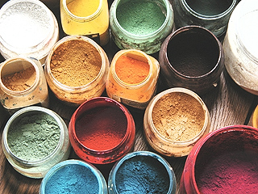
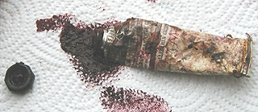

## Séparer ou non liants et pigments
### Peinture : séparer ou non liants et pigments
 **Séparer ou non  
liants et pigments**  _Par contre, cette formule implique quelques restrictions. Le tube n'est pas né seulement parce que le broyage industriel de l'époque n'avait pas la qualité actuelle et nécessitait une intervention du peintre. Il a de réels aspects pratiques._

A lire dans le _Courrier des Lecteurs_, [Commencer à lier pigments et huile](courrierdeslecteurs2012b030.html)

_L'intérêt initial du tube, le procédé par séparation_

Au XIXème siècle, l'invention du tube a permis aux peintres de transporter littéralement l'atelier [sur le motif](motif.html). C'est encore là que réside son intérêt majeur. Comme le font toujours certains peintres contemporains, les artistes préparaient la pâte et l'injectaient eux-mêmes dans les tubes. C'est cependant l'industrialisation de ce procédé qui fut déterminante.

En effet, plus tard, cet outil s'est déplacé dans l'atelier pour des raisons de temps : préparer les couleurs soi-même était soi-disant trop long, trop difficile, point de vue excessif assez typique de la période moderne. On a en effet beaucoup exagéré sur ce point : depuis longtemps, les pigments proposés dans le commerces sont déjà très finement broyés ; il n'y a plus qu'à les mélanger au liant avec une spatule ou un autre outil, ce qui prend seulement quelques minutes.

Le procédé de broyage (ou de liage si l'on préfère ce terme plus juste mais moins usité) à la façon ancienne met en oeuvre une [molette](molette.html) - destiné au liage du pigment, mais aussi au broyage terminal - et un plaque de porphyre (non de marbre, contrairement à l'opinion répandue). _Le broyage sur plaque de porphyre avec une molette de cristal est un procédé chic mais d'une utilité discutable._  [Lire le chapitre XIII, _La molette._](chap23molette.html)

De plus, il existe des méthodes simples permettant d'accélérer la préparation de la peinture. L'argument de la durée de préparation est encore valable, mais bien moins qu'il ne le fut.

Voir aussi [Tubes de peinture : conservation](courrierdeslecteurs2009b030.html#20090623cl) in _Courrier des Lecteurs._ 

_Procédés de préparation rapide_

Note 1, mélanges : sauf exceptions, il est fortement déconseillé de mélanger des pigments avant de les incorporer à un liant. Chaque pigment a son pouvoir colorant qui ne se révèle que lorsqu'il est "mouillé" (sur le mouillage pigmentaire, lire le [chap. XXII](chap22mouillage.html)). Il est presque impossible de prévoir les résultats d'un mélange opéré à sec.

Note 2, quantités : les procédés exposés ci-dessous concernent des quantités relativement faibles. Nous préconisons en effet la préparation de masses de peintures en rapport avec la séance de travail et non avec la surface à traiter. Si toutefois celle-ci devait être particulièrement importante, le mélange pourrait être opéré à l'aide d'une perceuse munie d'un embout idoine, réglée à vitesse minimale.

> **1 - avec l'huile**

temps de préparation d'une palette d'une douzaine de couleurs :

10 minutes - 1/4 d'heure ou davantage en fonction des surfaces et de la durée de la séance, des volumes traités et... de l'habitude.

Cette méthode a été largement exploitée par de nombreux peintres contemporains. En cas de problème, n'hésitez pas à [nous envoyer un courrier](ecrire.html).

La molette, comme nous le disions, est devenue inutile. Par contre, la [spatule à peindre](couteauouspatule.html) est pratiquement indispensable.

> \* verser l'[huile](huiles.html) sur la palette en faisant plusieurs petites flaques bien espacées, autant que de couleurs à préparer.
> 
> \* poser le premier pigment sur la première flaque (en général, pour commencer, il suffit de couvrir généreusement la flaque en débordant un tantinet).  
> Le laisser s'imbiber. Certains auteurs prétendent que l'imbibition doit durer une nuit. L'expérience démontre que c'est une durée incroyablement disproportionnée. Passez à l'opération suivante sans vous inquiéter.  
> Pour une raison expliquée [ci-dessous](separerounon.html#lapresenceraredegrumeauxrebelles), il vaut mieux traiter en premier le blanc de titane, si vous vous servez de ce pigment.
> 
> \* pendant que le premier pigment s'imbibe, bien nettoyer la [spatule](couteauouspatule.html) (la tremper dans [l'essence minérale](essences.html#kerdane), l'essuyer une première fois, tremper à nouveau et essuyer le plus soigneusement possible) et passer à la couleur suivante.
> 
> \* _répéter l'opération pour chaque pigment_. Lorsque vous avez terminé, le premier pigment que vous avez traité est déjà bien imbibé d'huile. S'il ne l'est pas suffisamment, remuez-le un peu à la spatule et laissez-lui un peu de temps supplémentaire.
> 
> \* en respectant le même ordre, faire tour à tour chaque mélange à la spatule sans omettre de bien nettoyer celle-ci à chaque fois. C'est très important à ce stade d'élaboration de votre peinture. Une spatule sale gâcherait les couleurs avant même que vous ayez commencé à vous en servir
> 
> \* _refaire le tour de vos couleurs_, ajouter du pigment ou de l'huile de sorte à obtenir des pâtes ayant sensiblement la consistance de la peinture qui sort d'un tube - ou bien celle qui vous convient. A chaque fois, malaxez bien la pâte. Si vous ajoutez du pigment, respectez un temps d'imbibition correct : passez à la couleur suivante et attendez le tour suivant pour faire le mélange. La présence (rare) de grumeaux rebelles \- caractéristique du blanc de titane - implique un temps d'imbibition et des malaxages supplémentaires. C'est pour cette raison que le titane doit être traité en premier.  
> L'erreur la plus courante est de fabriquer une pâte trop liquide. Cela peut provoquer par la suite, au séchage sur le tableau, des plissures épouvantables. De plus, le temps de siccativation est beaucoup plus long lorsque la pâte est grasse. Il faut donc spécifier qu'une pâte doit être liquéfiée après le liage et surtout pas pendant : on dilue la pâte plus tard avec une essence ou un médium et non avec une huile pure.  
> Une bonne pâte a une certaine "tenue plastique".  
>  

Certaines personnes prennent beaucoup de temps pour mélanger chaque couleur parce qu'elles veulent peut-être en préparer de trop grandes quantités en une seule fois, _mais surtout parce qu'une opinion persiste (chose courante en peinture) :_ celle selon laquelle le pigment doit être **broyé** par l'utilisateur final. C'est totalement faux.

Quant aux quantités, préparez le pigment au fur et à mesure des besoins. On a toujours trop de pâte à mettre en réserve en godets en fin de séance ! Si vous employez des quantités faibles, vous n'aurez jamais à en venir là : protégez la palette de l'air libre (couvrir les couleurs avec des gobelets plastiques, des assiettes en carton, tout ce que vous trouverez) et elle sera prête pour le lendemain.

Il vaut mieux réserver les grosses quantités pour les mélanges précieux.

> **2 - avec d'autres liants**

Il est possible d'utiliser sensiblement la même méthode que ci-dessus avec du liant acrylique, du jaune d'oeuf, une eau gommée, de la laque de Coromandel, etc. (la plupart des [liants](liants.html)).

MAIS dans certains cas, lorsque le liant est assez épais (donc particulièrement avec les liants acryliques et vinyliques), il n'est pas inutile de diluer initialement le pigment. 5% d'eau distillée est une quantité souvent indiquée par les fabricants (se référer éventuellement à la notice du liant).**  
On imbibe le pigment avant de verser le liant.** Cette pratique, très utilisée dans le domaine industriel, pose des problèmes au peintre. Celui-ci doit rester conscient du fait que l'eau s'évaporera. La matière obtenue étant plus fluide qu'avec le pigment pur, la tendance à ajouter trop de pigment est naturelle. Quelque chose est faussé dans le jugement intuitif de la qualité de la pâte, mais ce passage est pratiquement inévitable, sans quoi le mélange liant-pigment, trop épais, demeure grumeleux.

> **Traitement typique pour l'acrylique et le vinyle**
> 
> On ne se sert pas systématiquement d'une palette, mais de contenants comme des petits pots ou aussi bien des assiettes en carton où l'on mouille le pigment avec un peu d'eau (le minimum) avant de "fouetter" avec n'importe quel instrument que vous jugerez adapté (par exemple une [queue de morue](spalter.html#laqueuedemorue)) pour détruire tout grumeau. Puis, on introduit le liant dans le mélange et l'on fouette de nouveau avec le même instrument, ou bien on malaxe avec une [spatule à peindre](couteauouspatule.html), comme dans le cas habituel de la peinture à l'huile.

Les procédés à l'eau posent des problèmes de conservation. Il est très conseillé d'utiliser de l'eau distillée et de désinfecter les contenants et les outils à l'eau de Javel ou à l'alcool à brûler. De plus, il vaudra mieux éviter de tremper une brosse ou quoi que ce soit dans le pot de peinture ou de liant. Il est préférable de verser une partie du contenu de celui-ci sur une palette ou un autre contenant.

Avec les peintures acryliques et vinyliques, il est important de tenir compte du fait que l'aspect blanchâtre apporté par le liant disparaîtra au séchage - et même déjà au mouillage. La peinture sèche sera plus sombre.

_Le procédé consistant à imbiber initialement le pigment peut être employé avec d'autres liants épais et d'autres chimies que celles de l'acrylique et du vinyle. On substitue simplement à l'eau un diluant correspondant au liant concerné._

> **Un cas particulier : la dispersion**

Ce terme est employé abusivement ([lire la définition du glossaire](dispersion.html)) mais il fait référence.

Certains fabricants proposent un produit original : le pigment pré-dilué (dit dispersion) dans un peu d'eau distillée. Cette solution est intéressante, mais certainement pas d'un intérêt capital car l'opération consistant à imbiber le pigment peut être réalisée par n'importe qui en peu de temps. Par ailleurs, le diluant eau limite la mise en oeuvre aux peintures aqueuses.

Cependant, l'idée de préparer soi-même les pigments sous forme de dispersions, avec le diluant approprié, n'est pas à rejeter. Elle permet d'aller très vite lors de l'incorporation au liant. Mais comme nous l'avons précisé ci-dessus ([2 - avec d'autres liants](separerounon.html#2avecdautresliants)), la présence de diluant fausse le jugement dans la mesure où la consistance de la pâte parait plus liquide qu'elle ne le sera après l'évaporation de ce diluant, poussant le peintre à incorporer de trop fortes quantités de pigments comparativement à la quantité réelle de liant.

Aussi ne conseillerons-nous ce procédé qu'aux peintres déjà bien familiarisés aux produits qu'ils emploient.

_Philosophies et avantages comparés_

Des critiques souvent fondées ont opposé les peintres aux fabricants au sujet du _choix de l'huile_ pour les couleurs en tubes (lire l'article sur [l'huile - huiles à peindre et siccativation](huiles.html#huilesapeindreetsiccativation) et sur [l'huile de lin - tendances, implications](huiledelin.html#tendancesdelhuiledelinimplications)) et pareillement en ce qui concerne l'aquarelle (provenance de la [gomme arabique](gommearabaquar.html), choix des adjuvants) ainsi que la [gouache](gouache.html) (il existe plusieurs liants et adjuvants possibles pour fabriquer une gouache). Les industriels ne doivent certainement pas être systématiquement blâmés : ils ont souvent cherché les solutions les plus satisfaisantes pour le peintre. Progressivement, des fabricants ont même opté pour une communication transparente, mais certains sont revenus sur cette décision (lire [passage in Les huiles](huiles.html#huilesapeindreetsiccativation)).

Pourtant, que dire des tubes de peinture acrylique ? Le fabricant devrait-il afficher les formules chimiques des complexes polymères composant les liants ? Cela ne nous renseignerait guère ! Noter qu'il en va de même avec les flacons de liant acrylique... à une différence près : le produit peut être testé pur.

Il est certain que toutes les peintures en tubes posent _par essence, de toute manière_, le problème de la connaissance de la composition du produit, déterminant le comportement de celui-ci et par conséquent l'emploi et le traitement que le peintre en fera. A la question "_que contient mon tube de peinture ?_", nous ne pouvons répondre que ceci :

\* _soit le fabricant indique lui-même la composition du tube (liant et pigment), ce qui rend possible un travail correct sans test préalable dans le cas général... si la confiance est au rendez-vous_

\* _soit seule l'identité du pigment est spécifiée (cas très courant). Il faut alors s'en remettre à l'expérience à moyen ou long terme pour en savoir un peu plus sur la qualité du produit et ses propriétés (mélanges, tenue à la lumière, etc.). Signalons de plus que le nom du pigment "en clair" n'est pas toujours indiqué. De nombreux tubes n'arborent que les codes du "colour index". L'acheteur peut consulter en ligne notre [nomenclature pigmentaire](nomenclaturepig.html) pour effectuer le décodage, mais comment faire au moment de l'achat ?_ 

\* _soit aucune indication n'est mentionnée. Cela ne signifie pas forcément que le produit soit mauvais. Il faut le tester, s'appuyer sur l'expérience des autres peintres, se documenter directement auprès du fabricant._

Il faut toutefois se garder de dire du mal indûment du tube. Grâce à leurs laboratoires, certains fabricants proposent des produits qu'un peintre ne pourrait créer en atelier et dont la qualité est irréprochable.

Le procédé sans tube, kui, correspond aux avantages suivants :

> \* une meilleure maîtrise du liant de certaines peintures ([huile de lin](huiledelin.html), [d'oeillette](huiledoeillette.html), [de carthame](huiledecarthame.html) de telle ou telle marque, [oeuf](oeuf.html), liant acrylique dans une certaine mesure, [Caparol ®](caparol.html), [oeuf](oeuf.html), [gomme arabique](gomme.html), liant [méthylcellulosique](methylcellulosiqueliant.html), etc.)
> 
> \* un _important sujet de polémique_ est éliminé : le manque d'information de la part de certains fabricants de tubes. Là, c'est le peintre qui décide en bonne partie de la composition de sa peinture... propos à tempérer cependant : les fabricants de liants ne sont pas tous partisans de la transparence en matière d'information. Il peut arriver, surtout avec les peintures synthétiques, qu'un liant ne donne pas les résultats escomptés. On peut dire dans l'ensemble que les [liants synthétiques](liantssynthetiques.html) peuvent poser ce genre de problèmes avant tout à cause de carences en matière d'information, mais aussi à cause de la difficulté d'informer le public sur des produits parfois chimiquement très complexes
> 
> \* l'exploration et la combinaison de plusieurs disciplines, tout simplement en changeant de liant sans changer de pigments. Ce procédé a une valeur évidente pour la pédagogie et la recherche artistique. La préparation séparée du liant ([cuisson et cuisine des huiles](cuisinedeshuiles.html), emploi d'huiles claircées, adjonctions faites à une gomme arabique, à une caséine, au jaune d'oeuf en peinture _a tempera_, par exemple), _ouvre sur un vaste domaine culturel et créatif._
> 
> \* un choix raisonnable des pigments est possible :
> 
> > \* à plus bas prix pour les fonds, ils ne présentent presque jamais des qualités aussi mauvaises que les bas de gammes en tubes, flacons et pots
> > 
> > \* d'origine contrôlée pour les plus importants, voire, dans de rares cas, recueillis et préparés par les peintres eux-mêmes. Ils peuvent aussi être associés à des liants dont aucun équivalent n'existe dans les tubes.
> 
> \* un coût globalement très inférieur au point de rendre de nombreuses techniques abordables pour des personnes disposant d'un budget limité ou situées dans des lieux où l'approvisionnement pose des problèmes (pays en voie de développement, pays en guerre, etc.).

> \* une conservation beaucoup plus durable. Le pigment pur se dégrade très peu lorsqu'il est conservé à l'abri de la lumière. Parallèlement, certains liants comme les huiles à peindre _se bonifient_ à mesure du temps passé en pleine lumière. A l'opposé, les tubes ont une tendance prononcée à rouiller et à se percer.

_Perspectives_

Les fabricants de peinture ont voulu fournir un produit fini, prêt à peindre, et ont souvent réussi à proposer effectivement des peintures de qualité. Mais la volonté de fournir un "_atelier portable_" aux peintres itinérants a peut-être dérivé en mode : le "complètement tubulaire" est un choix commercial répondant à une demande limitée à une époque et impliquant certaines restrictions, au détriment d'une autre peinture probablement plus qualitative dans l'ensemble mais surtout plutôt **plus créative en soi.**

En effet, l'aspect "cuisine" du procédé séparant liants et pigments est séduisant à juste titre. _Des cours lui sont maintenant exclusivement consacrés_ et sont proposés par des "ateliers" offrant un enseignement relativement ludique de type "méthode Martenot" dont les élèves sont généralement des amateurs - mais combien de peintres professionnels ont commencé par là ?

Il n'est pas exclu que la réduction du temps de travail et l'essor de ce que l'on nomme globalement "les loisirs créatifs", incluant les arts plastiques vus comme loisirs (soit dit sans dépréciation), puissent modifier sensiblement les données commerciales et industrielles. Davantage de temps libre implique une demande sensiblement différente en terme de produits et de procédés.

 [Communication](http://www.artrealite.com/annonceurs.htm) 

