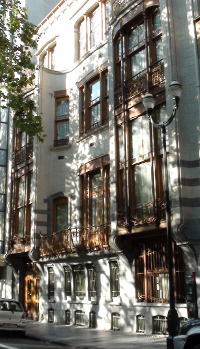

## Soude
### Soude, article du glossaire
 _Du mot arabe identique (noter qu'il existe  
un synonyme dans cette langue :_ al-qâly_,  
qui donne en français [alcali](alcali.html))_

On désigne couramment soude ou  "soude Solvay" le carbonate de [sodium](sodium.html) Na2CO3, à distinguer de la [soude caustique](soudecaustique.html).

Telle quelle, sa réactivité en présence de matières grasses est minime. Elle donne des lessives et des savons seulement après [caustification](soudecaustique.html#caustificationsoude). On l'emploie comme [fondant](fondant.html) du [verre](verre.html#fondantsduverre) et comme un agent apportant plusieurs propriétés intéressantes dans la réalisation de [glaçures](glacure.html) (voir [sodium et oxyde de sodium](sodium.html)). Mais il existe d'innombrables autres applications industrielles.

La soude est avant tout une plante (Chénopodiacées) poussant sur le littoral en terrain salé. On fabriquait avec elle - et quelques autres, notamment la salicorne, plus tard les laminaires, une famille de goémons - le _marc de soude_ ou _cendre de soude_ par calcination. La soude proprement dite (la molécule) était elle même extraite de cette substance.

Ernest Solvay transforma en 1861 un premier procédé d'extraction moderne inventé par Nicolas Leblanc en 1789. Le point commun entre les deux processus est l'utilisation de sel (NaCl) comme matériau de base. Sel marin chez Leblanc (information partiellement confirmée), sel gemme et calcite (CaCO3) chez Solvay. Le procédé de Solvay, peu coûteux et peu polluant ([l'ammoniaque](ammoniac.html) utilisée est réemployée) lui valut une considérable fortune. Ce chimiste belge, personnage hors du commun, fut un important novateur social (sécurité sociale, journées de huit heures et congés payés dans ses entreprises) et un mécène de tout premier plan dans le domaine des sciences.

En effet, à partir de 1911, les "Conférences Solvay" accueillirent des génies scientifiques tels que Albert Einstein, Marie Curie, Henri Poincaré, Max Planck, Paul Langevin, etc., dans le fameux Hôtel Solvay d'Ixelles (Région de Bruxelles-Capitale) conçu par l'architecte Victor Horta, qui figure au patrimoine mondial UNESCO (photo ci-contre, Dotapea © 2013).

 [Communication](http://www.artrealite.com/annonceurs.htm) 

