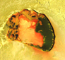

## Soufre
### Soufre, article du glossaire
 _Du latin_ sulfur_.  
Correspond au radical_ thio-_(qui donne de nombreux substantifs),  
du grec_ theion_, soufre.  
Note : le terme_ thiosulfate _(hyposulfite S2O3) est pertinent  
malgré sa facétieuse et atypique redondance étymologique._

Soufre  : [n°16](annexe1.html#s) du tableau périodique des éléments.

Cette matière - un atome [allotropique](allotropie.html) [non-métallique](nonmetaux.html) - fut anciennement considérée comme une condensation de la substance du feu.

A l'état naturel sur la terre et d'autres corps célestes, le soufre se présente notamment sous la forme de cristaux jaunes. Cette forme est souvent associée à une activité volcanique (exemple typique ci-contre, le volcan Tupan Caldera sur Io, survolé par la sonde Gallileo - [crédit photo](soufre.html#creditio)). Sous forme [amorphe](amorphe.html) (extrait des sels sulfureux) et pulvérulente, il est jaune citron. Mais il est en fait présent sous de nombreuses formes et couleurs dans notre environnement et dans l'univers.

Il peut être mis en solution [colloïdale](colloide.html) (_lait de soufre_) par action d'un acide sur du thiosulfate.

La _fleur de soufre_ est obtenue par une condensation brutale de vapeurs de soufre.

Le soufre est présent dans d'innombrables pigments, liants et autres produits naturels ou non qui nous entourent. Il s'associe bien avec beaucoup de métaux et éléments, un peu comme le carbone. Sa chimie n'est pas aussi riche toutefois, mais elle peut se combiner à celle des hydrocarbures et de différents autres éléments, formant parfois des corps "hybrides" qui participent à la chimie du vivant (cf. [Ail, allicine](ail.html) et [Polysulfide](polysulfide.html)).

En cela il peut être comparé au [phosphore](phosphore.html) qui, coïncidence ou pas, présente un autre point commun : son rapport particulier avec le feu. En effet, au-delà des volcans où c'est une évidence, le soufre est l'un des composants de la poudre à canon (voir [salpêtre](salpetre.html)) et pourrait avoir été présent dans les bouts dits soufrés des anciennes allumettes.

En ce qui concerne les arts plastiques et les domaines voisins, signalons que l'association de soufre et de [plomb](plomb.html) peut engendrer un noircissement. Voir [Compatibilités et incompatibilités _in_ Les pigments, les couleurs](pigments.html#compatibilitesetincompatibilites). L'argent est également réactif (lire [passage](chap19oxydationsmetaux.html#sulfurationdelargent) _in_ Les dialogues de Dotapea chap. XIX).

\_\_\_\_\_

Crédit photo

Nasa/Jpl - Image Nasa  
"You may use NASA imagery, video and audio material for educational or informational purposes, including photo collections, textbooks, public exhibits and Internet Web pages."

 [Communication](http://www.artrealite.com/annonceurs.htm) 

