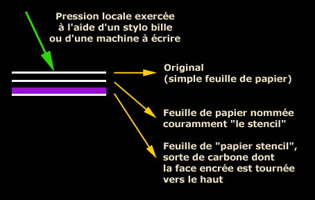

## Stencil
### Stencil, article du glossaire
 _Du français_ étinceler_,  
par un cheminement linguistique compliqué.  
En anglais,_ stencil _signifie pochoir...  
ou stencil dans le même sens qu'en français._

En principe, il s'agit d'un [papier paraffiné](papiersspeciaux.html#sulfurparaff) que l'on perfore à la main ou à la machine à ronéotyper et que l'on encre selon la méthode du [pochoir](pochoir.html).

Dans les faits, la définition de ce mot et des techniques associées s'est manifestement étendue ou déplacée. On évoque en effet un "papier stencil" dans le cadre de procédés sans perforation. Dans ces cas - il s'agit essentiellement de polycopie -, le seul point commun du procédé avec le pochoir est, si l'on veut, qu'il s'agit "d'utiliser un négatif".

Le papier stencil est essentiellement un papier encré encore utilisé dans les écoles au début du XXème siècle. La machine à ronéotyper n'est pas nécessaire pour son emploi : il suffit d'un stylo à pointe dure (le bille particulièrement, inventé en 1938) ou d'une machine à écrire ordinaire. Voici une description schématique du procédé :



Note : il est possible de ne pas insérer la feuille intermédiaire de sorte que c'est l'original qui devient "le stencil".

Ces feuilles sont simplement posées les unes sur les autres et ajustées de différentes manières : encoches, performations latérales ou simple trombone.

Lorsqu'une pression locale est appliquée, l'encre (en fait une sorte de poudre) se colle sur le verso du stencil à l'endroit correspondant à cette pression.

Concernant la suite de l'opération il existe différents procédés mais il s'agirait dans tous les cas, pour chaque copie, de transférer une partie de l'encre collée au verso de la feuille dite "le stencil" sur une feuille vierge.

On tirerait tout au plus une cinquantaine de copies pour chaque "stencil" avec l'encre la plus efficace qui serait de couleur violette. C'est un bain d'alcool (entre autres produits plutôt odoriférants voire nauséabonds à cause de la présence éventuelle de [dénaturants](denaturant.html)) qui en fait une sorte de teinture, d'encre assez stable. Le choix du papier, sa capacité d'absorption particulièrement, semblent avoir une certaine importance. On mentionne pour divers procédés des papiers assez peu absorbants.

Cinquante copies au plus, c'est peu. Cela signifie que pour aller au-delà de ce chiffre on doit "refaire un stencil" à l'aide d'un "papier stencil" neuf. Typiquement, s'il s'agit de texte manuscrit on replacera en haut soit l'original soit l'ancien stencil et l'on récrira par-dessus le texte déjà écrit. On peut aussi placer un calque tout au-dessus pour ne pas altérer l'original. Avec une machine, on retape.

On ne peut donner aucune garantie de longévité des épreuves imprimées, mais ce procédé peut certainement être utilisé dans le domaine des arts plastiques, dans certains contextes. Des transpositions avec d'autres matériaux doivent également être réalisables.


 [Communication](http://www.artrealite.com/annonceurs.htm) 

[](index-2.html#20131014)


```
title: Stencil
date: Fri Dec 22 2023 11:28:30 GMT+0100 (Central European Standard Time)
author: postite
```
