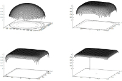
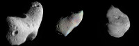

## Tensioactivit�
### Tensioactivit�, tension de surface, tension et surface, port�e en arts plastiques
 **Tensioactivit�  
tension de surface, tension et surface**

**I. La tension**

La tension en tant que concept g�n�ral pourrait �tre d�crite (grossi�rement, nous y reviendrons) comme une "force" endog�ne, interne, � distinguer en cela de la pression que l'on d�finit plut�t par l'action d'un corps sur un autre corps. Cela peut surprendre qu'un ph�nom�ne dit superficiel d�pende de causes internes, profondes, et pourtant c'est semble-t-il le cas.

Cette force voudrait en quelque sorte s�parer les �l�ments constitutifs d'une substance ([voir _Le tendu_ in _Les liants font les proc�d�s_](liants.html#etalementtendu), voir aussi _Tension in Le petit Robert, acception 3_). Mais si le contexte global n'impliquait pas quelques contraintes, cette force interne existerait-elle ? Comme l'indique un passage des Dialogues de Dotapea consacr� aux surfactants, cette question est presque philosophique.

_Il est important, � ce niveau de la d�finition, de lire [<<< ce lien >>>.](chap01liants.html#surfactant)_

**II. La tension superficielle et son contexte**

La tension superficielle serait la m�me "force interne" exerc�e � la surface d'un corps. Elle concerne essentiellement les fluides. Elle serait responsable de la tendance de ceux-ci � s'arrondir et � former des gouttes, la sph�re �tant est la forme qui oppose le moins de surface pour un volume donn�. Nous allons voir pourquoi cette question de surface est importante.

Mais avant de poursuivre, pr�cisons le contexte. Nous �voquons un "syst�me" (un ensemble) constitu� de plusieurs �l�ments, non d'un seul car par exemple, les liquides expos�s au vide se dissocient. Pas de flaque d'eau sur la lune. Pas de "surface de l'air" non plus en haut de l'atmosph�re. Mais nous reviendrons sur ces points un peu plus loin.

Un tel "syst�me" peut �tre par exemple les oc�ans et l'atmosph�re ou une nappe d'huile sur une nappe d'eau. Sachant que pour rendre compte de tout le syst�me, il faudrait y inclure les autres �l�ments participant � son propre confinement : les masses rocheuses de la plan�te pour le syst�me "oc�ans et atmosph�re", un contenant quelconque pour l'eau et l'huile, et les gaz exer�ant une pression au-dessus.

Ce n'est pas anecdotique : si les liquides et les gaz ont besoin de confinement pour former une surface, les solides ont une surface m�me lorsqu'ils ne sont pas confin�s [\[voir note 1\]](tensioactivite.html#note1). Entendons ici par surface "�tendue plane", l'une des d�finitions classiques de ce mot. Cette diff�rence que le vide semblerait r�v�ler pourrait �tre li�e aux types de liaisons �lectroniques associ�s � chaque [phase](gazliquidessolides.html) de la mati�re ([lire l'article consacr� aux liaisons](liaisons.html)).

En compl�ment, on lira ci-dessous l'annexe consacr�e � la tension de vapeur. [Lien.](tensioactivite.html#annexetensiondevapeur)

**III. Les facettes d'une force conceptuelle**

Revenons maintenant � ce que nous avons nomm� par facilit� une "force interne" induisant une s�paration et cons�quemment, la d�limitation quasi frontali�re qu'est une surface, ceci afin de mieux comprendre la d�finition de la tension donn�e ci-dessus.

> \* Globalement, il existe des �l�ments "incompatibles". Ils sont soit en [phases](gazliquidessolides.html) diff�rentes, soit ayant une r�partition de charges diff�rentes ([polaires ou apolaires](polaireapolaire.html)). Cette force n'a rien de myst�rieux. Elle n'existe pas � proprement parler. Il n'y a pas v�ritablement "d'�nergie de surface" (le terme est parfois employ�) � consid�rer comme ind�pendante des interactions fondamentales. C'est une abstraction. Il existe par contre une somme d'�nergies, m�caniques (pression, quelle qu'elle soit) et/ou �lectromagn�tiques, que l'on peut nommer tension et qui a essentiellement pour r�sultante une s�paration de fait. La tension est donc conceptuellement et globalement "ce qui tend vers une s�paration".
> 
> \* Localement, cette tension donne lieu � une surface s�parant les �l�ments dits "incompatibles".
> 
> \* Encore plus localement, � l'�chelle des liaisons �lectroniques, [Jean-Louis](quinoussommes.html#jeanlouis) �crit : � _les mol�cules de la surface sont � moiti� d�couvertes ; au lieu d'avoir une coquille de copines, elle n'en ont qu'une demi, l'autre moiti� de leur univers �tant fait d'air ou d'autre chose. Donc elles n'aiment pas. Elles ont envie de rentrer dans la masse, de se recouvrir de mol�cules identiques. Donc, litt�ralement, elles "tirent sur la surface" pour comme s'en recouvrir. D'o� la tension de la surface._ �  
> Voil� comment une "force endog�ne" m�ne � la cr�ation d'une forme, en l'occurrence la sph�re.

**IV. Bulles, mousses et �mulsions**

Un produit dit "surfactant" tendrait � "r�duire la tension de fronti�re" (les guillemets ici ne sont pas fortuits) � l'aide de produits capables d'interfacer les milieux en pr�sence. Il s'agit [d'amphiphiles](chap01liants.html#amphiphile). Quel r�sultat cela donne-t-il ? Des �talements et des flous comme indiqu� ailleurs sur ce site au sujet du "tendu", mais aussi bien souvent, des bulles. Des bulles aqueuses dans une mati�re huileuse, ou l'inverse - ce sont les �mulsions grasses et maigres bien utiles par exemple lorsqu'il faut mouiller certains pigments ([lien](chap22mouillage.html#structuresurfactants)) -, ou bien des bulles d'air pi�g�es par des liquides - cela donne des mousses - qui peuvent se solidifier plus ou moins durablement. Ces "bulles" peuvent avoir toutes les tailles et les amphiphiles surfactants peuvent �tre en th�orie de toutes natures.

L�, effectivement, on rejoint un domaine quasi philosophique ou a minima lexicographique : peut-on aller jusqu'� affirmer qu'un bateau est un surfactant ? Non, tout au plus peut-on dire pour introduire une note de fantaisie que c'est un amphiphile au sens purement �tymologique, "qui aime les deux", en l'occurrence l'air et l'eau.

**V. Ce que le confinement engendre**

Sur la base de quelques interactions simples, se construisent des processus aboutissant aussi, par des r�ponses r�elles � des contraintes r�elles comme le confinement, � d'autres formes que la sph�re. Ainsi, en 2011, les travaux de Felipe J. Llanes-Estrada et Gaspar Moreno-Navarro (Complutense University of Madrid) concluent � l'existence de neutrons cubiques - oui, cubiques - dans les pulsars lourds comme PSR J1614-2230. [Lien vers les archives arXiv de la biblioth�que de l'universit� Cornell.](http://arxiv.org/abs/1108.1859) En deux mots, dans un volume donn� on entasse plus de briques que d'oeufs. Une contrainte - en l'occurrence un confinement colossal - fa�onne un mat�riau r�el, pas toujours de la m�me mani�re : ici en sph�re, l� en cubes, parce que les contextes diff�rent.

  
_En lien sur l'image,  
une recherche Google  
sur l'argument "neutrons cubiques"_

**<<< Annexes >>>**

I. La tension de vapeur  
(en compl�ment aux Dialogues de Dotapea)

� Tous les corps ont ce qui s'appelle une "tension de vapeur", �a caract�rise en gros leur facilit� � s'�vaporer. L'�ther a une forte tension de vapeur, l'huile d'olive beaucoup moins. Les solides ont aussi une tension de vapeur. Au sens strict, un morceau de m�tal peut s'�vaporer lentement. C'est �videmment fonction de la temp�rature et de la pression. Si tu chauffes de l'eau, elle bout, i.e. elle s'�vapore d'avantage. Si tu chauffes un morceau de fer tu formes de la vapeur de fer, et si tu fais �a sous vide tu �vapores litt�ralement le m�tal qui se recondense sur les surfaces froides environnantes. L'�vaporation des m�taux est tr�s utilis�e dans l'industrie, notamment la micro�lectronique. �

[Jean-Louis](quinoussommes.html#jeanlouis)

II. Autres

La tensioactivit� se mesure � l'aide d'un appareil, le tensiom�tre.

Un liquide dit tensioactif aurait tendance � s'�taler, ce qui pourrait sensiblement correspondre � la d�finition du terme "tendu" utilis� en arts plastiques et d�coratifs.

[Lire absolument le _chapitre XXII, Le mouillage pigmentaire_](chap22mouillage.html)_, en particulier **[ce passage](chap22mouillage.html#structuresurfactants)**._

[Lire aussi passage _in Les dialogues de Dotapea, chap. I, A propos des liants_](chap01liants.html#tensioactif)

\_\_\_\_\_\_

\[1\] Sur ce point, quelques pr�cisions.

Un confinement li� au vide est ind�tectable � notre �chelle. M�me si l'on admet qu'il existe une "�nergie du vide", celle-ci porte sur des �chelles si gigantesques qu'il a fallu attendre le prix Nobel de physique de 2011 (Perlmutter, Schmitt, Riess, [lien vers une recherche Google](http://www.google.fr/#sclient=psy-ab&hl=fr&source=hp&q=%22prix+nobel+de+physique+2011%22&pbx=1&oq=%22prix+nobel+de+physique+2011%22&aq=f&aqi=g3&aql=&gs_sm=e&gs_upl=1600l9263l0l10660l29l29l0l0l0l0l294l4860l5.13.11l29l0&bav=on.2,or.r_gc.r_pw.,cf.osb&fp=bd99)) pour que les observations confirment l'hypoth�se de son existence au demeurant peu envisag�e jusqu'alors. Par ailleurs, il n'est pas certain que l'on puisse parler de confinement �tant donn� qu'il s'agit d'un ph�nom�ne impliquant l'univers entier. Confinement ou expansion ?

A une �chelle plus humble, une plan�te en formation, encore en fusion, pourrait avoir une surface avant d'avoir termin� son d�gazage. Ce n'est pas constat� directement bien s�r, mais ce n'est pas du tout � exclure dans le principe. N�anmoins, il lui faut une certaine masse (et densit�) pour cela, c'est-�-dire une autre forme de confinement, par la gravitation. Une masse trop petite donne, on le sait bien (rappel photo ci-dessous), des corps irr�guliers.

  
_Eros, Gaspra et Tempel 1  
__Image Nasa - "You may use NASA imagery, video and audio material  
for educational or informational purposes,  
including photo collections, textbooks, public exhibits and Internet Web pages."_

Pour eux, s'il y a eu un ph�nom�ne de tensioactivit�, menant par exemple � un d�gazage, ce qui est fort possible, c'est � une �chelle faible ou sur une dur�e courte.  
Une plan�te trop peu dense vers l'ext�rieur ne donne pas non plus de surface, du moins � ce que l'on croit savoir. En th�orie, il n'y a aucune v�ritable surface oc�anique sur les plan�tes g�antes Jupiter, Saturne, Uranus et Neptune. Les mat�riaux (hydrog�ne, h�lium, m�thane, eau, ammoniac, etc.) sont trop l�gers et, sous pression et temp�rature faibles, trop proches de leurs [points singuliers](gazliquidessolides.html#schema). A v�rifier cependant.  
La sonde Juno ([visiter le remarquable site officiel](http://missionjuno.swri.edu/)), lanc�e en ao�t 2011 et devant arriver pr�s de Jupiter en 2016, devrait apporter des informations tr�s attendues apr�s la chute de la sonde atmosph�rique de la mission Galileo qui, en d�cembre 1995, n'a manqu� que de quelques kilom�tres l'altitude n�cessaire pour confirmer la pr�vision. Juno devrait �galement nous renseigner sur l'existence suppos�e d'un noyau dot� d'une surface solide constitu�e d'hydrog�ne m�tallique, autre raret� de la nature associ�e cette fois � un confinement consid�rable.

A lire dans la continuit� de cette note, l'annexe I de cet article, consacr�e � la tension de vapeur. [Cliquer ici.](tensioactivite.html#annexetensiondevapeur)

Pour revenir dans le corps du texte, cliquer sur le bouton "Pr�c�dent" de votre navigateur.

 [Communication](http://www.artrealite.com/annonceurs.htm) 

