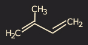

## Terp�ne
### Terp�ne, article du glossaire
 _De t�r�benthine_

Le terp�ne ou monoterp�ne, ou encore "2-m�thylbuta-1, 3-di�ne", premier compos� de la s�rie terp�nique, a pour formule brute C10H16, soit deux [isopr�nes](isoprene.html). La s�rie associ�e a pour formulation g�n�rale (C5H8)n. Ainsi on obtient 3, 4, 6 isopr�nes ou plus (on tend alors vers le [caoutchouc](latex.html#fabricationcomposition)).

Oxyg�n�, le terp�ne donne le [camphre](camphre.html) (C10H16O). Liquide, non [satur�](saturation.html), il peut �tre extrait d'essences et de r�sines v�g�tales.

Concernant la s�rie terp�nique, citons [Delcroix et Havel](livres.html#delcroix), tr�s pertinents sur ce sujet de premi�re importance pour les arts plastiques (pp. 56 et suivantes) :

� _Les terp�nes sont pr�sents dans les v�g�taux, dont ils sont souvent les constituants odorif�rants : [t�r�benthine](essences.html#essencedeterebenthine), [camphre](camphre.html), menthol, citronnelle, ...) et dont on sait depuis tr�s longtemps les extraire sous la forme d'" huiles essentielles ". �_

_(...) Ce sont des secr�tions ou excr�tions, spontan�es ou provoqu�es, fra�ches ou fossilis�es (...)_ �

_� (...) tous les compos�s terp�niques se pr�sentent structuralement comme des polym�res de l'isopr�ne (...) qui n'est cependant pas leur v�ritable pr�curseur dans la synth�se qu'en effectue la nature. Celle-ci se permet en effet de " d�couper " la formule d�velopp�e d'un terp�ne en " motifs isopr�nes ". �_

Des substances fortement �labor�es (masses mol�culaires �lev�es) sont ainsi compos�s de briques d'isopr�ne et de segments terp�niques. On notera au passage que la carot�ne, pi�ce essentielle du processus v�g�tal de photosynth�se, est un terp�ne lourd, de formule C40H64.

Concernant les arts plastiques, cette s�rie est pr�sente dans les essences v�g�tales, les ol�or�sines, les r�sines tendres et dures, c'est-�-dire � de rares exceptions pr�s (on pense aux essences min�rales) **tous les adjuvants � la peinture � l'huile et � la cire** auxquels il faut ajouter par ailleurs les [latex v�g�taux](latex.html).

L'isopr�ne

 [Communication](http://www.artrealite.com/annonceurs.htm) 

