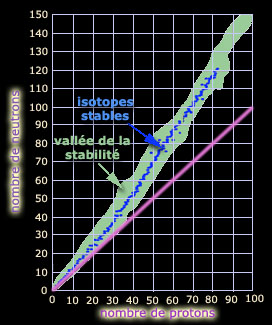

## Transmutation
### Transmutation, article du glossaire
 _Du latin_ transmutatio_, de_ trans- _et_ mutare_, changer  
Le verbe correspondant est transmuer,  
de pr�f�rence � transmuter_

Le l�gendaire objectif ultime des alchimistes (la transmutation, ��l'Oeuvre �, quasiment la pierre philosophale) fut atteint par Ir�ne et Fr�d�ric Joliot-Curie dans la premi�re moiti� des ann�es 1930 (Nobel 1935 pour la "radioactivit� artificielle", c'est-�-dire non seulement la transmutation artificielle, mais aussi, plus sp�cifiquement on le verra, la formation d'un isotope inconnu d'un �l�ment).

La transmutation est de toute fa�on un ph�nom�ne "naturel" et d'ailleurs les Joliot-Curie n'appr�ciaient pas le terme "radioactivit� artificielle", arguant (pour faire court) qu'il n'y a qu'une seule radioactivit�. De fait, les termes "naturel" et "artificiel" semblent surtout correspondre ici � des conceptions "communes", "normales" essentiellement li�es � la pr�sence ou l'inexistence de ces ph�nom�nes sur notre toute petite plan�te.

La transmutation est le ph�nom�ne par lequel un [�l�ment](element.html) devient un autre �l�ment. Le nombre de protons d�finissant chaque �l�ment (lire [passage](chap04orbitales.html#ipseiteelement) avec exemple in _Les dialogues de Dotapea_, chap. IV), la transmutation ne consiste en rien d'autre que modifier ce nombre.

L'uranium 238 (demi-vie : environ 4,5 milliard d'ann�es soit peu ou prou l'�ge de la terre) se transforme "naturellement" en [plomb](plomb.html) 206 apr�s quatorze transmutations s'�talant sur des p�riodes tr�s longues. C'est une "cha�ne de d�sint�grations" (parmi d'autres, la plupart aboutissant au plomb ou l'un de ses [voisins](annexe1.html#pb), quoi que cette affirmation doive �tre modul�e, voir encadr�), cha�ne o� interviennent aussi des changements [isotopiques](ion.html#isotopeinion). Les agents de la transmutation sont :

> \* le rayonnement alpha, d�couvert par Ir�ne Joliot-Curie en 1925 (th�se). Il s'agit de l'�mission d'un noyau d'h�lium (deux protons et deux neutrons) capable d'arracher un "proton de recul" � un autre atome. Un tel "rayonnement" est peu p�n�trant et peut �tre stopp� par une feuille de papier. Il est cependant assez puissant pour avoir fait parler de lui dans la presse g�n�raliste du monde entier en 2006, lors de l'affaire Litvinenko, un cas rarissime d'empoisonnement mortel au polonium 210.
> 
> \* le rayonnement b�ta-. Un neutron se change en proton en �jectant un �lectron.
> 
> \* le rayonnement b�ta+. Un proton se change en neutron en �jectant un positron. Dans la nature, le positron (�lectron positif, antimati�re de l'�lectron) ne tarde pas � rencontrer son alter ego n�gatif (largement majoritaire), ce qui provoque leur annihilation r�ciproque, soit leur transformation en �nergie sous la forme d'un rayonnement gamma, hors de propos ici car ce rayonnement n'est pas assez puissant pour provoquer des modifications nucl�iques.

Une pr�cision concernant les dur�es et les "fins de cha�nes"

On parle ici de dur�es qui peuvent �tre absolument ph�nom�nales. Pas des milliards d'ann�es mais plut�t des milliards de fois l'�ge de l'univers (environ 15 milliards d'ann�es).

Le diagramme ci-dessous donne une repr�sentation graphique de ce qu'est la stabilit� d'un �l�ment : elle est fonction directe de son nombre de protons d'une part et de son nombre de neutrons d'autre part.

Son orientation ne suit pas la proportion "un pour un" (cf. ligne mauve). La "vall�e de la stabilit�" et les isotopes stables sont identifi�s en fonction des �missions (voir ci-contre).

Le fer (5626Fe, soit 30 neutrons pour 26 protons) est le plus stable en termes d'�nergie de liaison nucl�ique.

Donc le plomb, certes, est stable d�j� � une �chelle qui n'est pas humaine ni m�me en rapport avec l'�ge de l'univers, mais en principe le fer le "surpasse" (si l'expression a un sens dans ce contexte). Le plomb 206 et ses voisins sont stables, m�me si ce ne sont pas "les plus stables possibles".

Voir [informations compl�mentaires](http://www.arpansa.gov.au/radiationprotection/basics/radioactivity.cfm) (site gouvernemental australien en anglais)

C'est pourtant ce manque de puissance du rayonnement gamma (pris dans le cas g�n�ral) qui expliquerait que les Joliot-Curie aient "manqu� le neutron" d�couvert par James Chadwick. Plus exactement, les Joliot-Curie auraient cru � tort qu'un rayonnement gamma pourrait "_lib�rer (...) des protons anim�s d'une grande vitesse_", l� o� c'est le rayonnement alpha, d�couvert pourtant par Ir�ne, qui poss�de suffisamment d'�nergie pour arracher, un peu comme aux jeux de billard ou de p�tanque, des protons au noyau.

Cependant, ce sont bien les Joliot-Curie qui r�alis�rent l'un des plus fantastiques r�ves de l'humanit� : la premi�re transmutation "de main humaine", r�ve des alchimistes. Ils ont soumis une simple feuille d'aluminium � un rayonnement alpha et obtinrent ainsi du [phosphore](phosphore.html), ou plus pr�cis�ment un isotope du phosphore qui n'avait jamais �t� observ� auparavant (d'o� sans doute l'appellation contest�e de "radioactivit� artificielle" �voqu�e au d�but de cet article). Ils purent isoler l'�l�ment produit avant qu'il se transforme en silicium, [son voisin dans la table de Mendele�ev](annexe1.html#si).

Co�ncidence amusante : le phosphore aurait pr�cis�ment �t� identifi� par des alchimistes.  
Cette d�couverte aurait eu lieu au XII�me si�cle en Orient et/ou au XVII�me en Occident.

On avait donc trouv� le moyen de transmuer un �l�ment par "d�cr�mentation" du num�ro atomique (par perte ou transformation de protons). Plus tard on d�couvrit qu'il �tait possible d'effectuer l'op�ration inverse, l'augmentation du nombre de protons. Ce ph�nom�ne, la nucl�osynth�se, se produit �galement naturellement, notamment au coeur des �toiles par [fusion de noyaux](fusion.html#fusionthermonucleaire). La fusion est l'objet de recherches intenses (par exemple le projet ITER - [lien externe](http://www.iter.org/)) car elle produit de grandes quantit�s d'�nergie.

Parmi les �l�ments que l'on a pu synth�tiser dans la foul�e de la d�couverte des Joliot-Curie en croyant cr�er quelque chose de totalement nouveau, le plutonium (un �l�ment dit transuranien, � savoir dont le num�ro atomique est sup�rieur � 92, soit celui de [l'uranium](annexe1.html#u)) s'av�ra en fait exister sur terre � l'�tat naturel (affaire de la mine d'Oklo, au Gabon). Il peut sembler douteux de toute mani�re d'accorder aujourd'hui pertinence � une distinction entre des �l�ments qui seraient intrins�quement naturels ou bien artificiels simplement parce que les uns sont pr�sents en quantit�s plus importantes dans l'environnement terrien actuel que les autres. La banalit� ne serait-elle pas la plus triste d�finition du naturel ?

> On notera la persistance de ce point de vue dualiste dans des expos�s actuels. Ainsi peut-on lire aujourd'hui sur un site dont le nom commence par W qu'il existerait une cha�ne de d�sint�gration "artificielle", celle du plutonium 241. Explication avanc�e : "_La dur�e de vie de cette s�rie est insuffisante pour que l'on en trouve des traces min�ralogiques._" Point de vue pour ainsi dire ptol�m�ien o� ce qui est naturel est cens� �tre ce que nous pouvons voir sur notre plan�te. La cha�ne de 241Pu est tout aussi naturelle ou artificielle que les autres. Elle dure moins longtemps, cela ne va pas plus loin.
> 
> Pour information on citera les quatre cha�nes en soulignant que ce ne sont pas les seules voies de transmutation car il existe des fissions "naturelles" (ou non) qui initient d'autres cha�nes et tout n'est pas r�gl� par le seul rayonnement alpha, c'est-�-dire qu'� chaque transmutation, l'atome ne perd pas quatre nucl�ons (ce qui implique que le raisonnement par modulos a ses limites). Voici les "parents th�oriques" de ces cha�nes de d�sint�grations :
> 
> > \* 238U
> > 
> > \* 239U
> > 
> > \* 240Pu
> > 
> > \* 241Pu
> 
> Tr�s th�oriques en effet car il existe des �l�ments plus lourds. Par exemple 294118 (ununoctium) se transmue en 290116, etc.

On notera pour finir ce passage que la transmutation demeure un enjeu capital d'actualit� dans diff�rents domaines dont celui du traitement des d�chets radioactifs.

D'un point de vue artistique plus proche de l'objet central de ce site, la transmutation ne semble gu�re "plastiquement utilisable" techniquement de nos jours mais elle peut apporter un regard r�aliste sur le monde et... sur l'oeuvre, l'oeuvre que beaucoup d'artistes veulent p�renne (au sens fort du mot, au-del� du durable). Il s'en d�gage une certaine ironie, du moins un curieux paradoxe qui m�rite d'�tre mentionn� : une oeuvre faite de [plomb](plomb.html) a la possibilit� th�orique d'�tre quasi �ternelle (voir [ci-dessus](transmutation.html#plomb1) et [l'encadr�](transmutation.html#encadre) o� il est aussi question du fer) et pourtant ce m�tal est r�put� peu noble, pour ne pas dire � deux sous, il a peu de tenue (il est tr�s [ductile](ductilite.html)), il fond � basse temp�rature et c'est un poison pour l'homme.

 [Communication](http://www.artrealite.com/annonceurs.htm) 

