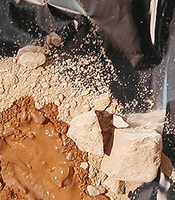

## Tripoli
### Tripoli, article du glossaire
 _M�me si cette appellation semble bien provenir  
de la ville libyenne �ponyme,  
le "tripoli" ne prend pas de majuscule._

Il s'agit d'une poudre produite � partir d'une roche faite d'amoncellements d'algues riches en silice ([diatom�es](diatomees.html)).

Elle sert d'une part dans la fabrication de patines destin�es aux meubles ([lire _La silice (arts picturaux)_](silicepeinture.html)), d'autre part, telle quelle, pour polir finement le verre, la pierre et les m�taux.

Au XX�me si�cle en France, encore, le tripoli �tait utilis� pour redonner du brillant aux lames tout en les aiguisant. On "trempait" un bouchon de li�ge dans la poudre et l'on frottait le m�tal.

On l'applique aussi au chiffon sur une couche de peinture s�che que l'on veut rendre plus adh�rente.

**Son point fort�: il ne raye pas les surfaces.**

[Voir aussi _Infusoire_.](infusoire.html)


 [Communication](http://www.artrealite.com/annonceurs.htm) 

[](index-2.html#20131014)


```
title: Tripoli
date: Fri Dec 22 2023 11:28:42 GMT+0100 (Central European Standard Time)
author: postite
```
