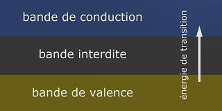

## Valence
### Valence, article du glossaire
 Définition restreinte : quantité de liaisons moléculaires d'un atome avec d'autres atomes.

Exemples : 

> Dans FeCl, l'atome de fer est monovalent (valence 1).
> 
> Dans FeO2, il est bivalent (deux liaisons, valence 2).
> 
> Dans FeH2O ou FeCl3, il est trivalent (valence 3).

Voir aussi, pour exemples, [ferreux](ferreux.html) et [ferrique](ferrique.html).

Notons qu'un [élément atomique](element.html) peut établir avec _un seul_ autre de zéro à plusieurs liaisons. C'est lorsqu'il y a plusieurs liaisons que l'on peut parler d'insaturation car l'une des liaisons peut être redirigée vers un troisième atome sans que la liaison initiale soit détruite. Lire l'article _[La saturation](saturation.html)_.

Au-delà, la valence désigne une propriété intrinsèque des atomes. Un atome a une valence qui définit un état de stabilité. Ce point est explicité dans un [passage](chap04orbitales.html#valence) de _Les dialogues de Dotapea, Chap. IV, Les orbitales._

La valence est fonction du remplissage de la couche électronique externe des atomes, elle même déterminant le nombre de liaisons possibles.

Cette sorte de cycle ou plutôt de période a été découverte il y a environ un siècle. A elle seule elle en dit beaucoup sur la stabilité des éléments et leur capacité à s'associer. Cette capacité est relativement lisible sur la table de Mendeleïev. Lire absolument [un passage de l'article](annexe1.html#valence) consacré à cette table.

Enfin, évoquons la "**bande de valence**". Ce terme désigne ce à quoi on pouvait s'attendre, à savoir la dernière couche électronique vraiment propre à l'atome. Il s'oppose (en quelque sorte) à la "bande de conduction" où les électrons circulent librement. Entre les deux bandes, il existe un vide (la "bande interdite" ou "gap électronique") qui correspond à l'énergie nécessaire pour faire passer un électron de la bande basse à la bande haute. C'est l'énergie de transition de bandes.

Une bande interdite trop large empêche toute transition. On a alors affaire à un isolant. Lorsqu'elle est plus mince, un apport d'énergie peut permettre à un électron de sauter jusqu'à la bande de conduction. Il s'agit alors d'un semi-conducteur. Pour d'autres éléments, la présence d'électrons dans la bande de conduction est une propriété pour ainsi dire naturelle (sans apport extérieur d'énergie). Il s'agit des conducteurs.

\[Parenthèse\] Notons également que la bande dite interdite peut absolument être temporairement occupée par un électron. C'est ce qui se produit dans les phénomènes de [photoluminescence](photoluminescence.html). Ce à quoi il faut ajouter qu'à cette échelle les phénomènes probabilistes ne peuvent être négligés. Un électron n'a qu'une probabilité d'avoir une énergie E à un instant T. Il peut même se retrouver d'un instant à l'autre loin de l'atome dont il provient.  
\[Fin de la parenthèse\]

Mais on ne peut aborder ces questions sans évoquer une propriété des corps nommée **niveau de Fermi**.

Il existe plusieurs manières de définir celui-ci et le terme de "potentiel chimique", fréquemment utilisé, n'éclaire guère la compréhension. On peut aussi dire que ce niveau est l'énergie de Fermi à une température de 0K, mais ce n'est pas plus clair ! On affirmera plutôt que ce niveau représente l'énergie nécessaire à ce que le nuage électronique ne s'effondre pas sur le noyau (de charge opposée donc fortement attractif), même sans apport extérieur (température complètement nulle, vide total). Cette sorte d'énergie intrinsèque n'en est pas véritablement une, du moins ce n'est pas une interaction à part mais la résultante d'une impossibilité quantique associée aux [fermions](chap26magnetisme.html#bosonsfermions).

L'important dans le présent contexte est que ce niveau détermine si un corps est isolant, conducteur ou semi-conducteur en fonction de sa "hauteur" (quantifiée en électrons-volts eV) : s'il est situé dans la bande interdite, il faut un apport extérieur d'énergie pour que les électrons aient une chance de passer dans la bande de conduction. On est donc ici dans le cas des semi-conducteurs et comme dit précédemment, dans celui des isolants si la bande interdite est infranchissable.  
Est semi-conducteur un corps dont l'énergie de Fermi (c'est-à-dire le niveau de Fermi élevé par un apport énergétique) permet à au moins un électron excité (par une température dite ambiante) d'atteindre la bande de conduction.  
Enfin, si le niveau de Fermi est situé dans la bande de conduction, on a affaire à un conducteur : aucun apport extérieur n'est nécessaire à l'électron pour atteindre la bande de conduction car même à 0K il dispose de l'énergie (de Fermi) nécessaire.

 

 

 [Communication](http://www.artrealite.com/annonceurs.htm) 

