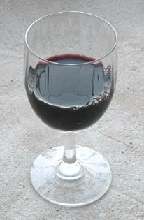

## Vin
### Vin, article du glossaire
 

Il n'est pas question ici de décliner en détail la liste des composants du vin tant ils sont nombreux et variables.

La connaissance du vin est en elle-même une science et un art vénérable et très complexe, aussi nous concentrerons-nous humblement sur certaines données qui concernent les personnes qui utilisent le vin dans le cadre des arts plastiques :

> \- un vin moyen, par exemple un Bordeaux banal présente un [pH](ph.html) acide. Modérément, mais nettement acide.
> 
> \- un vin sucré comme le Porto est très légèrement moins acide.
> 
> \- l'un des acides les plus présents dans le vin est l'acide vinylique. [Voir Le vinyle.](vin.html#vinyle)
> 
> \- d'autres informations peuvent être consultées dans l'article _[Les alcools](alcools.html#vinrouge)_.

 

 

 [Communication](http://www.artrealite.com/annonceurs.htm) 

