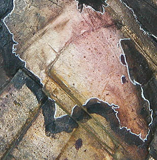

## Le vinyle
### Le vinyle, substance à emplois multiples, arts plastiques, arts décoratifs, etc.
 **Le vinyle**  On mentionne deux variétés, le PVA (acétate de polyvinyle, copolymère vinylique destiné aux [colles](moyendassemblage.html) à papier et à bois, au [béton](beton.html), etc.) et l'EVA (acétate éthylo-vinylique, plus résistant en tant que peinture) mais nous manquons d'informations au sujet de ces produits ([merci de nous communiquer tout renseignement](ecrire.html)). 

Dans tous les cas, l'atout majeur des liants vinyliques est son excellent accrochage sur de nombreuses surfaces.

Le vinyle ne se prête pas du tout aux empâtements - il craquelle - mais son élasticité remarquable ainsi que sa qualité de "protecteur" du pigment et des surfaces (il est aussi largement utilisé comme enduit) en fait une substance très importante en peinture artistique ou décorative ainsi que dans d'autres domaines.


Il a tendance à jaunir (voir photo : coulures vieilles de deux ou trois ans sur les bords d'un pot de liant vinylique). La coloration est beaucoup plus sensible sur les zones épaisses.

La surface enduite est extrêmement lisse lorsque le liant est utilisé pur (voir _[Emploi comme lissant](vinyle.html#emploicommelissant)_).

_**Surprise !**_

_Certains auteurs prétendent que_ les peintures vinyliques seraient capables d'adhérer à des surfaces enduites de peinture à l'huile _ou à la gomme laque car elles sont elles-mêmes grasses, proches des huiles. Bien que nous ayons dans un premier temps rejeté ce point de vue ("Comment ? Grasses, des peintures aqueuses ?"), nous avons réalisé des expériences qui donnent finalement - SURPRISE ! - un résultat... assez positif !_

_L'accrochage du vinyle (comme de l'acrylique d'ailleurs) sur une couche grasse parfaitement sèche est tout à fait réel, contrairement à ce que nous avons constaté avec certaines autres peintures aqueuses. Le vinyle est donc bien un produit gras à sa manière. Moins que l'huile, c'est évident, car l'accrochage n'est pas aussi intime, mais il est effectif._

_Les expériences ont été réalisées avec du liant pur, sans pigment. L'accrochage optimal ne peut être réalisé qu'à cette condition. Pour qui veut appliquer une couche de peinture, il faut le faire par-dessus une couche de liant pur._

_Les expériences d'application sur la [gomme laque](gommelaque.html) ont donné d'excellents résultats._

Diluant : eau

Dissolvants : l'[alcool à brûler](alcools.html#alcoolabruler) est un assez bon dissolvant qui peut être utilisé pour nettoyer des taches par exemple. Des [hydrocarbures benzéniques](benzene.html) sont parfois utilisés. On en trouve notamment dans les "diluants pour peintures synthétiques non cellulosiques" du commerce. Leur emploi n'est pas anodin.

_Le vinyle comme liant_ _à peindre_



Le [Caparol Binder ®](caparol.html) (liant Caparol) est un exemple très répandu de liant vinylique, mais il existe d'autres produits du même type.

Nous conseillons aux acheteurs éventuels de contrôler toujours

> \* la relative neutralité chimique du produit ([papier tournesol](papiertournesol.html)). Le Caparol est un peu alcalin.
> 
> \* l'absence de jaunissement excessif (période test de 6 mois au moins).

Les pigments fluorescents sont souvent associés à des liants vinyliques comme la Flashe ® de Lefranc & Bourgeois. Celle-ci autorise le verre comme support pour un emploi temporaire (vitrines de Noël par exemple, nettoyables à l'eau chaude). L'aspect de cette peinture est mat.

Comme nous le disions, certains liants vinyliques ont tendance à jaunir ou brunir. Cependant, cette coloration est relativement peu sensible dès lors que la couche picturale est fine, ce qui est presque toujours le cas puisque le vinyle supporte mal l'empâtement.

_Autres emplois du vinyle_

Signalons 

> \* l'emploi TRÈS COURANT de liant vinylique comme enduit pour les toiles à peindre, le bois, etc.
> 
> \* l'emploi du même produit comme lissant pour le même type de support dans le but de pouvoir effacer plus facilement des esquisses pratiquées par-dessus avec des peintures diluées (étape de mise en place au début de la réalisation d'un tableau) ou tout simplement pour diminuer un excès de porosité du support (emploi comme "bouche-pores")
> 
> \* l'emploi d'autres formes de vinyle (poudres notamment) comme "résines d'appoint" en peinture décorative
> 
> \* la présence de différentes formes de vinyles dans certains [fixatifs](fixatifs.html)
> 
> \* la présence de vinyle dans certains bouche-pores, sous-couches spécifiques à différentes peintures, et dans des _produits de_ _démoulage_. Dans ce dernier cas, le film déposé après évaporation de l'alcool (le solvant de ce produit) demeure sur la pièce moulée. On l'enlève avec de l'eau sans altérer la surface des originaux
> 
> \* la présence de vinyle dans quelques vernis à bronzer destinés à être mélangés à de la poudre de bronze et, éventuellement à des pigments. Ces vernis sont en fait de véritables liants
> 
> \* l'emploi de liant vinylique comme assouplissant du [béton](beton.html) et du [plâtre](platresupport.html)
> 
> \* l'emploi de vinyle comme colle blanche. Les liants vinyliques sont moins efficaces pour cet usage que les véritables colles [polyvinyliques](polyvinyle.html) qui d'ailleurs coûtent souvent moins cher (les colles à papiers peints, par exemple)
> 
> \* la présence possible de vinyle dans certaines pâtes de type [mastic](mastic.html).

Dans les fixatifs, les bouche-pores, les vernis à bronzer et les agents de démoulage, les vinyles sont dilués dans [l'alcool](alcools.html), produit qui s'évapore vite intégralement.

[_Important  : article sur la conservation du vinyle en pot (autre page)_](caparol.html#unconseilvraimenttresutile)


 [Communication](http://www.artrealite.com/annonceurs.htm) 

[](index-2.html#20131014)


```
title: Le vinyle
date: Fri Dec 22 2023 11:28:48 GMT+0100 (Central European Standard Time)
author: postite
```
